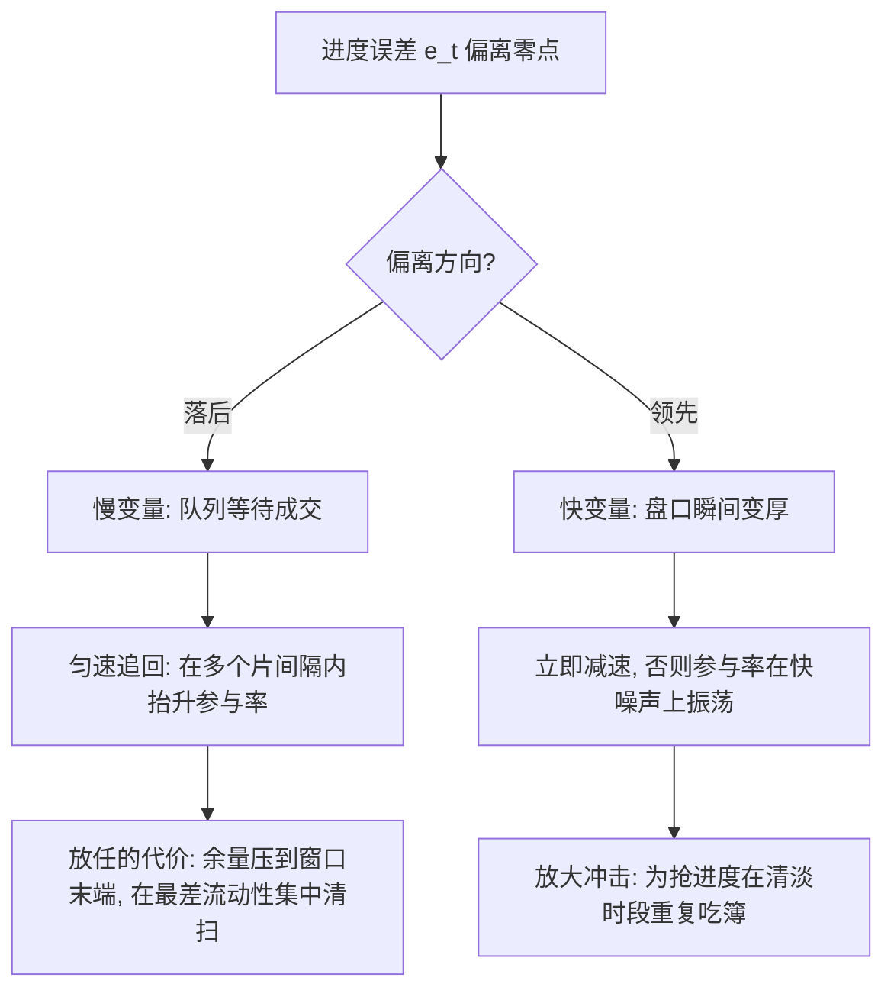
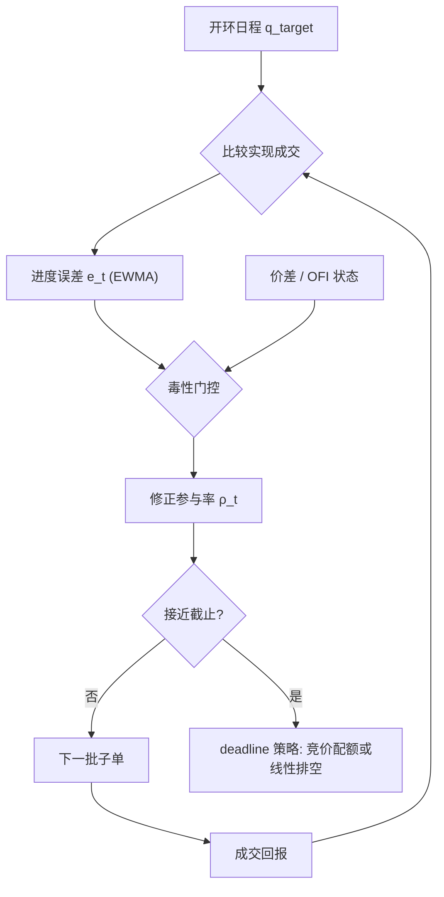

# 子单调度的深化

日程给计划，调度给修正：执行的质量不在计划曲线多漂亮，而在偏差出现后，修正律以多快速度、多大冲击把它收敛掉。

<footer>—— 据 Bertsimas and Lo, Dynamic Programming and Trade Execution, Journal of Financial Markets, 1998；Almgren and Chriss, Journal of Risk, 2000/2001 整理</footer>

[上一课](/quant/ex-algo-taxonomy-deep)把算法收成五根轴，分化最大的是决策轴：静态日程只回答「这一秒该完成多少」，不回答「没完成怎么办」。主干 [子单切片](/quant/child-order-slicing)定了量、间隔、类型三维，[自适应 POV](/quant/adaptive-pov) 给过控制律样例；本课把子单调度写成闭环控制：状态怎么取、增益怎么定、截止怎么守。不重推 AC 的双曲正弦。

## 问题

开环日程假设「目标即成交」。真实成交是随机的：限价片在队列里等 [成交概率](/quant/fill-probability)，市价片吃到的深度随盘口变，涨跌停与临停直接中断释放。累计成交于是随机偏离计划，记进度误差 $e_t=\hat q_t-q_t$（计划量减已成交量）。$e_t$ 不被处理，就滚成两种尾部：一路落后，余量压到窗口末端，在最差的流动性里集中清扫；一路领先，为抢进度在清淡时段重复吃簿。问题是设计修正律，使完成风险有界，而修正本身不再制造新冲击。

误差从哪来决定怎么修。队列等待造成的落后是慢变量，可匀速追回；盘口瞬间变厚造成的领先是快变量，追它会放大参与率。两类混进同一增益，算法在快噪声上振荡。

进度误差就是「计划减已成交」的欠账：计划到此刻应完成 60%，实际只成交 55%，误差就是 5% 的欠账。开环日程对这笔欠账视而不见，闭环调度把欠账本身当成输入信号，用来修正下一片的量。

### 状态、时钟与控制律

状态三元组：剩余库存 $x_t$、剩余时间 $T-t$、进度误差 $e_t$；外生状态：价差、波动、毒性。时钟可选墙上时钟、成交量时钟或风险时钟：成交量时钟把随机性对齐到流动性厚的时段，进度方差更小，见 [日内季节性](/quant/intraday-seasonality)。控制律写成参与率修正：

$$
\rho_t=\mathrm{clip}\Bigl(\rho_0\bigl(1+g\,\tfrac{e_t}{x_t}\bigr),\rho_{\min},\rho_{\max}\Bigr),
$$

落后为正则加速，领先为负则减速。增益 $g$ 应相对成交动力学定标：一次修正要在若干个片间隔内显效，而不是在每笔成交后反弹。毒性门控叠在外层：[订单流毒性](/quant/ofi-toxicity)升高时先压 $\rho_{\max}$，再谈追进度。

截止前收敛应预先编排：例如「完成八成不晚于八成时间」，剩余两成留给正常流动性，而不是全数压给尾盘。末端清扫在 TCA 尾部分位上的尖刺，几乎总对应一次失控的 $e_t$。

## 方法

落地为三个模块。观测：成交回报与时钟对齐，$e_t$ 用短窗平滑（EWMA），避免把部分成交的抖动当趋势。决策：控制律加硬规则——临近竞价段或收盘前 $\Delta$，切换到 deadline 策略：剩余量转入 [竞价配额](/quant/ex-auction-execution)，或按参与率上限线性排空，事先写死。执行：每片仍走 [子单切片](/quant/child-order-slicing) 的三维规格，调度只改片的量与间隔，使归因时「日程」与「接口」可分离。

增益用回放数据扫描定标：$g$ 过小等价开环，尾部照旧；过大则参与率在均值附近振荡。合适的 $g$ 使 $e_t$ 的自相关在几个片间隔内衰减，修正量的右尾不聚集在放量突发段。

增益 $g$ 可以类比淋浴水温旋钮的灵敏度：$g$ 太小像锈死的旋钮，水凉了半天没反应，等于开环；$g$ 太大则一点误差就猛调，水温来回振荡。合用的 $g$ 让欠账在几个片间隔内还清，而不是每笔成交后都反弹一次。

## 机制

反馈回路的失效方式可预测。其一，滞后振荡：回报延迟叠加增益过大形成极限环——加速、冲击、落后、再加速。其二，同步化：同批跑同类控制律的账户在价差恢复时一起加速，外生成交量假设失效，见 [自适应 POV](/quant/adaptive-pov) 的结尾讨论；对策是增益与片间隔带随机化，代价是进度方差。其三，目标污染：KPI 若是贴 VWAP，控制律退化成追踪器；调度必须挂在到达价或完成率上。

不用滚动最优控制代替规则表，是因为最优控制需要条件冲击与波动的在线估计，误差进入二阶项，规则表是显式可审计的次优。折衷是分层：低频层重估 $\rho_0$ 与上下限，高频层只跑修正律，两层分开审计。

## 边界

控制律假设误差可观测：成交回报延迟、暗池成交的打印滞后都会让 $e_t$ 偏大，落后被高估。填成概率模型在体制切换时失效，增益在恐慌日应预置收紧而非重估。A 股 9:20 后不可撤与 14:57 收盘竞价是硬截止，控制律须在节点前冻结。不要把归因残差拿去每日重估增益：参数按预登记节奏更新，否则调度层会把样本噪声写成规则。

初学者容易把 TCA 报告里尾盘集中放量的大单解读为「尾盘流动性好」，实际上那多半是进度误差一路落后、被控制律压到窗口末端的集中清扫——在最差的时点干了最多的活，冲击成本也最贵。

## 小结

- 调度是闭环控制：状态取剩余库存、剩余时间与平滑后的进度误差，输出参与率修正而非重画日程。
- 时钟选成交量轴可降低进度方差；增益过小退化为开环，过大在自身冲击上振荡。
- 毒性门控外置：先压上限再追进度；末端清扫是失控误差的标志。
- 反馈的三种失效——滞后振荡、同批同步化、基准污染——对策都抬高进度方差。
- 低频重估参数、高频只跑修正律，两层分开审计；硬截止节点前冻结。
- 出处：Bertsimas and Lo, *Journal of Financial Markets*, 1998；Almgren and Chriss, *Journal of Risk*, 2000/2001；切片三维见 [子单切片](/quant/child-order-slicing)。
