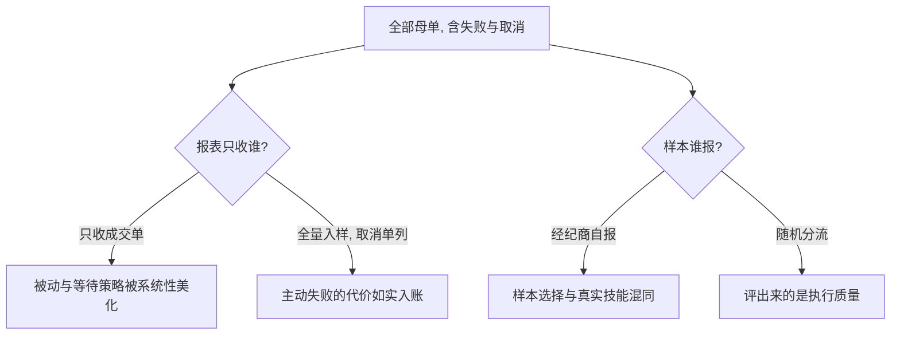
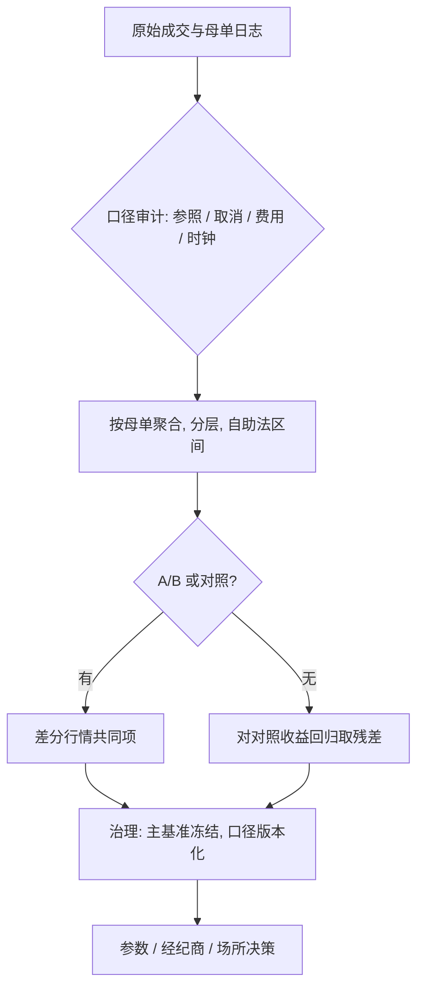

# TCA 的深化与陷阱

TCA 的每个数字都是估计量：有方差、有偏、且被考核重塑行为；不写抽样与口径的 TCA 报告，只是一张记分牌。

<footer>—— 据 Perold, The Implementation Shortfall, Journal of Portfolio Management, 1988；Berkowitz, Logue and Noser, Journal of Finance, 1988 整理</footer>

[上一课](/quant/ex-multiasset)把组合缺口定为唯一加总口径。主干 [成交后分析 TCA](/quant/tca) 与 [滑点归因](/quant/slippage-attribution) 给了基准与拆项；度量与案例单元由此进入。本课不加新科目，写的是把它当计量来做：统计功效、选择偏误、被 KPI 重塑的行为。

## 问题

交易台常见的比较：算法 A 本季相对到达价省 3 个基点，算法 B 费 1 个基点，结论换 A。单笔母单滑点的标准差常以几十个基点计，每季几百笔的均值标准误仍在 1–2 个基点量级——4 个基点的差距可能全是噪声。更隐蔽的是偏误：被取消的母单常不进报表（它们恰是被动等待失败的部分）；经纪商考核用经纪商自报的样本；暗池打印滞后使场所间时间窗不可比。方差与偏误未声明时，一切「谁更好」都不可证伪。

标准误回答的是「均值本身有多不确定」：单笔滑点上下几十个基点，几百笔平均后才缩到 1–2 个基点。看到 4 个基点的差距，先问一句这个差距有没有量准，再谈谁更好。

第二层是激励。TCA 指标同时是考核指标时，被度量者会优化指标而不是成本：把到达时点后挪让参照价更有利、把截止前的成交对齐基准、把难做的单推进不计入的时段。

### 功效、分层与配对

功效先行：解读差距前先算标准误——按母单聚合的自助法置信区间，不把子单当独立样本（子单共享冲击与时机）。分层轴必须全是**事前**变量：波动桶、规模对 ADV、紧急度、日期类型（指数日、事件日单独成层，见 [波动执行的专门问题](/quant/ex-vol-execution)）；用事后结果分层等于把答案藏进分层里。配对优先于前后比较：同类母单在两条规则间随机轮换（A/B），把行情作共同项差掉；做不了随机化时，把滑点对同期对照收益回归，取残差比较。

最低样本量可以反推：要检出 3 个基点、单笔标准差 30 个基点的差距，约需 $(2\times1.96\times30/3)^2\approx 1500$ 笔母单；多数交易台一个季度、按算法各分到几百笔就下结论，功效严重不足。

## 方法

口径审计清单，逐项过：参照价的到达时点定义（决策价与到达价分列，见 [滑点归因](/quant/slippage-attribution)）；未完成与已取消的会计处理（取消母单单列）；费用与返佣的净额口径（返佣记负费用会诱导路由偏向返佣所）；暗池与跨所打印的时间基准；金额加权与等权两套并报。口径冻结在度量规范里随代码版本管理；改口径的历史在页脚披露。

返佣是经纪商按成交量返给客户的回扣。把返佣记成负费用，报表成本立刻变低，但它诱导路由偏向给返佣的场所——账面省了钱，真实成交成本未必省，这就是「口径改变行为」的典型例子。

制度性实验：路由与日程参数的变更走 A/B 轮换或阶梯 rollout，保留随机化种子；无法实验时用断点或对照集并声明设计。经纪商与场所的评价只基于随机分流——把容易的单分给某家再考核滑点，评出来的是分流规则不是执行质量。

## 机制

为什么偏误方向可预测：主动规则的失败单更容易被取消（价格走掉了），「只算成交单」系统性美化被动与等待策略；赢了评比的经纪商吸引更多流量，样本选择与真实技能混同。为什么窗口期是战场：截止前的对齐让「贴基准」变好而总成本不变甚至更差，Perold 用纸面组合定义缺口，就是为切断对基准的循环引用。方差侧，共同行情使有效样本量小于名义样本量：同一日的几十笔母单共享一个市场运动，按日分块的自助法才是诚实的不确定度。

## 边界

TCA 无法在没有实验的情况下证明因果：场所对比永远有「那家拿到的单不一样」的竞争假说。跨资产不可比：外汇点差惯例、期货展期与结算价使股票式基点口径失真。单季度是一个体制样本，[波动执行的专门问题](/quant/ex-vol-execution) 的分层必须前置而不是事后剔除。度量基础设施有成本与时滞：时间戳与时钟同步决定几个基点的分辨率。TCA 回答「做得好不好」，回答不了「该不该做」——后者是 [成本预测模型](/quant/ex-cost-forecast) 的事前问题。

初学者容易把 TCA 报表当客观记分牌，实际上从参照价取哪格时间戳、到取消单算不算，每一步都是可争议的建模决策。先审口径再看数字，否则比较的可能只是两份报表的制作方式。

## 小结

- TCA 数字是估计量：先报标准误与有效样本量再谈差距；子单不是独立样本。
- 分层轴全部事前；取消与未完成母单单列，否则被动策略被美化。
- 配对实验优于前后比较；口径清单（参照价、取消、返佣、时钟）冻结并版本化。
- 基准窗口是对齐行为的战场；Perold 的纸面组合口径切断循环引用。
- 经纪商与场所评价只认随机分流的流量；单季度结论按体制分层。
- TCA 管事后评价，成本预测管事前决策，两个方向不可越界。
- 出处：Perold, *JPM*, 1988；Berkowitz, Logue and Noser, *Journal of Finance*, 1988；分解框架见 Kissell 的执行质量论述。
