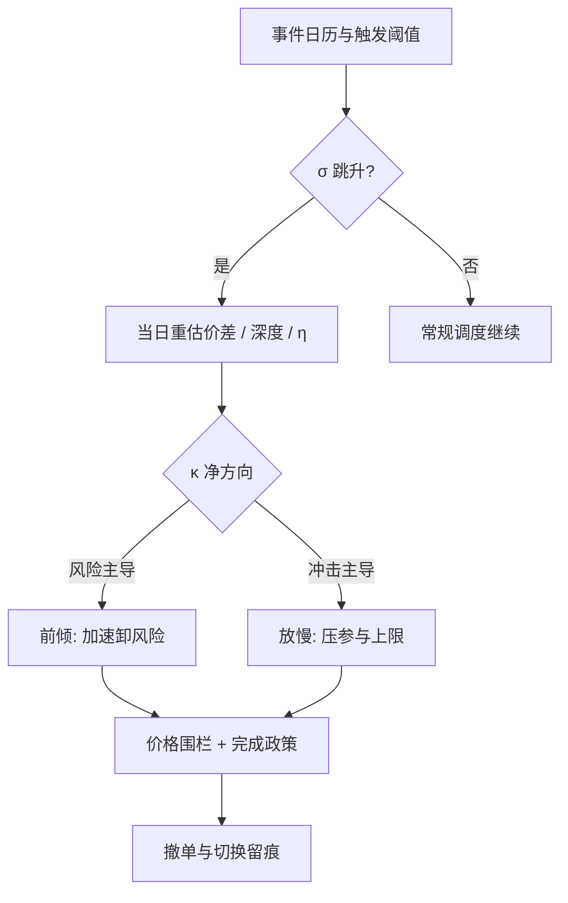

# 波动执行的专门问题

波动不改变执行问题的形式，改变的是每一个参数：价差、深度、σ、相关性与所有人的风险厌恶同时跳变；体制切换不是扰动项，是执行算法的第一等公民。

<footer>—— 据 Brunnermeier and Pedersen, Market Liquidity and Funding Liquidity, Review of Financial Studies, 2009；Almgren and Chriss 对 σ 进入最优轨迹的论述整理</footer>

[上一课](/quant/ex-auction-execution)在一次性出清里选申报点，现在回到连续时段，但让状态极端化。前面各课的公式都默认参数平稳：价差取均值、深度取均值、$\sigma$ 取预测值。恐慌日这些假设同时破裂，问题不是「换参数重算」，而是哪些环节该自动反应、哪些该冻结。

## 问题

σ 跳升沿四个通道改写执行。价差：逆向选择与做市库存分量同时走阔，见 [买卖价差成本](/quant/spread-cost)，taker 起步成本翻倍。深度：报价撤走，[毒性流与停报价](/quant/toxic-flow) 的机制——报价的期权价值随波动上升，撤单是做市商的理性反应。风险预算：VaR 类限额随 σ 收紧，等效 $\lambda$ 跳升，[Almgren–Chriss 最优执行](/quant/almgren-chriss) 的 $\kappa^2=\lambda\sigma^2/\eta$ 里分子两个因子同向放大。制度约束：涨跌停、熔断、临停截断可执行集，见 [涨跌停与流动性黑洞](/quant/cn-limit-liquidity-hole)。四个通道时标不同：价差秒级、预算分钟级、熔断随机。

问题于是是：哪些参数允许在线重估，哪些必须事前冻结？恐慌中现场调参，等于把一次不可复制的样本写进生产系统。

### 紧迫度的重推与参数的分层

AC 的 $\kappa$ 在恐慌日的方向并不显然：$\sigma$ 与 $\lambda$ 上升推高 $\kappa$（更前倾、更快卸风险），但 $\eta$——每单位参与率的冲击——同样上升（深度变薄），压低 $\kappa$。净方向不可先验断定，必须用当日的价差与深度重估 $\eta$ 再算。工程化做法分三层：外层是事件日历（财报、到期、宏观数据），事前收紧参与率上限与价格保护；中层是状态触发（价差、深度、波动超过阈值），触发预登记的参数切换，而不是临时调参；内层是调度与接口逻辑，保持不变以保证归因可比。冻结清单与切换清单都进规格文档。

参与率的分母在恐慌日失真：ADV 是常态样本的均值，而恐慌日的可成交深度可能只有常态的一两成。按常态 ADV 算出的 $q/\mathrm{ADV}=5\%$，真实瞬时参与率可能已是四成——分母要换算成当日已实现或盘口推算的深度。

## 方法

价格保护：所有子单带限价围栏，相对中点或最近成交价留固定基点带，防止恐慌跳跃中市价子单吃穿数档；围栏触发不是重试信号，应上报并等待状态确认。接口切换：波动升高时从排队转向吃簿或转入 [竞价配额](/quant/ex-auction-execution)，把无限等待换成有界成本；此时 [子单调度的深化](/quant/ex-slice-scheduling-deep) 的毒性门控应已压低参与上限。熔断与临停：暂停期间的申报规则、复牌竞价的处理预置在状态机里。完成政策：恐慌日允许显式放弃并把余量计入机会成本，与投资端事先约定；强行完成会把尾部清扫做成最大的一笔冲击。

## 机制

同步性是恐慌日执行成本的放大器。所有按风险预算运转的交易台在 σ 跳升时同时前倾，各自把他人当作外生流动性，合计冲击远超单账户模型；这是 [到达价格算法](/quant/arrival-price) 拥挤问题的极端版。流动性螺旋补上第二级：价格下跌—资金压力—报价收缩，市场与资金流动性互相加强，见 [流动性螺旋](/quant/liquidity-spiral-risk)；此时「等价差恢复」本身就是有风险的仓位。经销商 gamma 一类机制性流（[经销商正负 gamma 体制](/quant/dealer-gamma-regime)）在特定价位制造方向可预判的对冲流，恐慌日与之重叠时条件 $\eta$ 离散度极大，点估计失去意义，应带分布进入调度。

## 边界

校准于平静日的冲击系数与填成概率在恐慌日全部失效，历史回放对极端日的代表性有限，参数切换只能靠事前登记的规则而不是回测最优化。TCA 必须按波动体制分层，否则恐慌日的执行会污染全样本均值。合规上，恐慌日的撤单率与报撤比受监控，见 [差异化收费与撤单率监控](/quant/cn-fee-cancel-ratio)，防御性撤单也要留痕可解释。最后是能力边界：执行算法能做的是不把恐慌变成自己的事故，不能把恐慌变成 alpha。

## 小结

- 恐慌日四个通道同时跳变：价差、深度、风险预算、制度约束，时标各不相同。
- $\kappa$ 的净方向不可先验断定：$\sigma,\lambda$ 推高、$\eta$ 压低，须用当日深度重估。
- 参数分三层管理：事件日历、预登记的状态触发、冻结的调度与接口逻辑。
- 全部子单带价格围栏；熔断与复牌竞价预置在状态机里；完成政策允许显式放弃。
- 同步前倾与流动性螺旋放大成本，条件 $\eta$ 应带分布而不是点估计。
- TCA 按波动体制分层；恐慌日撤单留痕；执行的目标是不添乱，不是套利。
- 出处：Brunnermeier and Pedersen, *RFS*, 2009；Almgren and Chriss, *Journal of Risk*, 2000/2001；价差分解见经典微观结构文献。
