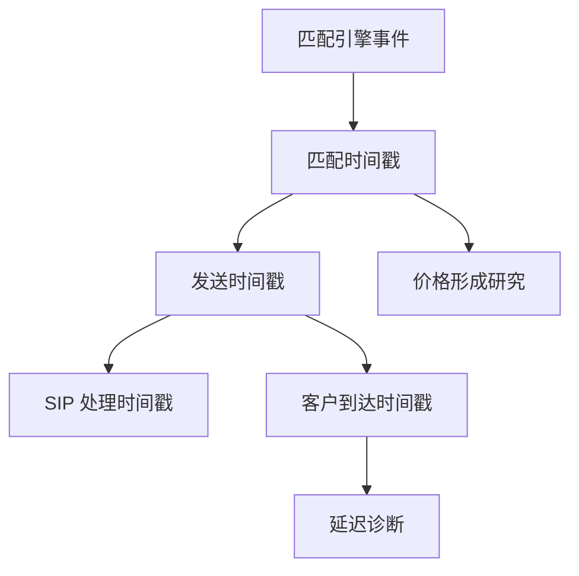

# 交易所时间戳与经纪商时间戳

行情记录上的时间字段可能是撮合引擎的时钟，也可能是经纪商或行情商写入的时钟。字段名字都叫 timestamp 时，对齐仍然没有定义。

<footer>—— 据 Hasbrouck 对逐笔数据时间戳来源与精度的讨论；对照 FINRA / 交易所对时钟同步的公开要求</footer>

[SIP vs 直连](/quant/sip-vs-direct)选定了管道。[交易系统](/quant/exchange-vs-broker-ts)已经从订单路径写过两套业务时钟。本课的缺口是**行情契约里的字段**：数据商文件中的 `timestamp` 究竟是交易所匹配时间、交易所发送时间、SIP 处理时间，还是经纪商收到时间。研究常把它们当成同一个「事件时间」，于是跨所领先滞后、有效价差、甚至日 bar 的开盘都会错。后课 PTP/GPS 写如何把不同引擎的钟校准到同一时间基；本课先要求把字段读懂。不重复订单状态机。

## 问题

一份直连 ITCH 可能带 matching engine timestamp。一份 SIP 可能带 SIP 收到各所报文的时间。一份经纪商推送可能带客户到达时间。三者都可以标成纳秒。精度不等于来源。用经纪商到达时间去重建本所簿的时间优先，等于用你的网络路径改写了市场。用 SIP 处理时间去算直连成交的中点，等于用慢钟给快事件贴标签。缺口是数据字典：每个源的每个时间字段映射到哪一种物理事件。

与系统课的差别：系统课决定生产 PnL 的主键；本课决定研究样本里「同一毫秒」的含义。两者应一致，但历史数据库往往只有数据商的一个戳，必须在文档里写清它是哪一种，而不是假定等于系统主键。

### 发送时间、匹配时间、参与者时间

匹配时间：引擎产生成交或报价更新的时刻，最接近价格形成。发送时间：报文离开交易所网关，已含内部排队。参与者/客户时间：你的网卡。监管时钟同步要求（后课）针对的是交易所与报告参与者，不是针对你的笔记本。研究领先滞后必须用匹配时间（并已校准）；延迟预算必须用参与者时间减匹配时间。用错字段，会把管道延迟当成价格发现。

TAQ 一类产品的时间戳定义随年代变。早期秒级、后来毫秒、再后来微纳秒，中间还换过源。拼接几十年样本必须读各期手册，不能假设字段不变。

## 方法

对每个数据集写一页契约：字段名、定义、时钟源、精度、是否单调、与序号的关系。重建簿只用匹配时间加序号。计算到达延迟时另存参与者时间。缺失匹配时间时，降级声明：结论只关于该馈送的到达过程，不是关于引擎内的价格发现。跨源合并前，先看后课对时；未对时的合并禁止做领先滞后。

检查：同一成交在交易所官方回放、SIP、经纪商三套文件上的三个戳，差的分布应合理（非负的传输延迟、SIP 多一跳）。若经纪商戳早于匹配时间，不是 alpha，是时钟未同步或字段填反。

### 成交与报价戳必须成对定义

Lee–Ready / EMO 需要「成交前最后报价」。若成交用匹配时间、报价用 SIP 时间，最后报价可能是未来或过时。同源同一种时间字段，是方向分类的前提。碎片化下本所成交对本所匹配时间的报价，全国有效价差对 SIP 时间的 NBBO，两套会计分开报。

## 机制

时间戳定义决定你把因果箭头画在哪。匹配时间上的报价更新导致随后成交，是价格形成。到达时间上的「报价晚于成交」，可能只是你的包后到。O'Hara（2015）强调高频下「何时算一笔交易」本身是对象；对象先被字段定义，再被经济解释。把字段问题当成微观结构发现，会制造虚假的超前交易。

加密 websocket 的服务器时间常常是发送时间甚至应用层时间，不是撮合时间。永续标记价格还有自己的计算时钟。不要把股票 ITCH 的匹配时间假设套过去。

### 字段精度随产品年代变化

同一「TAQ timestamp」在不同年代可以是秒、毫秒或微纳秒，源也可能从 SIP 换到另一汇总。拼接长样本必须按手册分段，否则领先滞后是精度阶跃。

## 边界

本课不校准振荡器，那是下一课。经纪商内部还有账本日期与业务截止，属于估值。债券 TRACE 的报告时间又是另一字段，见本课序最后一课。字段读错时，宁可不做领先滞后。

客户到达早于匹配时间，优先当字典填反或未对时，不当做信息优势。先修系统课的主键在研究库里必须能找到对应字段。

## 小结

- timestamp 字段必须映射到匹配、发送、汇总或到达，精度不能代替定义。
- 价格发现用匹配时间；延迟预算用到达减匹配。
- 方向分类要求成交与报价同一字段定义。
- 客户戳早于匹配戳，优先当对时或字典错误。
- 历史产品字段随年代变，拼接要读手册。
- 出处：Hasbrouck 对微观结构数据手册式处理；O'Hara, *Journal of Finance*, 2015；各 SIP / 交易所馈送规格。
