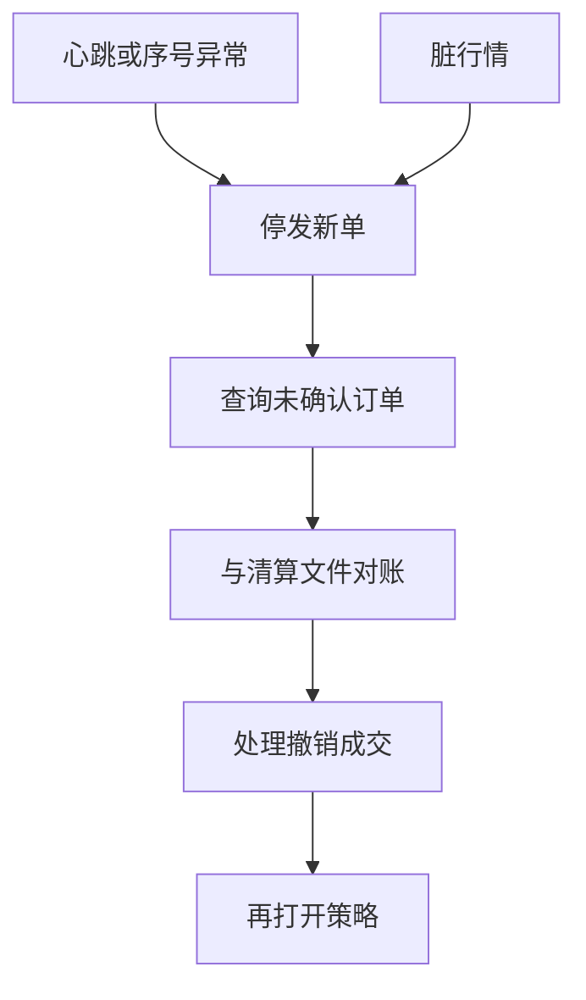

# 交易所故障

撮合核一旦停或发脏数据，时间优先变成无定义：未确认订单、过时行情与跨市场对冲腿会同时处于不确定状态。事故回放靠日志与时钟，不靠盘后 OHLC。

<footer>—— SEC, Knight Capital Americas LLC, Release No. 70694（2013 年 10 月 16 日）；CFTC–SEC, Findings Regarding the Market Events of May 6, 2010；对照 NYSE 2015 年 7 月 8 日交易中断的公开说明</footer>

[上一课](/quant/timestamp-precision)把回放主键定为序号与校准时钟。本课的缺口是**引擎或发布管道离开契约**：停机、错误映像、脏行情、部分标的不可用。Knight Capital 2012 年 8 月 1 日因部署错误在约 45 分钟内制造巨额损失，SEC 处罚令把变更管理写成监管对象。[闪电崩盘](/quant/flash-crash-2010)是流动性路径；本课是基础设施路径。后课 CCP 处理成交之后的违约，不处理「成交是否发生过」。

## 问题

故障不是单一状态。至少要拆：撮合核停（无法新成交）、行情停或乱序（本地簿不可用）、网关拒单（意图进不去）、部分标的分区故障（组合缺腿）、以及错误成交后的撤销/调整。策略若把「交易所可用」当成常数 1，风控闸门永远不会为基础设施开火。问题是把可用性写成标的–通道–时刻的过程，并规定每种状态下的合法动作：只撤不发、全撤、停止对冲、或等待官方指示。

Knight 的教训是生产变更：旧代码路径被错误激活，订单进入错误的行为映射。这与市场 alpha 无关，与[监控](/quant/trading-telemetry)的「拒单与心跳」有关——若心跳只看 PnL，发现时损失已经实现。NYSE 2015-07-08 等中断说明：股票停、衍生品与国际上市仍在交易，跨市场对冲的基差变成不可交易的缺口。Facebook 2012 IPO 则是开盘拍卖与技术过载叠在一起，成交确认延迟使「是否成交」在一段时间内未知。

### 不确定成交比明确停机更难

停机时，未确认订单应按规则视为未知：可能已成、可能未成、可能在重启后丢失。重复发送同一 ClOrdID 可能重复成交，也可能被拒。正确动作是停发新单、按交易所恢复程序查询、用 Drop Copy 与清算文件对账，而不是用行情「看起来没动」去猜测。脏行情（错误价格打印）会使止损与盯市触发真实成交；需要独立的价格 sanity（相对前成交、相对关联合约）而不是单一源。

熔断、LULD、A 股临停是制度内状态，有规则可循，见涨跌停与停牌课。本课对象是规则未覆盖的技术失败：主机、映像、发布、链路。两者在监控上应分原因码，不要都叫「流动性差」。

## 方法

状态机：`normal / stale_md / matching_halt / query_pending / recovery`。`stale_md` 来自行情序号缺口或心跳超时，禁止依赖名次的新限价，允许或不允许仅减仓取决于产品规则。`matching_halt` 来自交易所公告或报盘全部拒绝。`query_pending` 在重启后禁止对冲直到订单状态与清算头寸对齐。演练用历史中断日重放：假定行情冻结、假定错误成交稍后 bust，检查模拟器是否仍在「成交价」上继续记账。

跨市场：一所停、另一所开，基差不是 alpha，是缺腿。自动对冲应在检测到一条腿的基础设施失败时停止，而不是用另一所去「补」。恢复顺序：官方公告 → 时钟与序号以谁为准 → 未完成订单列表 → 成交 bust 名单 → 再打开策略。顺序反了会在脏状态上交易。

### 变更管理是交易系统的一部分

可交易清单应包括：映像版本哈希、配置版本、可回滚点。研究环境与生产环境的配置漂移本身是故障源。把「今天换了风控阈值」写进研究日志，与把因子改参写成同一纪律，见后课研究日志。

## 机制

连续簿假设状态机活着。故障把全序切断：之后的时间优先无定义，直到新的权威日志开始。客户侧旁路与 FPGA 不会让你在核停时成交，只会让你更快地发现「没有回报」。发布故障可以比撮合故障更常见：成交在发生，行情没有，本地簿与真实簿分叉——处理同[快照增量](/quant/snapshot-incremental-feed)的 desync，只是规模变成全市场。

跨资产传染：ETF、期货、期权共用信息。一所脏价格会通过套利算法打进另一所，直到人工或熔断切断。这是 2010 年路径的基础设施版：供给函数还在，但输入是错误状态。

## 边界

不提供利用故障窗口攻击系统或诱导错误成交的方法。事故细节以监管文书与交易所公告为准，不要用传闻补时间线。加密交易所停机、银行内部撮合中断，机制类似，规则不同，不能直接套用 SEC 文书。

## 小结

- 故障要分核停、行情脏、缺腿、不确定成交；合法动作是停发与对账，不是猜。
- Knight 把变更管理写成监管对象；跨所中断把基差变成缺腿。
- 恢复顺序：公告 → 权威日志 → 订单与 bust → 再交易。
- 出处：SEC Release No. 70694（Knight）；CFTC–SEC 2010 联合报告；NYSE 公开中断说明。
