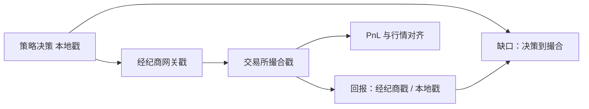

# 交易所 vs 经纪商时钟

同一笔成交有两个「何时」：撮合引擎写下的交易所时间，以及经纪商网关或你的主机关上收到回报的时间。对账若混用，延迟腿和实施缺口会变成两套账。

<footer>—— 据 Hasbrouck 对逐笔时间戳来源的讨论；对照 Perold 把决策到成交的时间写入实施缺口</footer>

[监控：PnL、敞口、拒单](/quant/trading-telemetry)要求每个数字声明时钟。[迟到数据与对账](/quant/late-data-recon)已经引入交易所戳与到达戳。本课的缺口是生产路径上的**两套业务时钟**：交易所撮合时钟与经纪商（或 DMA 网关）时钟，它们如何进入订单状态机、如何与行情对齐、以及哪一套可以当成交的法律时间。附录 [交易所时间戳与经纪商时间戳](/quant/exchange-broker-clocks)从数据源契约再写一遍；本课写交易系统：下单、回报、风控闸门必须选主键。后课序号缺口依赖你已经用交易所序号而不是本地到达序。

## 问题

订单生命周期上至少有：策略决策时间（本地）、发送时间、经纪商收到时间、交易所收到时间、撮合时间、交易所回报时间、经纪商回报时间、本地收回报时间。监控若把「成交时间」随便标成其中某一个，盘中 PnL 会把仓位乘错价格：行情用交易所时钟更新，成交却用本地到达，看起来像未来函数或像巨大滑点。缺口是规定主键：撮合与行情对齐用交易所时钟；延迟诊断用本地与经纪商时钟之差；客户账单可能用经纪商时钟——三套都要存，只用一套做主键。

经纪商时钟还会掺入队列：你的单在经纪商内部风控停了一毫秒，交易所戳看不到这一毫秒，但实施缺口的延迟腿在这里。把所有延迟都归因于「到交易所的网」，会去优化错的一跳。

### 主键不能按「哪一个更细」来选

纳秒交易所戳看起来更高级，若未与行情同源，细只是假精度。经纪商毫秒戳若与客户协议一致，账单对得上，但仍不能拿去和 Level-3 对队列。方法是：存储全部戳，计算只用声明的那一个。回测重放必须用与实盘相同的主键，否则模拟器偏差会表现为「实盘总是慢」。

多市场时，两个交易所的时钟即使都叫 exchange_time，也不在同一时间基上，除非做了 GPS/PTP 校准。跨所价差研究的主键问题见附录对时课；本课先要求：本所成交对本所撮合戳。

## 方法

订单事件表字段：`exch_ts`, `broker_ts`, `local_send_ts`, `local_ack_ts`，外加交易所序号。PnL 与敞口按 `exch_ts` 对齐行情。延迟仪表：`local_ack_ts - local_send_ts`（往返）、`exch_ts - local_send_ts`（单向的有偏估计，含时钟差）、`broker_ts - exch_ts`（回报路径）。闸门：超时用本地时钟（你是否活着）；错价与自成交用交易所时钟（市场发生了什么）。

对账：日终与经纪商账单对 `broker_ts` 与成交编号；与交易所官方成交回放对 `exch_ts` 与序号。两边都能对上，才说明没有丢回报。只能对上一边，是本课与下一课序号缺口的交界。

### 集合竞价的「成交时间」是出清时刻

开收盘与波动再开盘，大量成交共享同一交易所时间。经纪商可能逐笔推送、时间戳被本地到达拉开。按经纪商时钟看，开盘像一串连续成交；按交易所时钟看，是同一瞬时批量。体制卡上的高频策略若用经纪商戳去排开盘队列，对象是错的。系统应保留拍卖标志，避免把批量拆成虚假的时间优先。

## 机制

两套时钟之差进入期望的方式，是错位的标记。用本地到达给成交打上「晚于行情」的戳，会把本已发生的撮合当成尚未发生，库存短时间错误，做市偏度报价会反了。用交易所戳去衡量「我们是否在截止前发出」，又会忽略经纪商内部排队，导致集合窗口前的假安全感。Perold 的实施缺口要把决策价钉在决策时钟、成交价钉在撮合时钟，中间的差才是延迟腿。混用时钟，延迟腿会吸收标记误差。

不要把时钟差解释成 [Kyle](/quant/kyle-model) 的信息优势。那是工程错位，不是知情交易。先对账，再谈 alpha。

### 账单时钟可以对、撮合时钟仍可以错

与经纪商对上金额，只说明 `broker_ts` 与编号一致。与交易所回放对不上，仍可能丢撮合事件。两套对账都要通过，主键才能同时服务 PnL 与法律成交。

## 边界

托管行、基金会计还有第四套日历（业务日截止）。那是估值，不是撮合。本课不讨论如何设置物理时钟源，只要求字段分离。下一课：即使时钟对了，序号跳号仍表示丢包。

多市场不要用一个本地到达序去当全局主键。没有对时的跨所「同一毫秒」没有定义。

## 小结

- 撮合与行情对齐用交易所时钟；延迟诊断用本地/经纪商时钟；账单用协议约定时钟。
- 三套都存，主键声明，回测与实盘一致。
- 拍卖成交共享撮合时间，不要用到达戳拆成连续时间优先。
- 实施缺口的延迟腿在混用时钟时没有定义。
- 跨所比较还需要对时，本课只锁本所主键。
- 出处：Hasbrouck 对微观结构数据时间戳的处理；Perold, 1988；迟到对账见 Croushore–Stark 的实时数据精神在交易上的对应。
