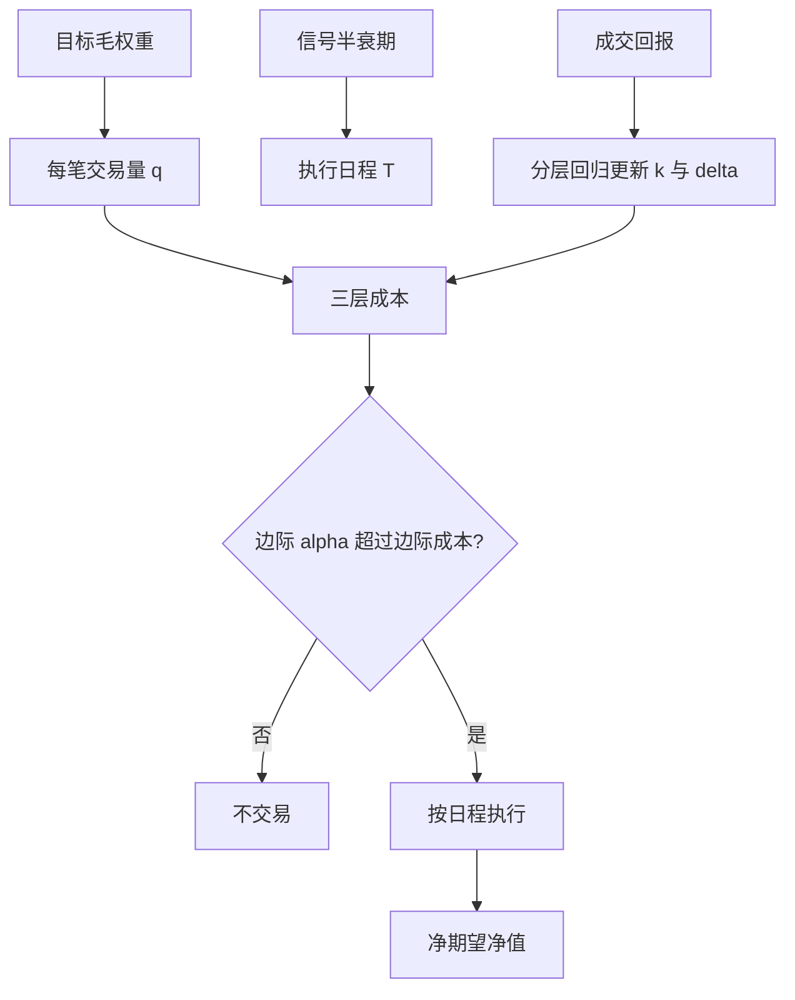
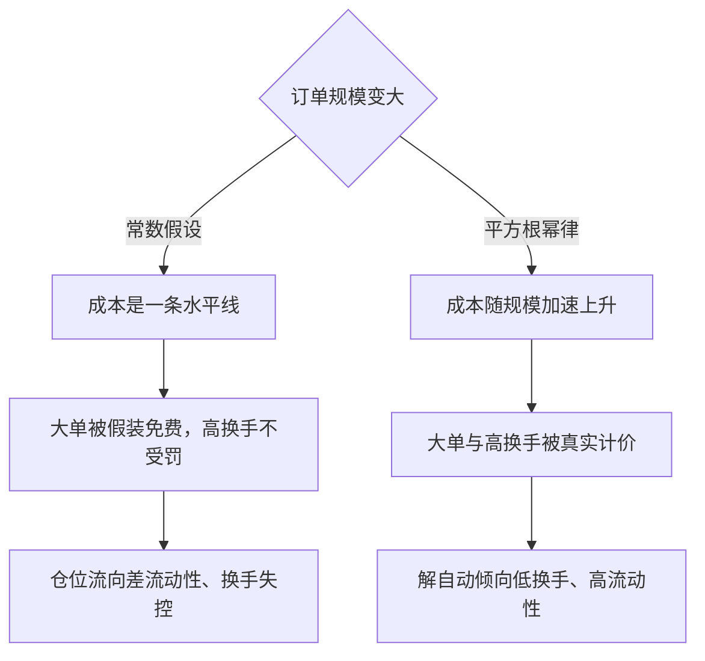

# 执行成本预测

事前的成本预测决定该不该交易，事后的缺口只决定做得好不好；两者共用一套冲击模型，回答的却是两个问题。

<footer>—— 据 Perold, The Implementation Shortfall, Journal of Portfolio Management, 1988；Almgren et al., Risk, 2005 整理</footer>

[上一课](/quant/portfolio-integration-cap)把通过检验的信号正交化、加权、加约束，交出一组目标毛权重，而解权重时成本多半只是占位符。本课把执行成本作为 alpha 换成净值的**最后折扣**：同一组毛权重按不同成本假设折出的净值可以差出一半；换手越高、市值越小，折扣越大。冲击模型的经验与校准已在[线性与平方根冲击](/quant/sqrt-impact)讲过，执行日程的最优解在[Almgren–Chriss 最优执行](/quant/almgren-chriss)讲过；本课只做它们与组合层的接口：怎么事前估、怎么接回决策、不确定性怎么改仓位。

## 问题

组合层最常见的成本错误是把交易成本写成常数基点。常数假设对小单是高估（半价差占大头），对大单是致命低估：冲击随参与率按幂律增长，无上限的成本形状被一条水平线抹平。后果有二：换手被「假装免费」，信号每微变一次就全翻一遍；仓位流向流动性差的名字，因为那里毛 IC 往往最高。两个错误回测里都不可见，实盘里都兑现为缺口。

时点错配是第二个缺口：把冲击全算在开工那一刻，慢信号被冤枉；假装摊开免费，快信号被高估。成本是「日程的函数」而不是「量的函数」——把冲击模型接进组合层时，必须记住这个变量替换。

ADV 就是日均成交量，参与率 $q/\mathrm{ADV}$ 是「你的单量占这只股票一天成交量的比例」。参与率 10% 意味着当天市场每成交 10 股就有 1 股是你——价格被你自己的单子推着走，这就是冲击的来源，也是它按参与率而非绝对量计算的原因。

### 三层成本，三种对策

单位成本至少拆三层：半价差截距 $s/2$、按参与率的临时冲击 $k\sigma(q/\mathrm{ADV})^{\delta}$、改写公允价的永久项。价差段靠降频与被动挂单省；冲击段靠摊薄参与率省；永久段省不掉，它决定该不该交易。混在一层就会得出「不如快点付」或「慢慢来便宜」这类只对一段成立的结论。

平方根律下总成本 $\propto q^{3/2}$：平均成本随规模上升、边际成本随规模下降，小单被价差截距主导，大单反而「越加越便宜」。按边际成本思考的优化器会在大名字上过度集中——必须配单名与参与率硬上限。

## 方法

**事前估**：对每笔目标交易 $q_i$ 用三层公式算 $\hat c_i$；日程 $T_i$ 由信号半衰期给，衰减快的信号不许用「摊平冲击」的长日程。**接回决策**：判据是边际比较——预期边际 alpha $\gt$ 边际成本才动。优化器不直接吃 $q^{3/2}$：优化层用凸惩罚做代理，执行层按日程交付真实缺口，两套口径定期核对。**回写**：实盘成交回报按波动与市值分层回归，更新 $k$ 与 $\delta$；回写只改成本参数，不改信号定义——改定义就是新试验。

成本不确定性进入决策的方式是把 $\hat c$ 换成保守分位：参数 $k$ 置信区间的上端，或压力情景（价差翻倍、深度减半）下的成本，替代点估计进判据。效果等价于下调预期收益：勉强过零的交易不再做，仓位整体收缩——这是对「成本参数本身是估计」的定价，不是拍脑袋保守。

代个数比较量级：价差 10 个基点的小单，一买一卖大约付 10 bp；换成日波动 2%、参与率 10% 的大单，临时冲击约 $2\%\times\sqrt{0.1}\approx63$ bp，是价差段的六倍多。同一策略在两类单上的主导成本完全不同，这正是「常数基点」假设失真的样子。

## 机制

成本折扣改变的不只是净值水平，还有组合的形状。平方根的凹边际使成本对规模温和、对换手严酷：翻倍仓位的成本远多于翻倍换手的成本，成本模型天然惩罚「高换手加大集中」。写进优化器后，解自动向低换手、高流动性倾斜——这是 alpha 与成本的正确相对价格。

不确定性的机制要点在凸性：估计误差平均下来总是多付而非少付，保守分位近似正确方向的修正。反过来，用乐观成本做回测再拿实盘「验证」，缺口就是模型误差与运气混在一起的残渣，事后无法归因。

初学者容易觉得「用保守分位是胆子太小」。机制上这是凸性修正：参数估错时，多付的损失比省下的收益更大，误差平均下来总是净亏。把成本换成高分位，等价于给预期收益打折——勉强过零的交易自动出局，这是在给「参数本身也是估计」定价。

## 边界

校准域外不外推：涨跌停使 $q$ 不可执行而非更贵，危机与拥挤使 ADV 分母失真，这两类日子应把可执行集当硬约束而不是放大 $k$。预测与归因分工：本课的模型回答事前，成交后的缺口归因回答事后，两者必须同一到达价、同一分层。成本预测给的是期望与分位，不是保证：回答「该不该交易、以什么节奏」。

## 小结

- 执行成本是 alpha 换净值的最后折扣：换手越高、市值越小，折扣占比越大。
- 常数基点成本对小单高估、对大单低估，会同时制造过度换手与向差流动性集中。
- 成本拆价差、临时、永久三层，分别对应降频、摊薄参与率、判断该不该交易。
- 优化层用凸代理、执行层按日程交付，判据是边际 alpha 对边际成本。
- 成本不确定性用保守分位进决策，等价于下调预期收益、收缩仓位。
- 出处：Perold, *JPM*, 1988；Almgren, Thum, Hauptmann and Li, *Risk*, 2005；模型细节见[线性与平方根冲击](/quant/sqrt-impact)与[Almgren–Chriss 最优执行](/quant/almgren-chriss)。
