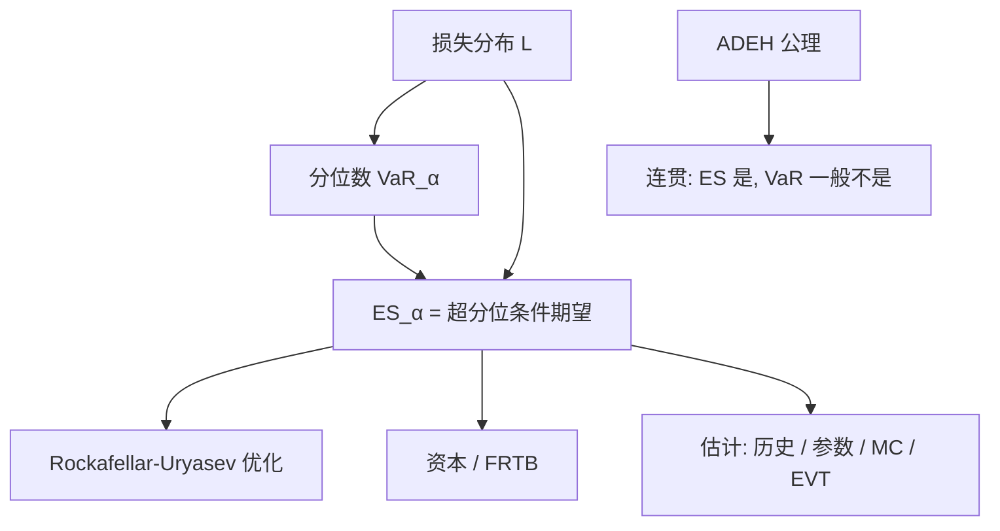

# Expected Shortfall

连贯的风险度量必须对分散化给奖励：合并之后的风险不得大于分开计量之和。分位数一般不满足这条；超过分位数之后的条件期望满足，因而成为监管与组合优化里替代 VaR 的尾部对象。

<footer>—— Artzner, Delbaen, Eber and Heath, Coherent Measures of Risk, Mathematical Finance, 1999</footer>

Artzner、Delbaen、Eber 与 Heath（1999）问的不是「99% 分位数怎么算」，而是「什么样的映射 $\rho$ 才配称为风险」。他们列出平移不变、正齐次、单调、次可加四条公理，满足者称为连贯（coherent）风险度量。VaR 作为分位数，在一般分布下次可加失败：把两个各自看起来安全的产品并在一起，合并 VaR 可以上升。Expected Shortfall（ES，也称 CVaR、尾部条件期望 TCE 的恰当版本）取超过 VaR 之后损失的条件期望，Acerbi 与 Tasche（2002）证明在连续分布上它连贯，并澄清了若干定义之间的差别。Rockafellar 与 Uryasev（2000）给出把 CVaR 写成辅助变量优化的形式，使组合选择可以直接最小化尾部均值。巴塞尔委员会在市场风险标准修订（FRTB）里用 ES 替换 VaR 作为内部模型的主度量。本篇写公理、定义、估计，以及它仍然不说的那些事。

## 问题

设 $\rho$ 把未来损失（或负财富）映到资本要求。次可加 $\rho(L_1+L_2)\le\rho(L_1)+\rho(L_2)$ 的经济含义是：合并账簿不创造额外风险，分散化不被惩罚。VaR 的反例通常构造两个互斥的稀有损失事件：分开看，每个事件都落在 $\alpha$ 之外，VaR 为零；合在一起，损失以高于 $1-\alpha$ 的概率出现，VaR 跳起。金融机构若用 VaR 做限额，就有动机把这种「并起来才爆」的结构拆到不同账户里监管套利。需要一个对尾巴形状敏感、且奖励分散化的替代。

ES 的直观是：已经知道损失坏过 VaR 的那些日子，平均还要再坏多少。它对 $\alpha$ 以下的整段分布积分，因此把「更长的尾巴」读进数字。问题是给出与 VaR 相容的精确定义（原子分布上若干版本会分叉）、给出可计算的估计、并说明连贯性不等于「够用」——流动性、内生强平、模型风险仍在公理之外。

### 四条公理在金融里的含义

平移不变：$\rho(L-c)=\rho(L)-c$，加入现金 $c$ 等额降低风险资本。正齐次：仓位放大 $\lambda>0$ 倍，资本同比例放大；它排除某些非线性流动性成本，也与「大额头寸更难平」的现实紧张。单调：几乎必然更大的损失不得报更低风险。次可加即分散化。Artzner 等人用接受集（acceptable sets）说明这四条等价于：风险是使头寸变得可接受所需要的现金。VaR 对应的接受集不是凸的，这正是它不连贯的几何形式。

正齐次使 ES 对杠杆线性：两倍名义则两倍 ES。真实强平与市场冲击是凸的，大额头寸的变现损失超线性。连贯度量不是流动性调整后的资本；要把冲击放进 $L$ 的定义，或另做流动性附加，见变现地平线一类工作。

## 方法

对连续分布、VaR 为 $\alpha$ 分位数 $q_\alpha$，

$$
\mathrm{ES}_\alpha(L)=\mathbb{E}[L\mid L\ge q_\alpha]
=\frac{1}{1-\alpha}\int_\alpha^1 q_u(L)\,\mathrm{d}u.
$$

第二种写法（分位数积分）在有原子时仍给出连贯版本，Acerbi–Tasche 称之为 Expected Shortfall，以区别于有时不连贯的朴素条件期望。损失若为正态，$\mathrm{ES}_\alpha=\mu+\sigma\phi(\Phi^{-1}(\alpha))/(1-\alpha)$，比 VaR 大约一个由 $\alpha$ 决定的倍数；厚尾下倍数随尾指数上升，正态公式会严重低估。

估计路径与 [VaR 的三种算法](/quant/var-methods) 平行，但更渴求尾巴样本。历史 ES 是窗口中超过历史 VaR 的那些损失的平均，$n(1-\alpha)$ 个点很少，方差远大于历史 VaR。参数 ES 在选定族之后有闭式。蒙特卡洛对每条路径全定价，再对超过样本 VaR 的路径取平均；$M$ 不够时，平均被一两个极值主导。EVT 对超阈值拟合 GPD 后，ES 有形状参数的闭式，见 [极值理论](/quant/evt)，这是高 $\alpha$ 下比经验平均更稳定的外推，前提是阈值诊断成立。

### 作为优化目标：Rockafellar–Uryasev

Rockafellar 与 Uryasev 证明，在适当条件下

$$
\mathrm{CVaR}_\alpha(L)=\min_{c\in\mathbb{R}}\Bigl\{ c+\frac{1}{1-\alpha}\mathbb{E}[(L-c)^+] \Bigr\},
$$

最优 $c$ 即 VaR。于是最小化 ES 变成对辅助变量 $c$ 与组合权重的凸问题（若 $L$ 仿射于权重）。这比最小化 VaR 可处理得多：VaR 作为分位数对权重非凸、非光滑。组合优化里用 ES 替换方差，是把 Markowitz 的二次风险换成尾部均值；估计误差同样被放大，需要收缩、约束或贝叶斯先验，不能指望公理自动给出稳定权重。

## 机制

ES 对尾巴敏感的机制就是条件期望：任何把超过 $q_\alpha$ 的损失再加长的变换，都会提高 ES，即使 $q_\alpha$ 不变。这堵住了「把风险藏在分位数以外」的设计。次可加来自期望的线性与条件期望的性质（在定义恰当的版本上），不是来自正态假设。因此两个厚尾、尾依赖很强的头寸，合并 ES 会接近二者之和，分散化奖励自动变小——这是特征不是缺陷：尾依赖高时本来就不该报分散化红利。高斯 Copula 在 VaR 上曾制造过「看起来分散、极端同爆」的错觉；ES 若用能产生尾依赖的联合模型来算，会对这种结构收费，见 [Copula](/quant/copula)。

监管用 ES 替换 VaR，改变的是资本对尾巴形状的弹性，不自动改变模型风险。同一套错误的联合分布，ES 只是把错误读得更完整。FRTB 还要求在压力期校准的 ES、多地平线与流动性期限，那是把「用哪一段历史来估尾巴」写成制度，与 Artzner 公理是不同层次的选择。

ES 不可如 VaR 那样用一次违反直接回测：违反日只告诉你越过了分位数，没告诉你越过之后的均值对不对。需要专门的 ES 回测（例如 Acerbi–Szekely），或先测 VaR 覆盖再检验超出量的均值。不要用 Kupiec 的次数检验去「通过」ES。

### 与 VaR 的数值关系不是常数倍

只在尺度族（正态、有限方差的椭圆分布等）上，ES 与 VaR 成固定比例，知道一个就知道另一个。厚尾、偏度、混合分布下比例随时间变：危机里尾巴变长，ES/VaR 上升。因此「用 97.5% ES 去对齐旧的 99% VaR」只是 FRTB 的校准选择，不是分布无关的恒等式。日常若只盯 VaR 限额，危机中真正的资本缺口在 ES 里先出现。Yamai 与 Yoshiba 讨论过 ES 估计在厚尾下的不稳定性：敏感换来的是更高的估计方差，样本不够时 ES 会比 VaR 更吵。

## 边界与工程取舍

连贯性不包含动态一致性、不包含内生流动性、不包含模型不确定性。Föllmer 与 Schied 的凸风险度量放松正齐次，以容纳流动性的非线性；那已超出 ADEH 的四条。ES 对数据极端值敏感，一个错误的脉冲可以抬高资本很久，需要清洗规则，而清洗又引入判断。原子损失（违约指示）上要使用积分定义，不能随手写 $E[L\mid L>\mathrm{VaR}]$。

地平线与标记价问题与 VaR 相同，且更重：ES 吃的是最坏的那些路径，这些路径上可交易价格往往已经消失。用中间价算出来的 ES，在强平情景里不是可实现损失。Artzner 等人的接受集是静态的一期模型；多期资本、中间的保证金追缴，要把过程写成另一套对象。Jorion 仍把 VaR 当作沟通语言，因为分位数比条件期望更好向非技术限额解释；技术资本与优化则应使用 ES 或更保守的压力。二者并存时，必须防止「对外报 VaR、对内用一个从未回测的 ES」。

把 ES 称为「连贯所以安全」是范畴错误。连贯只约束度量如何对待分散化与现金；它不验证你的损失模型。错误的 ES 可以连贯地错。

## 小结

- Artzner 等（1999）的连贯风险度量要求次可加；VaR 一般不满足，ES 在恰当定义下满足。
- ES 是超过 VaR 的尾部均值，对分位数以外的损失形状敏感。
- 连续分布上积分定义与条件期望一致；有原子时应用 Acerbi–Tasche 的分位数积分。
- 估计比 VaR 更渴求尾样本；高分位应考虑 EVT，并接受更大的估计方差。
- Rockafellar–Uryasev 把最小化 CVaR 写成凸问题，便于组合优化。
- ES/VaR 的倍数不是普适常数；连贯不等于模型正确，也不包含强平与冲击。
- 出处：Artzner, Delbaen, Eber and Heath, *Mathematical Finance*, 1999；Acerbi and Tasche, *Journal of Banking & Finance*, 2002；Rockafellar and Uryasev, *Journal of Risk*, 2000；监管语境见 BCBS 市场风险标准修订；教科书对照见 Jorion, *Value at Risk* 与 McNeil, Frey, Embrechts, *Quantitative Risk Management*。
