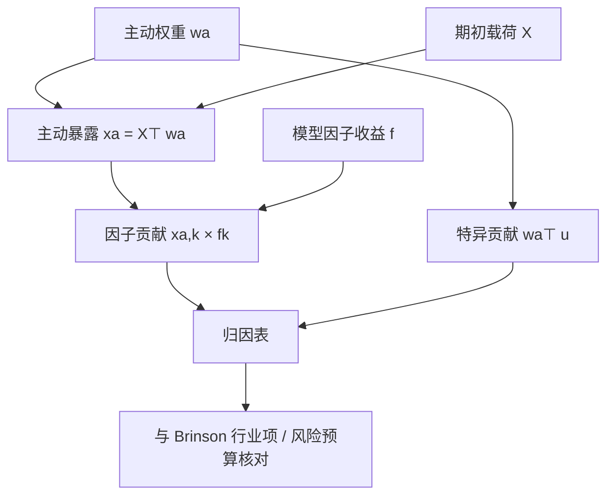

# 因子归因

主动收益来自主动暴露乘以因子收益，再加上无法被命名因子解释的残差；归因的工作是把这张乘法表写清楚，而不是另找一个更高的夏普。

<footer>—— 据 Grinold and Kahn, Active Portfolio Management 对残余收益与因子分解的论述</footer>

[Brinson](/quant/brinson) 按互斥格子拆配置与选择。[基本面风险模型](/quant/fundamental-risk-model) 则把收益写成载荷乘因子加特异项。因子归因是把后一套结构用到已实现的主动收益上：报告期内，组合相对基准在每个因子上超配了多少、该因子实现了多少收益、特异部分还剩多少。它回答「这段跟踪误差来自价值、动量还是行业」，而不是「来自超配了银行」。Grinold 与 Kahn 把主动管理写成对风险模型负责的 $\alpha$；没有与优化器共用的 $X$，归因会把同一笔 P&L 讲成另一个故事。本篇写持仓因子归因的会计、与收益型风格分析的差别，以及残差不该被命名为 alpha 的情形。

## 问题

股票超额收益 $r=Xf+u$，组合主动权重 $w_a=w_p-w_b$ 的主动收益为

$$
w_a^\top r=(X^\top w_a)^\top f+w_a^\top u.
$$

向量 $x_a=X^\top w_a$ 是主动暴露，$x_{a,k}f_k$ 是因子 $k$ 的贡献，$w_a^\top u$ 是特异贡献。问题是：在给定模型版本与期初（或日均）载荷下，把一段样本的主动收益加总成一张可复核的表，并使日频贡献之和（经连接）等于已实现超额。

若研究用自制 [FF3](/quant/ff3) 排序、风控用 Barra、归因再用另一套行业，三张 $X$ 不一致，优化器以为已经中性的风格会在归因里冒出来。这不是市场「不可解释」，而是会计科目没对齐。因子归因的第一约束与风险模型相同：**载荷必须先于收益、模型版本必须先于报告期。**

### 持仓型与收益型不是同一张表

持仓型用实际权重乘以模型因子收益，解释力取决于 $X$ 是否覆盖共同源。收益型（Sharpe 1992 的风格分析）用组合收益时间序列对一组指数或因子做约束回归，估出的是平均风格，看不见期内暴露的变化，也看不见你实际持有过哪些股票。对冲基金无持仓披露时只能走收益型；有持仓的多空与指数增强应走持仓型，收益型只作核对——若两者对「价值贡献」符号相反，优先查分类与杠杆，而不是信回归。

因子贡献 $x_{a,k}f_k$ 里的 $f_k$ 是风险模型的因子收益，不是你对 $k$ 的预期溢价。动量因子本周大跌，超配动量就会记负贡献，即使你长期相信动量有溢价。归因是事后乘法，不是对 $E[f]$ 的检验。

## 方法

日频持仓归因的最小流程是：取日初主动权重（或交易后快照），取当日有效的 $X_t$（行业哑变量与风格描述子），用模型方法计算当日因子收益 $f_t$ 与残差 $u_t$，输出 $x_{a,t}^\top f_t$ 与 $w_{a,t}^\top u_t$。风格描述子通常已对行业与市值正交，于是行业贡献与价值贡献较少双计。若 $X$ 未正交，必须报告共线诊断，否则「价值」与「杠杆」会抢同一段 P&L。

多期把每日因子贡献相加会遇到与 Brinson 相同的复利缝：算术和未必等于区间超额。实务常用：在充分短的区间（日）上做算术分解，再对净值做精确复利，把缝隙单独列为「复合 / 交叉」一行。Menchero 的多期算术归因给出系统性的连接；不要把月频平均暴露乘月因子收益当作日频路径的充分统计——暴露在月内可以变号。

特异项应再拆：可命名的未入模因素（新股、停牌再开、事件）与真正的选股残差。若残差持续能被某个未入模的描述子解释，应考虑更新风险模型，而不是把残差当 alpha 宣传。反过来，把选股信号已经正交化进 $X$ 之后，残差贡献理应接近零；若仍很大，说明正交只在研究截面上做了、没有进组合的 $X$。

### 从因子贡献到风险预算核对

归因表的暴露列应能与事前风险报告的 $x_a$ 对上（允许 EWMA 与已实现之间的差）。若事前限制价值主动暴露 $\pm 0.3$，归因里价值贡献却主导超额，只可能是：$f$ 极大，或实现暴露破限。后者是[约束](/quant/portfolio-constraints)执行问题，应在运营里修，而不是在归因里改因子定义。行业格子的 Brinson 配置项，应与因子归因里行业因子贡献同号、量级可比；系统偏离通常来自分类映射或期货映射。

回报型因子（Fama–French 的 HML 收益）与基本面模型里经截面回归得到的价值因子收益，数值不是同一个序列。用 FF 的 HML 去解释 Barra 价值暴露的贡献，会留下一截旋转残差。归因必须用「产生 $X$ 的那套模型」产出的 $f$。

## 机制

结构能工作，是因为共同冲击沿着可观测特征走：同业、同估值、同动量的股票一起动，$f$ 捕获这一截，$x_a$ 把组合从基准撬开的方向记下来。贡献是暴露与冲击的内积：你可以因为踩对方向而贡献为正，也可以因为暴露大、因子波动大而贡献的绝对值大——后者是风险，不一定是技能。Grinold–Kahn 的 IR 针对的是残差收益相对残差风险；把因子贡献全部算进「选股 IR」会把风格择时混进去，与 [IC/IR 与择时](/quant/ic-ir-timing) 里「择时消耗广度」的警告一致。

残差项 $w_a^\top u$ 在模型良好时接近特异风险的实现。它仍可能高度相关：当许多账户对着同一套模型中性化，残留拥挤会在 $u$ 里出现共同因子，2007 年量化震荡是极端例子。归因在那些日子会显示「特异」主导——名字是特异，机制是未建模的拥挤。这是因子归因的盲区，不是残差 alpha 的证明。

### 与 Brinson 选择项的换算

粗行业 Brinson 的选择项 $\sum w_{b,i}(R_{p,i}-R_{b,i})$ 里，仍含行业内风格。把同一持仓做因子归因，行业内价值、动量会从「选择」里被抽到风格贡献。因此「Brinson 选择很大、因子残差很小」完全可以同时成立：你的选股其实是行业内的风格倾斜。产品若声称选股，应看特异贡献；若声称行业内价值，应看价值因子贡献。用 Brinson 选择去证明「有选股 alpha」，在风格模型下通常过宽。

## 边界与工程取舍

载荷时点错误（用期末市值、用未来行业归属）会把收益泄漏进 $X$，贡献表变得好看且不可复制。新股、ST、北向纳入会让 $X$ 与 $u$ 在事件日不连续，应单独标记。多空与期货的名义映射错误时，市场因子贡献会吞掉几乎全部超额，其余因子变得不可读——先修映射，再读风格。

不要把因子贡献的正值当成该风格应该加码的证据：那是样本内的 $f$，加码是另一种[择时](/quant/ic-ir-timing)。不要在归因之后更换模型版本再重跑同一段，以「解释度更高」为准——解释度提高可能只是把残差改名成新因子。验收应用：预测跟踪误差与已实现主动风险是否校准、压力周贡献是否可讲述、与 Brinson 行业项是否同向。

A 股涨跌停使部分 $w_a$ 不是意图暴露。归因若只有实现持仓一列，会把不可交易造成的风格漂移记成观点。应并行报告意图组合（优化器输出）与可执行组合的因子贡献差，即实施缺口在因子空间里的投影。

日频因子收益 $f_t$ 含噪声。把单日贡献排序当成「今天该不该加码价值」，是把归因表误用成择时信号。归因的分辨率可以是日，决策的分辨率应由预指定规则决定。

## 小结

- 因子归因把主动收益写成主动暴露乘以模型因子收益，加上特异项；载荷与模型版本必须先于报告期。
- 持仓型归因与 Sharpe 风格分析回答不同问题；有持仓时应以前者为准，后者只作核对。
- 贡献是事后乘法，不是对因子溢价的检验；残差在拥挤时可以是未建模的共同源。
- Brinson 选择常含行业内风格；声称选股应看特异贡献，并与优化器所用的 $X$ 对齐。
- 意图暴露与可执行暴露应分开归因，以免涨跌停与停牌造成的漂移被记成观点。
- 出处：Grinold and Kahn, *Active Portfolio Management*；Sharpe, *Asset Allocation: Management Style and Performance Measurement*, Journal of Portfolio Management, 1992；风险模型因子收益见 Rosenberg / MSCI Barra 方法论；多期连接见 Menchero 对算术归因的讨论。
