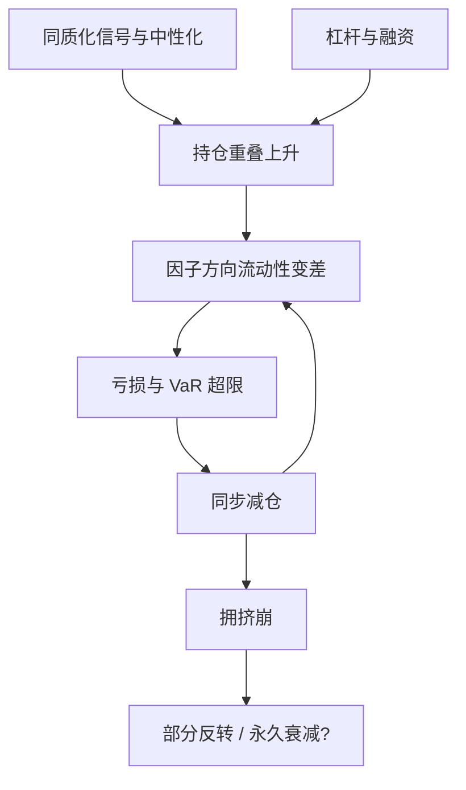

# 因子拥挤与拥挤崩

当足够多的资金用相近的模型交易同一组相对价值，流动性的供给曲线会在几天内竖直起来；不是因子「失效了」，是拥挤把退出变成了价格本身。

<footer>—— 对照 Khandani–Lo 对 2007 年 8 月量化震荡的叙述</footer>

因子溢价的研究默认：你可以按历史规则加仓，市场会按历史弹性吸收。拥挤（crowding）打破这个默认。当大量资金持有高度相关的多空组合，因子的买方与卖方不再是「基本面投资者对噪声交易者」，而是「同类杠杆对同类杠杆」。拥挤崩（crowded unwind）是自我强化的清算：亏损触发去杠杆，去杠杆制造更大亏损。2007 年 8 月的量化震荡、以及此后多次因子同步回撤，迫使研究者把「谁还在买这个因子」写成风险的一部分。

## 问题

标准风险模型解释个股对行业与风格的暴露，不太解释策略之间的持仓重叠。两家都做行业中性、市值中性、对 Barra 风格约束的统计套利，残差看起来特异，其实在同一组相对价值上拥挤。Khandani 与 Lo（2007, 2011）描述 2007 年 8 月：一批量化组合在几天内同时大幅亏损，随后部分反转；看起来像价格暂时与「相对价值」脱钩，更像是资金同步退出。Stein（2009）从更一般的角度指出：专业投资者的套利不是稳定装置，当他们用相似信号和杠杆时，会成为不稳定的来源。

拥挤不同于「因子变弱」。衰减可以是缓慢的信息扩散或成本上升；拥挤崩是短窗口、高相关、流动性蒸发。度量若只看过去三年的 IC，会把拥挤读成「因子还很好」——因为拥挤期的前期，因子往往最顺、波动最低。

### 拥挤如何进入价格

设可交易的因子组合供给有限（融券、冲击成本、市值）。需求侧是一群策略的目标持仓 $w^{(j)}$，高度相关。总目标 $\sum_j w^{(j)}$ 相对市场深度过大时，价格必须先动，才能让一部分人降杠杆。价格向因子不利的方向走，又通过 VaR 与融资约束把更多 $w^{(j)}$ 推向减仓。Lou 与 Polk 用「共动量」（co-momentum）一类指标，刻画同一动量篮子里股票被同步交易的程度：拥挤高时，后续动量收益更差、崩得更急。

ETF 化把拥挤从私募持仓变成可见的份额与创造赎回。因子 ETF 的规模与折溢价是公开代理，但真正的杠杆与总收益互换仍在场外，公开数字总是下限。

## 方法

持仓相似。若能看到多空持仓或经纪商的汇总，重叠度、持仓相关系数、短头寸集中度是最直接的拥挤度量。大多数人没有全市场持仓，只能用代理。

价格与交易代理。因子组合的换手突然放大、借贷费率上升、空头利息集中、成份股之间的残差相关升高，都暗示同步交易。共动量、共价值：过去同方向强势的股票，未来更可能作为一篮子被一起卖出。Cahan 与 Luo 等从业研究把因子估值（因子组合自身的便宜程度）与拥挤分开：便宜可以是机会，也可以是别人刚被强平后的现场。

风险侧。在基本面残差上观察第一主成分是否突然变强——统计风险模型 PCA 正是为这一层准备的。若残差 PCA 的解释方差在几天内跳升，往往不是「出现了新的基本面风格」，而是策略相关。把该主成分纳入 $\Sigma$，至少能让优化器在拥挤升温时自动降杠杆。

### 拥挤与容量

容量是「再加一笔钱，IC 还剩多少」；拥挤是「现在已经有多少钱在里面」。两者相关但不相同。一个因子可以容量大但暂时拥挤（大量资金涌入优质流动性名字），也可以容量小却尚未拥挤。Novy-Marx 与 Velikov 从交易成本分类异常，给出的是结构容量；拥挤度量给出的是周期位置。风控应同时看：结构上能不能做大，周期上该不该做满。

用因子过去的夏普当拥挤指标是危险的。高夏普可能是拥挤的原因（吸引资金），不是安全证明。更有用的是持仓代理、融资与残差相关，而不是净值曲线的斜率。

## 机制

微观上，拥挤崩是流动性的需求冲击。Kyle 的 lambda 在正常时期由做市与慢资金吸收；当慢资金本身就是量化多空、且同时碰到止损，lambda 在因子方向上变陡。行业中性、市值中性并不能免疫：中性化让大家的残差更像，踩踏发生在「纯化之后」的那一维。这是正交化的阴暗面——越纯化，策略越同质。

宏观上，融资条件是开关。杠杆资金的约束在波动上升时收紧（保证金、总杠杆上限）。因子之间的相关在压力期趋向 1，不是因为经济突然只剩一个因子，而是因为同一个约束在同时砍仓。因此拥挤风险无法用平静期的 $F$ 线性外推。

### 2007 作为校准事件

Khandani–Lo 强调：震荡短暂、随后部分反转，说明更多是流动性与去杠杆，而不是因子永远消失。对研究的含义是：样本里必须包含至少一次拥挤事件，才能谈策略的真实最大回撤；只用 2010s 的低波动年份校准止损，会把杠杆加到下一次踩踏无法存活的水平。反转也带来道德风险：有人专门在拥挤崩时反向捡便宜，这本身又成为下一次拥挤的燃料。

## 边界与工程取舍

代理指标都会错。短头寸高可能是对冲而非拥挤；残差相关升高可能是宏观漏因子。多指标同时恶化才提高警报级别。行动上，拥挤升高时的正确反应通常是降杠杆、放宽换手、避免在最拥挤的纯化残差上再加码，而不是立刻反转做空因子——反转需要对手盘，拥挤崩的价格路径极不对称。

不要把拥挤当成对所有因子失效的借口。McLean 与 Pontiff（2016）记录的是发表后衰减，机制包括统计偏差与投资者学习，并不等于 2007 式清算。衰减、成本、拥挤是三件叠在一起但可分开测的事。

风控限额应写在「残差 PCA 解释方差」或「因子 ETF 资金流」上，而不是写在「因子今年亏了多少」上。后者是事后，前者才可能是拥挤的同期信号。

## 小结

- 因子拥挤是策略持仓重叠与杠杆叠加后的流动性风险；拥挤崩是去杠杆的自我强化，而不是缓慢的 alpha 衰减。
- Khandani–Lo 对 2007 年 8 月的记录、Stein 对专业套利不稳定的论述，是这一现象的经典参照。
- 度量依赖持仓重叠、融券与资金流、共动量/共价值、以及基本面残差上的 PCA。
- 行业与风格中性会让残差更同质，从而把踩踏推向纯化后的维度。
- 容量是结构，拥挤是周期；高夏普不是安全证。风控应在残差共同运动升温时降杠杆。
- 出处：Khandani and Lo, *What Happened to the Quants in August 2007?*, Journal of Investment Management, 2007/2011；Stein, *Presidential Address: Sophisticated Investors and Market Efficiency*, Journal of Finance, 2009；Lou and Polk, co-momentum 研究；McLean and Pontiff, *Does Academic Research Destroy Stock Return Predictability?*, Journal of Finance, 2016。
