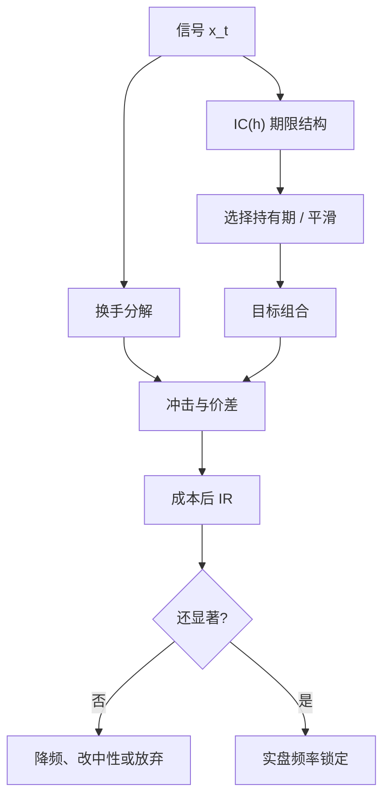

# 因子衰减与换手

信息系数的半衰期决定你能等多久；换手决定你为这份等待付多少冲击。两者同时变差时，不是「把频率调低」就能救回来的。

<footer>—— Grinold 的 IR 分解遇上 Novy-Marx–Velikov 的交易成本分类</footer>

因子研究习惯报告一个全样本 IC 或一个多空夏普。实盘要问两件更窄的事：信号对未来收益的预测力在多久后消失（衰减），以及为了维持该信号需要买卖多少（换手）。衰减快的因子必须高频调仓，换手立刻变成成本；衰减慢的因子可以低换手持有，但往往容量更大、拥挤更重、或根本是风险溢价。Grinold 把信息比率写成 $\mathrm{IR}\approx\mathrm{IC}\times\sqrt{B}$，广度 $B$ 与你重下赌注的次数有关——而每一次重下都在付价差。衰减与换手是把这条公式从无摩擦世界拖回市场微观结构。

## 问题

设 $t$ 日信号 $x_t$ 与未来 $h$ 期收益的截面相关为 $\mathrm{IC}(h)$。典型的动量 $\mathrm{IC}(h)$ 在数周到数月内仍正；短期反转在数日内高、随后变号；价值可以在季度财报之间缓慢衰减。若你按日调仓去追一个本来衰减很慢的信号，大部分交易只是在噪声上换座位。若你按月调仓去交易一个三日就消失的信号，持仓里剩下的几乎是残渣。

换手不是风格标签，而是信号自相关的函数。分数的一阶自相关高，组合换手低；自相关低，即使 IC 高也难以在成本后存活。Novy-Marx 与 Velikov（2016）按换手给异常分类，并指出高换手异常在引入真实交易成本后大量消失。McLean 与 Pontiff（2016）则记录发表后样本外衰减：那是可预测性被套利或被多重检验高估，与单只股票上信号的期限结构不是同一层，但会叠在一起出现。

### IC 的期限结构

把 $\mathrm{IC}(h)$ 画出来，比报告「IC=0.05」有用得多。若 $\mathrm{IC}(h)$ 近似 $c\rho^{h}$，半衰期 $h_{1/2}=\ln 2/|\ln\rho|$ 告诉你调仓周期的上限。更细致的做法是把未来收益拆成逐日增量，看信号对第 1、2、…、k 日收益各自的预测力。很多「日频因子」的预测力集中在开盘后几十分钟，隔夜就已经换了一批人。

用同期 IC（信号与当日收益）做研究是泄漏。衰减曲线必须从「信号可获得之后的第一段收益」算起，并扣掉公告日、涨跌停不可交易的区间。

## 方法

衰减诊断。固定形成期，计算 $x_t$ 与 $r_{t+1:t+h}$ 的秩相关，对 $h=1,\ldots,H$ 画图。再对行业、市值中性后的 $\tilde{x}$ 画同一张图——中性化常常让衰减变快，因为慢变量（行业均值）被拿掉了。

换手分解。双边换手 $\sum_i |w_{i,t}-w_{i,t-1}|/2$。可拆成：分数变化引起的、权重方案（等权变市值加权）引起的、以及约束/优化引起的。纯化与风险中性通常增加换手。把换手与衰减画在一起：理想区是「IC 衰减慢、换手低」；最危险的是「IC 只在 $h=1$ 显著、日换手 40%」。

成本后净 IC。用有效价差、冲击模型或 Novy-Marx–Velikov 的价差分组，把预期成本从毛收益里减掉。高换手因子对冲击函数的斜率极度敏感：同一套衰减，在大盘与微盘上净 IR 可以差一个数量级。

### 再平衡规则

不是每天把组合推到目标权重。常用：阈值再平衡（偏离超过带宽才交易）、衰减加权（把 $x_t,x_{t-1},\ldots$ 按 $\mathrm{IC}(h)$ 加权合成慢信号）、换手惩罚进入优化。这些是用信号滤波器去匹配衰减，而不是用更猛的交易去假装 IC 不会掉。Grinold–Kahn 的最优权重已含「alpha 与风险、成本」的权衡；工程上要把成本写成换手的函数，而不是事后从净值里减一个常数。

降低换手会改变你交易的因子。对动量做过度平滑，会滑向中期趋势；对反转做过度平滑，信号会消失。滤波器是经济选择，要在样本外单独检验，不能只看换手数字变小。

## 机制

衰减来自价格发现：信号被交易进去，剩余可预测性下降。它也来自公司事件的节奏——盈利能力按季披露，价值描述子跳变稀疏，所以价值换手低、衰减慢。微观结构信号衰减快，因为它们交易的是盘口上几分钟的不平衡。把不同半衰期的东西加进同一个日频回测，不加持有期匹配，是把慢因子的夏普借给快因子。

换手来自排序的扰动。即使真 IC 不变，估计噪声也会让边缘股票跨过分位线。分位越多、中性化维度越多、样本越短，噪声交易越多。这是正交化与行业中性的隐蔽账单：更纯的因子往往更吵。

### 发表后衰减与持有期衰减

McLean–Pontiff 的发表后下降，说的是异常在论文出现后样本外变弱，部分是统计偏差，部分是资金学习。持有期衰减说的是同一个已发表因子，信号对 $h=1$ 与 $h=20$ 的预测力不同。两者会互相加强：发表后资金涌入，会把本来就短的半衰期变得更短，并抬高拥挤。研究设计上应分开报告：复制用原始持有期；实盘用成本后、匹配衰减的持有期；样本切开发表前后。

## 边界与工程取舍

成本模型错了，衰减诊断再精确也无用。用固定bps 惩罚会低估小盘、高换手的凸性冲击，高估「降频」的好处。涨跌停让目标换手无法执行，名义衰减与实现衰减脱节。A 股还要把隔夜与开盘集合竞价单独画 IC——很多所谓日频因子其实是隔夜因子。

不要用全样本最优持有期。那是对 $H$ 的多重检验。应预先声明调仓频率（与产品、容量一致），再看该频率下衰减是否还撑得住。Harvey–Liu–Zhu 的多重检验逻辑在这里同样适用：试了 12 种再平衡再报告最好的一种，t 值不算数。

容量测试应沿衰减曲线做：增加 AUM 时，先死的是短半衰期、高换手的那截 IC，不是全样本平均 IC。平均 IC 会把已死的短端和还活着的长端混在一起。

## 小结

- 因子可用性由 IC 的半衰期与维持信号所需换手共同决定；只报全样本 IC 会掩盖短端不可交易、长端已变弱。
- Grinold 的 $\mathrm{IR}\approx\mathrm{IC}\sqrt{B}$ 在有摩擦时必须把广度对应的再平衡写成成本。
- Novy-Marx–Velikov（2016）表明高换手异常在交易成本后大量消失；McLean–Pontiff（2016）记录发表后可预测性下降。
- 中性化与纯化通常加快衰减、增加换手；再平衡规则会改变因子的经济含义，需样本外单测。
- 持有期衰减与发表后衰减、拥挤是不同层，应分开度量。
- 出处：Grinold and Kahn, *Active Portfolio Management*；Novy-Marx and Velikov, *A Taxonomy of Anomalies and Their Trading Costs*, RFS, 2016；McLean and Pontiff, *Does Academic Research Destroy Stock Return Predictability?*, JF, 2016。
