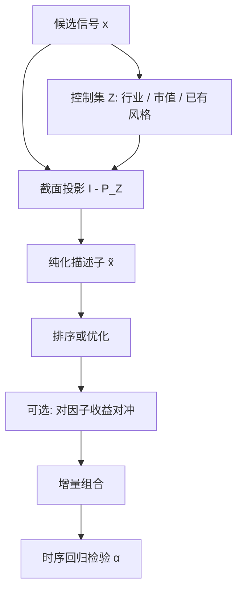

# 正交化与纯化

相关的因子不是两个 alpha，而是同一条风险被命名了两次；正交化要做的是规定顺序、拿走重叠，而不是把经济含义洗成互不认识的残差。

<footer>—— 因子纯化的线性代数，对照 Gram–Schmidt 与 Barra 描述子正交</footer>

[上一课](/quant/size-neutral)用对数市值回归残差、市值分层内排序、组合层规模约束，把规模从信号里剥开。缺口是：市值中性之后，价值与盈利、动量与反转、低波动与质量仍然共线。把一串相关信号同时放进回测再加总多空，会把旧风险算成新 alpha。正交化与纯化要问：给定控制变量之后，这个信号还剩多少独特截面变异，对应的可交易组合是什么。本课写截面纯化、时序正交与持仓中性的差别。不重推市值分层。后课风险模型默认已经分清这三件事。

## 问题

设截面上已有因子矩阵 $Z$（行业哑变量、对数市值、已入模的风格），新信号为 $x$。若直接用 $x$ 排序，组合收益里有一块来自 $Z$ 的风险溢价。你无法分辨是新发现，还是旧因子的线性重组。更糟的是，相关因子同时优化时，权重会在共线方向上放大噪声：一个因子略偏多、另一个略偏空，净值剧烈抖动，看起来像「多因子对冲」，其实是在交易残差噪声。

纯化通常指：把描述子投影到控制变量的正交补上，得到 $\tilde{x}=x-Z\hat\gamma$，再用 $\tilde{x}$ 定义因子。正交化更广，也包括对因子收益做 Gram–Schmidt，得到一组不相关的收益序列。两者对象不同：一个是截面特征，一个是时序收益。混用会让「这个因子已经正交」这句话失去所指。

### 顺序不是中性的

Gram–Schmidt 依赖顺序。先拿走市值再拿走价值，与先价值再市值，残差不同。经济上应先控制更原始、更慢、更像风险的变量（行业、市值、beta），再纯化更像 alpha 的信号。若把目标信号放在最前面，后面的控制变量会变成「对 alpha 正交的风险」，解释会颠倒。Barra 的惯例是：行业与国家优先，然后是 Size、非线性 Size，再是其他风格互相正交。这是建模选择，不是定理。

「对所有其他因子同时回归」得到的是对称的残差，但若回归元高度共线，系数不稳定，残差几乎是噪声。对称纯化并不自动比有序纯化更科学，它只是把识别问题藏进了设计矩阵的条件数。

## 方法

截面加权回归。$x = Z\gamma + e$，权为市值或流动性。$\tilde{x}=e$ 即纯化描述子。随后可用 $\tilde{x}$ 做分位组合，或作为风险模型里的因子载荷。加权的含义是：大盘上的共线关系优先被去掉，微盘上奇特的相关结构少干扰载荷估计。

双重或三重排序。不求残差，而在控制变量的格子里做条件排序。Fama–French 对规模与价值的 $2\times 3$ 就是离散正交。优点是非线性、少模型假设；缺点是格子稀疏、难以同时控制许多变量。

收益端正交。对已有因子收益 $F$，新组合收益 $r$ 做时序回归 $r=\alpha+\beta^\top F+u$，用 $u$ 或 $\alpha$ 评价增量。这是 Gibbons–Ross–Shanken 检验与 Fama–French 拼盘回归的日常操作。它回答「收益是否被已有因子解释」，不自动给出一个可交易的中性组合——除非你用 $\beta$ 去对冲 $F$。

### 纯化与对冲的差别

描述子纯化改变的是选股分数；对冲改变的是持仓对因子收益的 beta。分数正交、持仓仍可能暴露：因为权重还取决于波动与约束。反过来，优化器可以对一个未纯化的分数加约束 $B^\top w=0$，得到持仓正交、分数仍脏。生产上两者常同时做：分数纯化减少优化器的共线拉扯，约束保证风险预算落地。

不要用全样本估计的 $\gamma$ 去纯化每一天的 $x$。应在当日或滚动窗口的截面上估，否则把未来相关结构泄漏进历史分数。

## 机制

几何上，纯化是 $I-P_Z$ 作用在 $x$ 上，$P_Z$ 是加权内积下的投影。若 $x$ 几乎落在 $Z$ 的列空间里，$\|I-P_Z\|x$ 很小，因子没有新信息。此时强行交易残差，等于放大 $Z$ 的估计误差：你以为在买独特 alpha，其实在买 $\hat\gamma$ 的噪声。这与多重共线回归里方差膨胀是同一件事。

经济上，正交化重新定义因子的叙事。对市值与行业纯化后的价值，不再是「买便宜的行业或小票」，而是「同业、同规模里相对便宜」。对价值纯化后的盈利，才接近 Novy-Marx 所强调的「盈利相对价值的增量」。不写清楚控制集，论文与研报里的因子名称无法比较。

### 过度纯化

控制变量越多，残差越像噪声。把所有已知风格、所有宏观敏感度、所有行业都拿掉之后，剩下的截面变异往往换手极高、样本外失效。纯化应当服务于一个预先声明的假设（例如「这是质量，不是价值」），而不是把 t 统计量做大的搜索。Harvey、Liu 与 Zhu（2016）警告的多重检验，在「试了二十种正交顺序、报告最好的一种」时同样适用。

另一边界是时变共线。危机里低波动、质量、动量可能突然高度相关。用平静期的正交关系去解释危机持仓，分解会崩。滚动纯化能跟上相关结构，但让因子定义每个月都在变，长期业绩归因变得很难读。

## 边界与工程取舍

与风险模型对齐。若组合用 Barra 约束风格暴露，研究阶段的纯化应尽量使用同一套描述子与同一套行业分类。研究用自制残差、组合用供应商因子，中间的旋转会把 alpha 漏到「其他」里。

可交易性。正交化后的信号可能在一堆难以交易的名字上取值很大——因为大盘、流动的名字已被 $Z$ 解释掉。必须把流动性、涨跌停、停牌放进同一套分数处理，否则纯化只是把权重推向不可执行的残差。

报告。至少给出：控制变量列表与顺序、加权方式、纯化前后 IC 与换手、对常见因子的回归 $\alpha$ 与 $R^2$。没有这些，正交化只是修辞。

因子收益互不相关，不等于经济独立。PCA 旋转可以制造正交，但载荷符号每个窗口都在变。基本面纯化保留名字与符号的稳定性，代价是因子之间允许相关——风险模型用因子协方差去承接这件事，而不是假装相关为零。

## 小结

- 正交化与纯化是把新信号从已有特征或已有因子收益的线性张成里投影出来，避免把旧风险算成新 alpha。
- 截面纯化改变分数，时序正交改变收益分解；持仓中性还需要约束或对冲，三者不是一回事。
- 投影顺序与控制集是经济假设；Barra 描述子正交与 Fama–French 双重排序是两种实现。
- 过度纯化与全样本拟合会造成噪声交易和前视偏差；共线时对称残差并不更干净。
- 应与生产风险模型的因子定义对齐，并报告纯化前后的 IC、换手与因子回归。
- 出处：Fama and French, *Common Risk Factors…*, JFE, 1993；Grinold and Kahn, *Active Portfolio Management*；MSCI Barra 描述子纯化惯例；Harvey, Liu, Zhu, *… and the Cross-Section of Expected Returns*, Review of Financial Studies, 2016。
