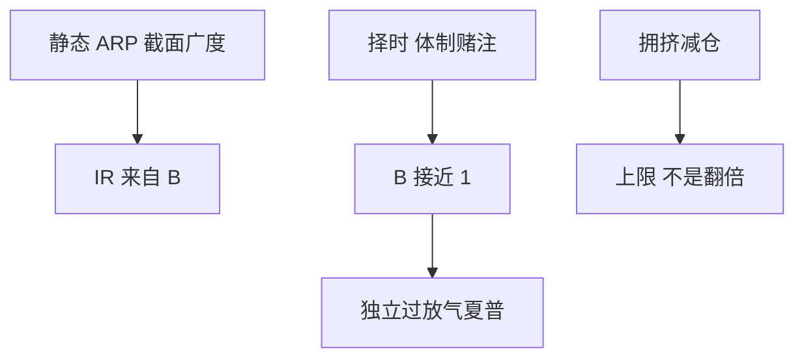

# 因子择时的可行性

静态收获因子溢价用的是截面广度；择时把许多独立赌注并成对体制的一两次方向，听起来像提高 IC，统计上往往只是降低 IR。

<footer>—— 基本定律见 Grinold；择时之难见 Asness, Chandra, Ilmanen and Israel, Contrarian Factor Timing is Deceptively Difficult, Journal of Portfolio Management, 2017</footer>

[上一课](/quant/alternative-risk-premia)把 ARP 写成可静态持有的风险预算。因子择时的缺口是：**要不要让暴露随估值、动量或宏观状态变号**。主干 [IC/IR 与因子择时](/quant/ic-ir-timing) 已写基本定律与转移系数。本课只补可行性：估值择时为什么诱人、样本外为什么常败，以及它和 [因子拥挤](/quant/factor-crowding) 的关系。不要把 [CAPM](/quant/capm) 或截面异象再检验一遍。

## 问题

价值因子便宜时加仓、贵时减仓，直觉像逆向。Asness 等人的结论是：估值对长期溢价有弱预测，对可交易频率上的择时 IR 很差；广度从数百只股票掉到「这一个因子下个月」。问题是把择时写成**消耗广度的体制赌注**，必须单独过 [放气夏普](/quant/deflated-sharpe) 与 [多重检验](/quant/multiple-testing-factors)，不能把静态多空的 t 统计量算到择时头上。

与宏观相机：择时因子是对风格溢价下注，择时市场是对 $R_m$ 下注。两者都可以用同一套宏观叙事包装，评价要拆开。拥挤指标（共动量、借贷费率）作为**减仓扳机**比作为「翻倍」信号更老实。

### 估值不是价格目标

因子的价值价差可以因为结构变化（会计、回购、指数纳入）长期不回归。用全历史分位数当「便宜」，会在体制转换后持续加在错误一侧。可交易的是相对历史的偏离加上容量约束，不是均值回复定理。

Grinold 的 IR≈IC√B：择时把 B→1。除非时间序列 IC 高到不合理，静态收获仍是默认。例外应写进研究日志的预注册，而不是回测里的「我们也择时了」。

## 方法

对照三层：静态权重；缓慢再平衡（估值分位、多年窗口）；高频择时（月度宏观、机器学习）。每层报告：相对静态的主动 IR、换手、危机月。拥挤只做上限，不做杠杆放大器。若择时只在样本内某个十年有效，按持续性课的标准判为未证实。

## 机制

因子溢价的可预测成分弱、噪声大、结构断点多。逆向择时在拥挤崩之后看起来英明，那是一次路径，不是可重复的 IC。静态组合已经在用再平衡做弱逆向，见 [再平衡溢价](/quant/rebalancing-premium)；再叠加一层择时，容易重复计算同一块方差。

## 边界

本课不主张「永远不要择时」。有容量或融资约束时，减杠杆是风控，不是观点。不要把风控减仓事后标成择时 alpha。

## 小结

- 因子择时消耗广度，默认不可行；要做就必须单独检验。
- 估值有弱长期信息，不是月度交易信号。
- 拥挤适合做上限，不适合做加倍。
- 出处：Grinold 基本定律；Asness, Chandra, Ilmanen and Israel, *JPM*, 2017。
