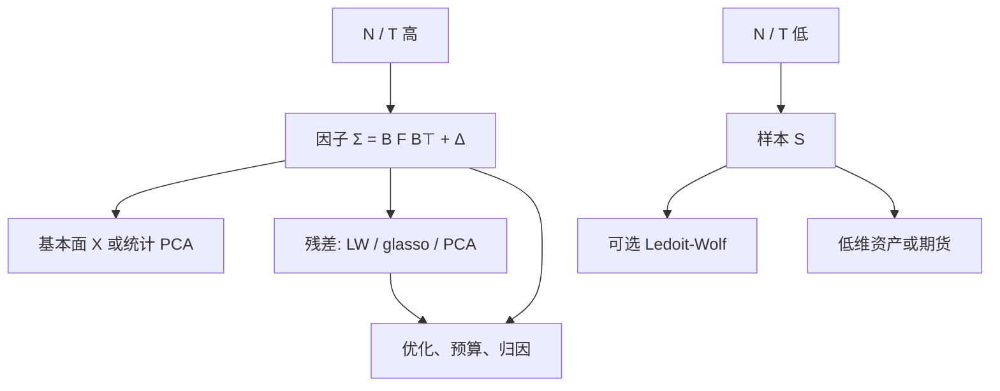

# 因子协方差 vs 样本

    
样本协方差把所有相关留给数据；因子协方差只把共同运动留给低维 $F$，其余推进对角。维数相对样本一旦偏高，后者的偏差往往比前者的方差更便宜。

    <footer>—— 对照 Rosenberg 以来的因子风险模型，以及 Ledoit–Wolf 对样本矩阵的收缩</footer>

[Markowitz](/quant/markowitz) 需要 $\Sigma$。两条极端的估计路：一是样本 $S$，二是严格因子结构 $\Sigma=BFB^\top+\Delta$（$\Delta$ 对角）。中间还有 [Ledoit–Wolf](/quant/ledoit-wolf) 把 $S$ 拉向简单目标、[图形 Lasso](/quant/glasso) 稀疏精度、以及 [统计 PCA](/quant/stat-risk-pca) 用样本特征向当 $B$。本篇做选择，而不是再推一遍收缩公式：[估计误差与收缩](/quant/cov-shrinkage) 已写病态机制。这里比较偏差–方差、何时样本已经够用、何时必须降维，以及残差层如何把两条路接起来。

## 问题

$N$ 只股票、$T$ 个观测。$S$ 的自由参数是 $N(N+1)/2$，因子模型是 $NK$ 载荷加 $K(K+1)/2$ 的 $F$ 加 $N$ 个特异方差。$N=2000$、$T=500$ 时，样本路径不可识别，因子路径可以。代价是：若真实存在第 $K+1$ 个共同源（拥挤、流动性枯竭），对角 $\Delta$ 会把这块风险当成可分散，组合在该方向上杠杆过大——2007 年量化震荡是残差共同运动被当成特异的样本。

因此问题不是「因子对还是样本对」，而是哪一层用结构、哪一层用样本。基本面 $B=X$ 钉死经济含义；统计 $B$ 跟样本谱走。样本 $S$ 只在 $N/T$ 足够小、或在已经很低维的期货集合上，才是可竞争的无结构估计。

### 何时样本协方差已经够用

期货十来个、月度宏观资产、或单一行业内几十只流动性极好的名字、$T$ 以年计时，$S$ 的条件数可以接受，再加一层轻度 LW 即可。此时强行上一个过时的行业分类，偏差可能大于方差。反过来，全市场选股、指数增强、$N$ 上千，必须因子化或大幅度收缩。用「我们有三年日数据」当理由走样本 $S$，忽略的是 $c=N/T$ 而不是日历长度。

已实现协方差、隔夜与日内块，改变的是 $S$ 的构造，不改变自由度计数。高频让 $T$ 变大，也让微观结构偏倚变大。高频样本矩阵仍然可能需要因子或收缩，见收缩总论里对采样频率的提醒。

## 方法

**样本。** $S=\frac{1}{T-1}R^\top R$（已中心化）。可逆时最小方差 $w\propto S^{-1}\mathbf{1}$。正则：特征值截断、LW、对角加载。评价看样本外方差，不看拟合 $R^2$。

**因子。** 基本面：期初 $X$，截面回归得 $f_t$，EWMA 估 $F$，特异波动另模型，见 [Barra 类模型](/quant/fundamental-risk-model)。统计：PCA / 渐近 PCA 得 $B$，Bai–Ng 选 $K$。混合：基本面加残差 PCA。预测方差

$$
w^\top\Sigma w=(B^\top w)^\top F(B^\top w)+w^\top\Delta w,
$$

$\Delta$ 对角时，特异风险随权重平方衰减，优化器不能靠噪声相关做假对冲。

**衔接。** 残差协方差 $\mathrm{Cov}(u)$ 若允许非对角：对 $\mathrm{Cov}(u)$ 做 LW 或 glasso，等于在因子之后把样本还回一小块。$\delta$ 或 $\rho$ 应比直接对原始 $S$ 时更小，因为共同源已被 $F$ 吃掉。这是实务里「因子 vs 样本」的真正答案：因子为主，样本为残差补丁。

### 比较实验要固定组合规则

只比较 $\|\hat\Sigma-S_{\mathrm{future}}\|_F$ 会偏袒更接近样本的估计器，包括过拟合的 $S$ 自己。应固定：最小方差或跟踪误差约束、换手惩罚、是否允许卖空，再看下一期已实现风险与约束。因子模型还要看归因是否可解释、压力周因子贡献是否可读。样本 $S$ 赢在短窗口的拟合，往往输在换手与叙事。供应商因子模型赢在维护与版本，输在与研究用 alpha 因子不对齐。

## 机制

因子结构把 $\Sigma$ 的秩和可估参数压到与 $K$ 同阶，相当于极强的收缩：向低维子空间投影，正交补上只留对角。偏差是投影误差；方差是 $F$ 与 $\Delta$ 的估计误差，远小于 $S$ 的条目噪声。样本 $S$ 偏差小（无条件协方差的经典估计在 $T\to\infty$、$N$ 固定时一致），方差在 $N$ 随 $T$ 增长时爆炸。LW 是两者之间的连续插值，目标 $F$ 若取单因子，已经非常接近「弱因子模型」。

Chamberlain–Rothschild 的近似因子结构允许特异协方差有界非对角，真实世界更接近这个，而不是严格对角 $\Delta$。因此完全相信对角会低估跟踪误差。补丁层（残差 LW / 残差 PCA / 残差 glasso）承认近似因子，而不退回全样本 $S$。Fan 等人关于因子加稀疏残差精度的工作，正是把 glasso 放到 $u$ 上，而不是放到原始收益上。

优化器爱用样本 $S$ 里「历史上对冲得很好」的噪声对。因子加对角会禁止这种对，除非它们共享载荷。这是特征：你失去一些假分散化，换来样本外存活。若一对股票有真实的产业链相关且未写入 $X$，应加描述子或允许残差边，而不是改回全样本 $S$。

### 动态与条件

样本窗越短越能跟上相关破裂，也越病态。因子模型用短半衰期估 $F$、慢更新 $X$，是在「快二阶、慢含义」上做分工。纯样本 $S$ 没有这层分工，缩短窗口等于同时加快所有特征——包括噪声特征。DCC 一类动态相关仍需要一个静态或因子的无条件骨架，否则高维 DCC 参数过多。选择「因子还是样本」之后，才轮到选 EWMA 还是 DCC；不要用动态相关去拯救一个维度错误的 $S$。

## 边界与工程取舍

不要在 $N/T\gt 1$ 时报告基于 $S^{-1}$ 的切点。不要因为因子模型的样本内 $R^2$ 不是最高就换回 $S$——风险模型的验收是跟踪误差校准，不是拟合。不要把统计 PCA 的旋转载荷当成可以跨年比较的风格。不要对因子 $\Sigma$ 再做一次目标为单位阵、$\delta$ 接近 1 的 LW，那会把行业块抹掉。国际、多资产、非同步：样本相关偏短，因子模型用当地市场因子往往更诚实；LW 只能保证可逆。

治理：研究、风控、归因应声明用的是哪一张 $\Sigma$。允许残差非对角时，要有边密度或残差主成分个数的上限，以免补丁层长回全样本。换模型版本（行业分类、风格定义、收缩目标）必须有平行期，否则无法区分市场与模型变更。

最小方差竞赛里，纯样本加卖空限制有时看起来不差，因为约束本身是正则。这不能推广到无约束或高杠杆账面。比较估计器时把约束写进实验设计，避免把 QP 的盒子约束当成 $S$ 的胜利。

## 小结

- 样本 $S$ 在 $N/T$ 小时无结构、偏差小；高维时方差不可接受，$\Sigma^{-1}$ 不可用。
- 因子协方差用低维共同源加对角（或稀疏）特异，是高维股票风险的默认；偏差是漏掉的无名共同运动。
- 实务答案是分层：因子为主，样本收缩只作用于残差，而不是二选一。
- LW 缩谱、glasso 选边、PCA 跟样本因子，都是中间正则，验收必须样本外并固定组合规则。
- 出处：Rosenberg 以来的基本面风险模型；Connor–Korajczyk、Bai–Ng 的统计因子；Ledoit and Wolf, 2003–2004；Fan 等因子加稀疏残差精度；总论见 [估计误差与收缩](/quant/cov-shrinkage)。
