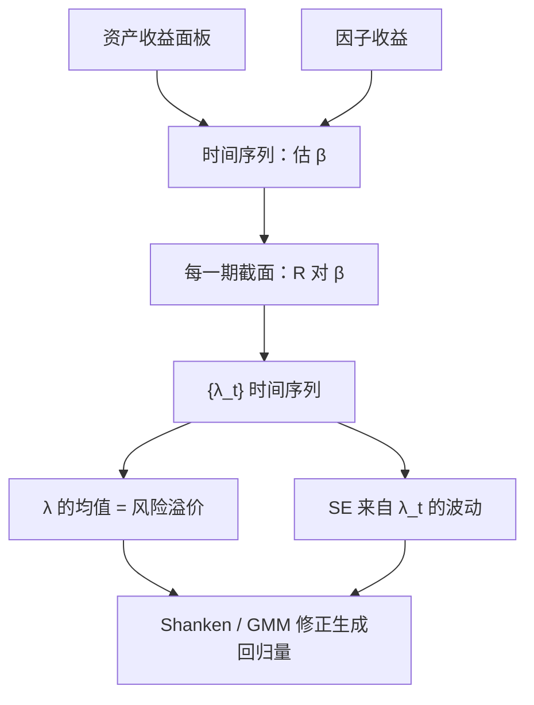

# Fama-MacBeth 回归

    
先在时间序列里估出每只证券对因子的载荷，再在每一个截面上把收益对载荷回归；风险溢价是这些截面斜率的时间平均，标准误来自斜率的时间序列，而不是来自把残差当成独立同分布的一次大回归。

    <footer>—— Fama & MacBeth, Risk, Return, and Equilibrium: Empirical Tests, Journal of Political Economy, 1973</footer>

资产定价要估的是风险价格 $\lambda$，不是某一只股票的 α。把 $T$ 期、$N$ 只资产堆成一次混合回归，残差在截面上同期相关，普通标准误会把精度说得太高。Eugene Fama 与 James MacBeth 1973 年的做法是把检验拆成两步：时间序列估 β，再对每一个 $t$ 做一次截面回归，最后对斜率取平均。它是 [CAPM](/quant/capm) 与多因子模型最常用的截面语言，也是后续 Shanken 修正、GMM、[Giglio–Xiu 三步法](/quant/giglio-xiu) 要修补的起点。本篇写步骤、标准误真正在防什么、以及生成回归量如何把 $\lambda$ 的精度说错。

## 问题

线性因子模型说 $E[R_i]=\lambda_0+\beta_i^\top\lambda$。$\beta_i$ 不是特征，必须从收益里估。若直接用全样本平均收益对全样本 β 做一次截面 OLS，有两件事被假装不存在：一是同一期里所有股票的残差被共同因子和行业拉动，观测不是独立的；二是 β 本身带估计误差，右边是生成回归量。第一件事会让「$N$ 很大所以标准误很小」变成幻觉；第二件事会让 $\lambda$ 的 $t$ 统计量膨胀。

Fama–MacBeth 针对的是第一件。他们不把 $NT$ 条观测当成独立样本，而是把每一个月当成一次截面实验：该月所有股票共享同一组宏观冲击，截面斜率 $\lambda_t$ 已经把这些冲击吃进估计量里；再看 $\{\lambda_t\}$ 在时间上的波动，就得到对「风险溢价是否稳定为正」的推断。问题从「怎么把 β 和收益放进一个回归」变成「如何让截面相关进入标准误，而不靠为残差指定一个巨大的同期协方差阵」。

### 两步，而不是一次混合 OLS

第一步，对每只资产（或每个组合）用时间序列

$$
R_{it}=\alpha_i+\beta_i^\top f_t+\varepsilon_{it}
$$

得到 $\hat\beta_i$。原论文对 CAPM 用滚动窗口估 β，再拿到样本外的一个月里做截面，以避免用未来收益估载荷。第二步，对每个 $t$，

$$
R_{it}=\lambda_{0t}+\hat\beta_i^\top\lambda_t+u_{it},
$$

得到 $\hat\lambda_t$。风险溢价估计是 $\hat\lambda=T^{-1}\sum_t\hat\lambda_t$，标准误是 $\widehat{\mathrm{Var}}(\hat\lambda_t)^{1/2}/\sqrt{T}$（可对序列相关做 Newey–West）。截距 $\lambda_{0t}$ 在超额收益回归里应接近零；若显著为正，往往是 β 估噪、模型漏因子，或零 β 资产仍有溢价。

Fama–MacBeth 的标准误处理的是残差的截面相关，不是 β 的估计误差。把「已经用了 FM」写成「已经做了错误变量修正」，是把 1973 年方法和 1992 年 Shanken 修正混为一谈。

## 方法

检验资产通常是组合而不是个股：按 β、规模、估值预排序，降低个股特质噪声，并对准可疑的违反方向。个股 β 噪声大，截面 $R^2$ 会被压缩向零，λ 的斜率衰减（attenuation）。组合并不能消灭生成回归量问题，只是让第一步更稳。因子 $f_t$ 若是可交易多空，时间序列回归的截距 α 本身已是定价误差；FM 截面估的是同一套 β 对应的风险价格，两套语言应对照，而不是只报告好看的那一张表。

滚动 β 与全样本 β 是两种信息集。滚动更接近「投资者当时能用的载荷」，但对窗口长度敏感：太短则 β 噪，太长则时变被抹平。全样本 β 用了未来收益，检验的是无条件模型，不是可交易策略。条件模型要把时变写进 $\beta_{it}$ 或 $\lambda_t$，见[风险溢价时变](/quant/time-varying-rp)与[条件 CAPM](/quant/conditional-capm)，不能指望一次静态 FM 自动完成条件化。

### Shanken 修正与 GMM

$\hat\beta$ 有误差，第二步把误差当成真 β，λ 的方差被低估。Shanken（1992）给出解析修正：在因子不可观测、需从时间序列估的设定下，给 $\mathrm{Var}(\hat\lambda)$ 加上与因子均值不确定性有关的一项。因子若是超额收益（可交易），时间序列 α 的 GRS 检验与截面 λ 的检验渐近相关，应选一套主检验，而不是两套都当独立证据。

GMM 把两步收成一组矩：$E[\varepsilon_{it}]=0$、$E[\varepsilon_{it}f_t]=0$，以及截面 $E[R_i-\beta_i^\top\lambda]=0$。优点是一次给出参数与稳健协方差，并能加约束（例如 $\lambda$ 等于因子均值）。缺点是资产多、矩多时有限样本差，权重矩阵不稳定。FM 仍是报告习惯：透明、可按月画出 $\lambda_t$ 的路径。工程上常先做 FM 看经济幅度，再用 GMM 或 Fama–MacBeth+Shanken 报推断。

## 机制

为什么按期截面、再对斜率取平均，能对付截面相关？因为同期冲击已经被吸进该期的 $\hat\lambda_t$：若某月所有高 β 股票一起涨，该月 $\lambda_t$ 会偏高，但这只是 $\lambda_t$ 路径上的一个点。只要冲击在时间上不完全持续，平均 $\lambda$ 的不确定性就由这条路径的波动来度量。这等价于一种聚类：把每一期当成一个聚类，而不是把每一只股票当成一个独立观测。

它不自动对付时间序列相关。市场溢价、价值溢价都有持续区间，$\lambda_t$ 会自相关，朴素 $1/\sqrt{T}$ 仍偏小，需要 HAC。它也不对付模型误设：漏掉的因子会把载荷投影到已包含的 β 上，λ 有偏——这正是 [Giglio–Xiu](/quant/giglio-xiu) 要用潜因子张成空间去修的问题。FM 是估计程序，不是识别策略。

### 特征回归不是 β 回归

实务里常把估值、盈利、动量直接放进每月截面，斜率叫「特征溢价」。这不是 1973 年的方法。Fama–MacBeth 原意是风险载荷的价格；特征回归是横截面预测，可以与风险模型并存，但系数不能直接叫 $\lambda$。要把特征解释成 β，需要像 [IPCA](/quant/ipca) 那样把特征写成载荷的工具，而不是把市值对数丢进 FM 就宣布发现了新因子。混用两种回归再比较 $t$ 统计量，没有共同的零假设。

左边用超额收益时，CAPM 的 $\lambda_0$ 应为零、$\lambda_m$ 应接近市场超额的均值。$\lambda_m$ 显著低于 $E[R_m]$ 是常见的「β 溢价过平」，不要用截距去「补」这块缺口还声称模型成立。

## 边界与工程取舍

$N$ 小（只有几十个组合）时，每月截面的 $R^2$ 可以很高，但 λ 的时间序列仍然短，推断瓶颈在 $T$ 与持续性，不在截面拟合。$N$ 大到个股时，β 噪声导致斜率衰减，应用组合、工具变量或收缩。缺失值、退市、停牌会让每月样本成分变化，λ_t 不可比，需要固定投资域或用平衡面板。

不要用同一套数据既排序构造因子、又拿这些组合做 FM 检验还报告完美拟合——这是 Lewellen–Nagel–Shanken 批评的「因子解释自己的排序组合」。检验资产应包括模型没用来构造因子的组合（动量、低波动、行业）。也不要把 FM 的平均 $R^2$ 当定价成功：定价看截距与 λ 是否等于因子均值，不看截面能解释多少方差。

真实出处：Fama & MacBeth, *Risk, Return, and Equilibrium: Empirical Tests*, Journal of Political Economy, 1973。Shanken 修正见 *Journal of Finance*, 1992。GRS 见 Gibbons, Ross & Shanken, Econometrica, 1989。不要把特征截面回归标成 Fama–MacBeth 原定义。

## 小结

- Fama–MacBeth 用「时间序列 β + 逐期截面」估风险溢价，标准误来自 λ_t 的时间波动，以吸收残差截面相关。
- 它不修正 β 的估计误差；Shanken 或 GMM 才处理生成回归量。
- 滚动 β 与全样本 β 对应不同信息集；静态 FM 不是条件定价。
- 特征回归与 β 回归不是同一句话；漏因子会使 λ 有偏。
- 出处：Fama & MacBeth, Journal of Political Economy, 1973。
