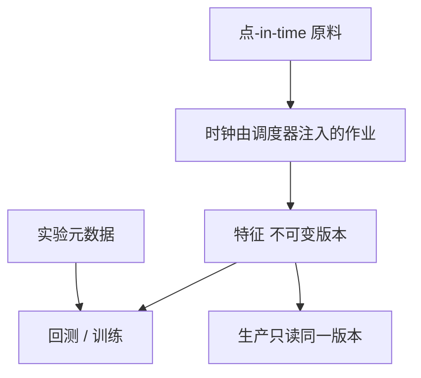

# 特征商店与研究平台

特征不是 notebook 里的一张 DataFrame，而是带 as-of、血缘与版本的只读快照。训练与实盘读同一份契约，才谈得上衰减来自市场而不是来自管道。

<footer>—— 对照 López de Prado, Advances in Financial Machine Learning 对研究可重复性的强调；Croushore–Stark 实时数据原则在特征层的应用</footer>

[上一课](/quant/data-vendors)要求字段有权威源。[迟到对账](/quant/late-data-recon)要求时钟。本课的缺口是**把已清洗字段组织成可点-in-time 查询的研究平台**：特征商店。López de Prado 强调研究和生产的泄漏；本课把它收到工程对象上。后课向量化回测假定特征已经能按日期批量取出且无未来函数。

## 问题

常见泄漏：用全样本标准化的均值方差去做当日 z-score；用包含 $t+1$ 的滚动窗口；用修订后基本面；用当时尚未调入指数的成员。特征商店的工作是使这些操作要么不可能，要么显式、可审计。问题是 API 形状：`get(feature_id, as_of, universe)` 只返回 $as\_of$ 日可知的值，拒绝「给我这列到昨天为止的未来」。

版本：同一 `feature_id` 的定义会变（换清洗、换复权）。应 `feature_id + version` 不可变；训练记下版本哈希，生产用同一哈希。改定义出新版本，不覆盖旧快照——否则去年论文不可复现。这与会计 vintage 同一思想，对象换成派生特征。

### 研究平台不是交易网关

平台负责：宇宙、特征、标签、实验元数据、权限。下单仍走[FIX](/quant/fix-protocol) 与风控。把回测引擎与报盘写在同一进程，事故面变大，也更容易把实盘延迟写进研究或把研究的未来函数写进实盘。边界：平台输出目标仓位或信号快照；执行系统消费快照并返回成交。对账在后课监控。

「特征商店」一词来自通用机器学习工程。金融上必须多一个 as-of 轴，否则就是普通 ETL。没有 as-of 的 Feast 式商店，默认不适配交易。

## 方法

存储按 `(feature_id, version, instrument, as_of)` 分区。计算作业只允许读取 as_of 之前的原料，由调度器传入时钟，禁止作业自己 `datetime.now()` 混用研究时钟。宇宙来自[指数成分](/quant/index-constituents-history)的点-in-time 名单或显式自定义名单。标签（未来收益）单独库，训练时显式 join，并在交叉验证里按时间切，见过拟合课，不在特征计算里提前 join 未来收益。

实验跟踪：每次回测记下特征版本、宇宙、成本模型、代码提交。没有这些字段的结果不得进入生产候选。与数据商对照的黄金样本应作为特征发布的门禁。

### 点-in-time 标准化

截面 z-score 用当日已实现的截面均值方差，或用截至昨日的滚动。全样本标准化禁止。行业中性：行业分类也要点-in-time（公司会改行业）。这些规则写在特征定义里，而不是写在某个研究员的记忆里。

## 机制

泄漏让样本内表现包含未来信息，生产一旦换成真 as-of，IC 下降。看起来像「因子死亡」，其实是管道从作弊切换到诚实。特征商店把诚实变成默认。代价是迭代变慢：改一个定义要出新版本、跑对照、再训。这是纪律成本，后课研究日志把它记下来，避免用「我本地改了一下」绕过版本。

规模：向量化取出宽表（日期 × 品种）供后课回测；事件级特征仍按事件时间存，不强行灌进日频宽表。两种存储可以共存，但 ID 空间统一。

## 边界

本课不写如何把未公开数据藏进特征以规避披露。另类数据许可、个人信息与内幕信息边界以法律为准。特征商店不是「越大越好」：无经济假设的千列宽表会把过拟合移到特征选择阶段。

## 小结

- 特征 API 强制 as-of；定义版本不可变，训练与生产钉同一哈希。
- 平台不下单；输出信号快照，执行另走网关。
- 截面标准化与行业分类都必须点-in-time。
- 出处：López de Prado, *Advances in Financial Machine Learning*；Croushore–Stark 实时原则。
