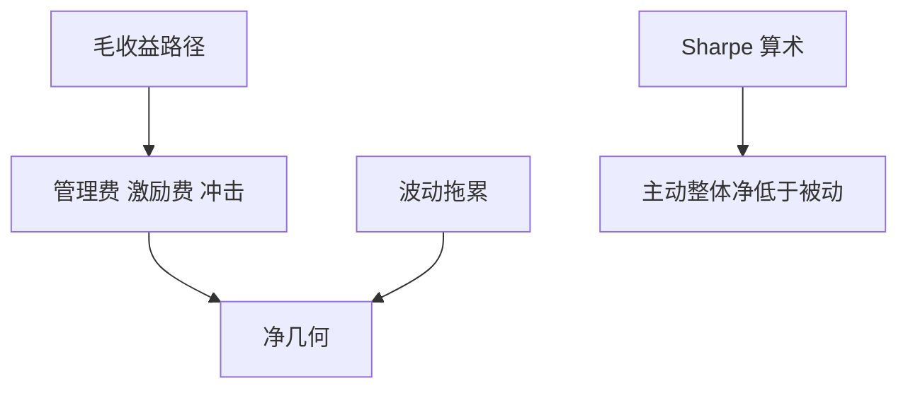

# 费用对复合收益

主动投资作为一个整体，在扣费后必须输给被动整体：这是会计恒等式，不是对任何一只基金的预测。

<footer>—— Sharpe, The Arithmetic of Active Management, Financial Analysts Journal, 1991；社会成本见 French, Journal of Financial Economics, 2008</footer>

[上一课](/quant/performance-fee-hwm)把激励费写成路径期权。本课的缺口是**管理费、交易成本与激励费如何进入几何收益**。Sharpe 的算术：主动投资者整体持有市场，毛收益相等，费用让主动整体净收益低于被动。French 估计美国主动投资的社会成本。本课把恒等式接到产品：2% 管理费不是从算术均值里减 200bp 那么简单，它与波动拖累、杠杆重置同类，见 [杠杆与波动拖累](/quant/leverage-volatility-drag)。

## 问题

年费 $f$ 对财富的乘数是 $(1-f)$ 每年，或更细的日计提。几何收益近似 $\mu-\sigma^2/2-f$。高波动策略同样的 $f$ 吃掉更多复利，因为净值回撤后费用仍按 AUM 抽。激励费在水位上额外非线性。问题是比较：毛夏普好看的策略，扣费后可能低于便宜的风险平价或指数。ARP 产品若叠加基金费、平台费、指数许可费，边缘见 [净边缘](/quant/net-edge)。

与生命周期：衰减的毛 IR 先被费用打穿。产品该停的时点往往是扣费 IR 过零，而不是毛 IR 过零。

### 算术主动 vs 单只基金

Sharpe 的恒等式不禁止单只基金扣费后战胜市场，只禁止**全体**主动一起战胜。营销用单只样本路径对抗恒等式，是选择偏差，见 [放气夏普](/quant/deflated-sharpe)。评价单只仍要做，但要把费用当确定的负 carry，不是当「如果今年没赚就不算」。

资金加权后，费用发生在 AUM 最大的时候往往最伤——那正是后课资金流追逐业绩的时候。

## 方法

模拟：日计提管理费 + HWM 激励 + 预估换手成本。输出：净几何、净夏普、相对被动的缺口。对照：把 $f$ 从 0 扫到合同值，看 IR 何时过零。杠杆策略的融资成本与费用分列，不要塞进同一个「损耗」。

## 机制

费用是对财富过程的连续漏出。凸性（激励费）在正路径上加速漏出，在负路径上留下管理费漏出。复利使早期高费对终值的伤害大于晚期。被动越便宜，主动必须提供的毛 IR 越高——这是算术，不是对技能的否定。

## 边界

本课不算税务（见税务感知组合课）也不算业绩费的会计操纵。下一课问扣费后技能是否持续，而不是再讲费用公式。

## 小结

- 费用进入几何，与波动拖累一起减终值；不是从算术均值里减一个常数。
- 主动整体扣费后不可能战胜被动整体（Sharpe 算术）。
- 产品停损看扣费 IR，不看毛 IR。
- 出处：Sharpe, *FAJ*, 1991；French, *JFE*, 2008。
