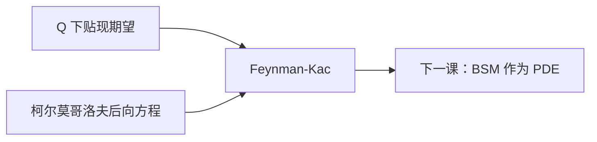

# Feynman–Kac

扩散的贴现期望满足柯尔莫哥洛夫后向方程：生成元作用在价格函数上，等于贴现与时间导数的平衡。

<footer>—— 据 Karatzas and Shreve, 1991, §5.7；Øksendal, Stochastic Differential Equations, 第 6 版, 第 8 章；Shreve, Stochastic Calculus for Finance II, 第 6 章整理</footer>

上一课[不全市场](/quant/incomplete-market)说明多个 $Q$ 时期望不唯一。本课回到已经选定一个测度、标的为扩散的情形。缺口是：$\mathbb E[e^{-\int r}g(X_T)\mid X_t=x]$ 如何变成关于 $(t,x)$ 的 PDE。没有这条桥，下一课无法把 Black–Scholes 写成方程。本课只给 Feynman–Kac 接口，不把 BSM 的边界条件写完。

## 问题

风险中性价格已经是条件期望。要计算它，一条路是模拟路径，另一条是解 PDE。缺口是承认两者是同一对象的两种写法：若 $u(t,x)$ 足够光滑、满足终值 $u(T,x)=g(x)$ 以及

$$
u_t+\mathcal A u-r u=0,
$$

其中 $\mathcal A$ 是扩散在该测度下的生成元，则 $u(t,X_t)$ 贴现后为鞅，从而 $u$ 等于条件期望。反过来，在正则性下条件期望解这个 Cauchy 问题。

本课不重推 Itô。生成元 $\mathcal A=\mu\partial_x+\tfrac12\sigma^2\partial_{xx}$ 已在伊藤引理里出现，这里只把它接到带杀灭（贴现）的期望。

### Feynman–Kac 不是量子力学的必经路

名字来自 Feynman 路径积分与 Kac 对 Schrödinger 半群的概率表示。金融只用概率这一侧：期望 $\leftrightarrow$ PDE。不必引入 Planck 常数或路径积分测度。把本课读成物理课，会把 $r$ 当成势能乱配。

贴现 $r$ 是零阶项。区域上的击中（障碍）把终时换成停时，PDE 换成边值；那是同一条公式的 Dirichlet 版，本课先钉全空间 Cauchy。

## 方法

设 $\mathrm d X=\mu(t,X)\,\mathrm d t+\sigma(t,X)\,\mathrm d W$，取

$$
u(t,x)=\mathbb E\bigl[e^{-\int_t^T r(s,X_s)\mathrm d s}g(X_T)\bigm|X_t=x\bigr].
$$

则（在多项式增长等条件下）$u$ 解 $u_t+\mu u_x+\tfrac12\sigma^2 u_{xx}-r u=0$，$u(T,\cdot)=g$。若还有支付流 $f$，右端加 $-f$。多维把 $\mathcal A$ 写成梯度与 Hessian 的收缩。这是后课 BSM 的模板：把 $\mu$ 换成 $rS$、$\sigma$ 换成 $\sigma S$、$g=(x-K)^+$。

反过来：用 Itô 作用 $e^{-\int r}u(t,X_t)$，PDE 恰好取消漂移，剩下随机积分；取期望得表示。这是「验证定理」方向，数值上常先猜 PDE 再承认它是价格。

## 机制

Itô 把 $u(t,X_t)$ 的漂移写成 $u_t+\mathcal A u$。贴现的乘积法则再减 $r u$。令漂移为零，贴现价格成为局部鞅；可积时取条件期望，初值等于终端支付的贴现均值。PDE 因此不是另起的「期权方程」，而是鞅条件的微分形式。生成元用哪个 $\mu$，就对应哪个测度：物理测度下是预测方程，风险中性下是定价方程。同一 $g$，不同 $\mathcal A$，解不同——这与「$\mu$ 不进 BSM」一致：BSM 用的是 $Q$ 的 $\mathcal A$。

边界与增长条件挡住爆炸解。没有它们，PDE 可能有许多解，只有多项式增长的那个等于期望。后课数值解要尊重这条，不能随便加一个快速增长的齐次解。

## 边界

本课不证一般半群理论，不处理积分-微分方程（跳）。美式把等式换成变分不等式，留给最优停课。后课默认：扩散 + 选定测度 $\Rightarrow$ 价格满足后向 Kolmogorov 加贴现。下一课[Black–Scholes 作为 PDE](/quant/bsm-as-pde)把 $\mathcal A$ 特化成 GBM 在 $Q$ 下的算子。

## 小结

- 贴现期望与带生成元的 PDE 是同一价格的两种写法。
- $\mathcal A$ 取自用来取期望的那个测度。
- 验证方向：PDE 使贴现 $u(t,X_t)$ 为鞅。
- 增长条件选出等于期望的那个解。
- 出处：Karatzas–Shreve §5.7；Øksendal 第 8 章；Shreve SDE II 第 6 章。
