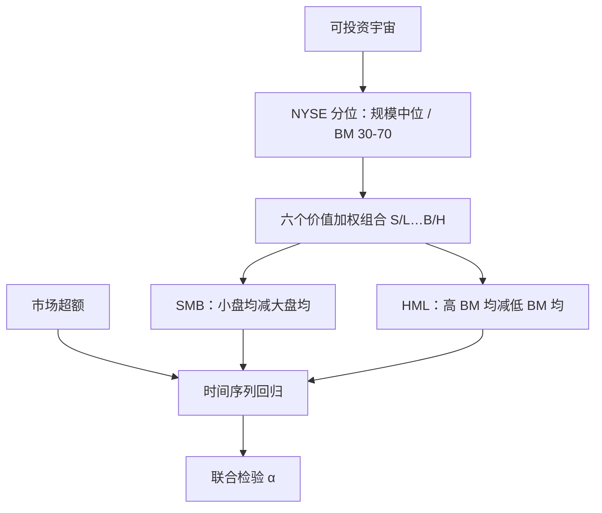

# Fama-French 三因子

股票收益的截面差异，并不能被市场 β 单独吸收；规模与账面市值比所代表的共同变动，必须作为额外的风险因子进入时间序列回归。

<footer>—— Fama & French, Common risk factors in the returns on stocks and bonds, Journal of Financial Economics, 1993</footer>

[CAPM](/quant/capm) 把超额收益写成对市场组合的暴露。Fama 与 French 在 1992 年的截面回归里已经看到：β 几乎解释不了平均收益的差异，市值与账面市值比（B/M）却能。1993 年的三因子模型把这两条特征翻译成可交易的多空收益序列——**SMB**（Small Minus Big）与 **HML**（High Minus Low）——再与市场超额收益一起，对组合或个股做时间序列回归。本篇只写股票侧的三个因子及其 2×3 构造；债券侧的期限与违约因子是同一篇文章的另一半，不在这里展开。后续的盈利与投资，见 [五因子](/quant/ff5)。

## 问题

CAPM 的预测是：截面上只有市场 β 被定价。实证上，小市值股票、高 B/M（价值）股票的平均收益高于 CAPM 所允许的水平，低 B/M（成长）则偏低。若把这些异常当成「错误定价」，模型就没有共同因子可对冲；若把它们当成补偿某种未写入市场组合的风险，就需要把规模与价值的共同变动抽成因子。Fama-French 选后一条路：先按特征排序做成多空组合，再问这些组合的收益能否吸收其他异常。

规模与价值并不是正交的。小盘里价值溢价通常更强，大盘成长与大盘价值的行为也不同。若只按市值切一刀、再按 B/M 切一刀且不做交叉，SMB 会混进价值，HML 会混进规模。因此构造必须在二维格子上同时控制两者。

### 为何是账面市值比而不是盈余收益率

1992 年的截面工作比较过 E/P、杠杆、B/M 等。B/M 在当时样本里对平均收益的单调性最干净，也最接近股利贴现模型的直觉：给定账面股权，价格低意味着贴现率高。E/P 会把亏损公司单独处理，B/M 则把亏损与高杠杆一并推进高账面组。三因子把 B/M 做成 HML，并不否定 [EP、CF 等价值度量](/quant/value-factors) 在别的样本里更稳；它只是选定一个能覆盖 1963 年之后美股截面的代理。

三因子是时间序列模型，左边是组合超额收益，右边是因子收益。它不是「在截面上把市值与 B/M 当特征回归」的 1992 年设定。两个 Fama-French 年份常被写成一篇；1992 证明特征有效，1993 把特征做成因子并检验 α。

## 方法

每年 6 月底（与财报滞后对齐）用纽交所（NYSE）中位数把股票分成小盘 S 与大盘 B；再用 NYSE 的 B/M 30% 与 70% 分位切成低（L）、中（M）、高（H）。独立双重排序得到六个价值加权组合：S/L、S/M、S/H、B/L、B/M、B/H。B/M 用上一年财报的账面股权除以 12 月底市值，规模用 6 月底市值。因子收益按月计算：

$$
\begin{aligned}
\mathrm{SMB} &= \tfrac13(R_{S/L}+R_{S/M}+R_{S/H}) - \tfrac13(R_{B/L}+R_{B/M}+R_{B/H}), \\
\mathrm{HML} &= \tfrac12(R_{S/H}+R_{B/H}) - \tfrac12(R_{S/L}+R_{B/L}).
\end{aligned}
$$

市场因子 $R_M-R_f$ 是全部上市股票的价值加权超额收益。对任意资产 $i$，

$$
R_{it}-R_{ft}=\alpha_i+\beta_{iM}(R_{Mt}-R_{ft})+\beta_{iS}\mathrm{SMB}_t+\beta_{iH}\mathrm{HML}_t+\varepsilon_{it}.
$$

检验的原假设是 $\alpha_i=0$。若一组按其他特征排序的组合在三因子回归里 α 联合不显著，就称这些特征被三因子「吸收」。

### 2×3 格子如何把规模与价值拆开

SMB 对三个 B/M 组等权平均，再减小盘减大盘，于是 HML 方向上的暴露被对冲掉一块。HML 对大小盘等权，再高减低，规模暴露被对冲。中间组 M 进入 SMB 但不进入 HML，避免把中等 B/M 的噪声喂进价值因子。全部用价值加权，是为了让因子代表「按市值加权的经济」，而不是微型股的等权噪声；等权版本会放大微观结构与[反转](/quant/short-term-reversal)。

## 机制

模型的经济学叙事是：小盘与价值股对「相对困境」更敏感——盈利能力弱、杠杆高、在紧缩时更难再融资——因此要求更高的风险补偿。HML 的正暴露被解释为对财务困境风险的补偿，SMB 则对小型企业的信贷与流动性更敏感。这套叙事从未被现金流数据钉死：价值溢价也可以来自投资者对成长股的过度外推（行为）。三因子并不在「风险补偿 vs 错误定价」之间做识别；它只保证：若你的组合在规模与 B/M 上有净暴露，你的平均收益里就有一块可以被 SMB 与 HML 的历史溢价说明。

时间序列里，因子的 β 是协方差，不是排序用的特征本身。一只当前 B/M 并不高的股票，仍可能因为与价值股同涨同跌而带上正的 HML β。特征组合与因子载荷是两条相邻但不同的对象；把「高 B/M」直接写成「高 HML β」会在行业轮动期出错。

### 对债券与对股票异常的不对称

1993 年同时为股票与公司债定价。股票侧三个因子对债的解释力有限，债的期限与违约因子对股票的 α 也帮不上忙。这意味着三因子首先是**股票截面**的工具。对股票内部，规模与价值能吸收不少 CAPM α，但[动量](/quant/momentum-wml)组合的 α 仍然显著——这是后来 Carhart 四因子补 WML 的直接动机，而不是三因子已经「完成」。

Ken French 数据库提供的 SMB/HML 用的是美股 CRSP/Compustat 口径与 NYSE 断点。把同一套公式套到 A 股或新兴市场时，必须重做当地交易所的断点，并处理 ST、壳与停牌。直接下载美股因子去回归 A 股组合，β 没有定价含义。

## 边界与工程取舍

三因子假设线性、β 恒定、残差与因子正交。条件 β、宏观状态变量会破坏第一项，见后续的条件定价条目。HML 用年度财务、12 月底价格，信息滞后最长接近一年半；Asness 与 Frazzini 后来的「HML Devil」用当期价格更新 B/M，溢价更大、换手也更高，那不是 1993 年的因子。

样本起点通常是 1963 年 7 月（Compustat 覆盖）。更早的美股价值溢价存在，但财务数据质量不同。微型股、IPOs、低价股会扭曲等权；价值加权又会让因子被少数大盘主导。实务上常在 NYSE-Amex-NASDAQ 上再加一层可投资过滤（价格、美元成交额），这会改变 SMB 的幅度。

不要把三因子的 $R^2$ 当成定价成功。时间序列 $R^2$ 高只说明共同波动被抓住；定价成功看的是 α 以及 GRS 一类联合检验。也不要把 SMB 理解成「做多小盘指数」：它是小盘减大盘，且在 B/M 上中性化过。

真实出处：Fama & French, *The Cross-Section of Expected Stock Returns*, Journal of Finance, 1992；*Common risk factors in the returns on stocks and bonds*, Journal of Financial Economics, 1993。不要把 1993 写成已经包含动量或盈利。Carhart 1997 才把 WML 加进来。

## 小结

- 三因子在市场超额之外加入 SMB 与 HML，用 2×3 独立排序把规模与价值的共同收益做成可回归的因子。
- 构造用 NYSE 断点与价值加权，HML 对冲规模、SMB 对冲 B/M，避免两个特征互相污染。
- 定价语句是时间序列 α 为零，不是截面 $R^2$，也不是「高 B/M 等于高 HML β」。
- 动量、盈利、投资在三因子下仍有 α，这是四因子与[五因子](/quant/ff5)的入口。
- 出处：Fama & French, Journal of Financial Economics, 1993；截面预备见 Journal of Finance, 1992。
