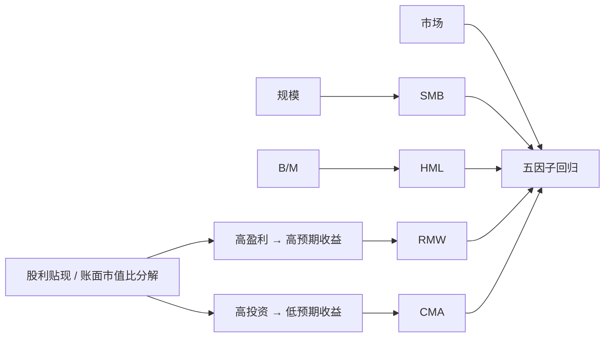

# Fama-French 五因子

在股利贴现模型里，给定账面市值比，更高的预期盈利意味着更高的预期收益，更高的预期投资意味着更低的预期收益；把这两条写成因子，就是盈利与投资。

<footer>—— Fama & French, A five-factor asset pricing model, Journal of Financial Economics, 2015</footer>

[三因子](/quant/ff3)留下两块长期显著的 α：高盈利公司的收益偏高，激进加资产的公司收益偏低。[Novy-Marx 的毛利率](/quant/quality-profitability)与资产增长文献已经把这两条写成特征。Fama 与 French 2015 年把它们收成 **RMW**（Robust Minus Weak）与 **CMA**（Conservative Minus Aggressive），与市场、SMB、HML 组成五因子。本篇写股利贴现动机、2×3 与 2×2×2×2 两套构造，以及「HML 变得多余」这件事在什么样本上成立。投资侧的会计细节见[投资与资产增长](/quant/investment-factor)。

## 问题

股利贴现把当前市值写成未来超额盈利（相对再投资）的折现。两边同除以账面股权 $B_t$，得到大致关系：B/M 高、预期盈利高、或预期投资低，都对应更高的内部收益率。三因子只用了 B/M（以及规模），等于把盈利与投资的信息压缩进价格。若市场对盈利与投资的定价不完整，或者两者有独立于 B/M 的共同变动，三因子就会在按盈利、按投资排序的组合上留下 α。

经验上这正是 1990 年代之后美股的情况：毛利率、营业利润率能预测收益，且不能被 HML 吸收；总资产增长、资本开支增长预测负收益，同样独立于价值。问题不是再找两个「能分开组的特征」，而是如何做成与 SMB/HML 同一套语言的多空因子，并检查五因子是否让 HML 的斜率变得不必要。

### 盈利与投资为何不能只留在残差里

若只在三因子回归里加两个虚拟变量式的特征组合，模型仍然对其他资产给出被 SMB/HML 污染的 β。把 RMW、CMA 放进右侧，等于承认这两类共同收益是定价核的一部分：任意组合的预期超额收益应等于五个 β 乘以五个因子溢价。这和「在 α 上再回归一次盈利」不是同一句话。后者是诊断，前者是模型。

2015 年的盈利不是毛利率。Fama-French 的营业利润率（operating profitability）是营业收入减销售成本、销售管理费用与利息，再除以账面股权。Novy-Marx 用（营收−销货成本）/总资产。两者相关但不是同一个因子；混用再抱怨「复制不了 French 数据库」是口径问题。

## 方法

规模断点仍是 NYSE 中位。盈利与投资各用 NYSE 的 30% 与 70% 分位。营业利润率用上一年财报；投资用总资产相对再上一年的增长率（$\Delta A_t/A_{t-1}$）。主方案是三套 2×3：规模×B/M、规模×盈利、规模×投资，分别定义 HML、RMW、CMA，SMB 则对三套小盘减大盘再平均，以免 SMB 只在某一特征上中性。

$$
\begin{aligned}
R_{it}-R_{ft}&=\alpha_i+\beta_{iM}(R_{Mt}-R_{ft})+\beta_{iS}\mathrm{SMB}_t\\
&\quad+\beta_{iH}\mathrm{HML}_t+\beta_{iR}\mathrm{RMW}_t+\beta_{iC}\mathrm{CMA}_t+\varepsilon_{it}.
\end{aligned}
$$

备选是 2×2×2×2：规模、B/M、盈利、投资各切两档，得到 16 个价值加权组合，再按目标维度平均多空。2×2×2×2 控制更干净，格子更稀、微型组合更噪；2×3 更接近 1993 年的惯例，也是 French 数据库的默认。

### HML 的冗余

在他们的美股样本里，把 RMW 与 CMA 加进去之后，HML 的因子溢价在对其他四个因子的回归中 α 接近零：价值的平均收益大体能被「弱盈利、高投资」的对立面说明——成长公司往往高投入、账面利润率路径不同。于是有人讨论四因子（去掉 HML）。这不是说价值特征不再预测收益，而是说**作为右侧因子**，HML 的独立定价贡献变弱。国际样本与更早样本里冗余并不总成立；A 股上价值、盈利、投资的共线性结构也不同，不能把「美股 HML 多余」写成定律。

## 机制

盈利因子捕获的是「同样的资产、更多的当期经济利润」。会计利润会被应计项操纵，所以后续有现金营业利润等修正，但 2015 年的机制仍是应计制营业利润。投资因子捕获的是扩张：q 理论说，当贴现率低时公司会多投资，于是高投资是低预期收益的代理；过度投资与帝国建造给出行为解释。五因子把两种解释都收成同一对多空腿，并不检验哪一种对。

SMB 在五因子里被重定义，因为它必须在盈利与投资上也尽量中性。直接沿用 1993 年的 SMB、再外挂 RMW/CMA，小盘盈利与小盘投资的暴露会漏进规模因子。读数据库时要看 SMB 的脚注是三因子口径还是五因子口径。

### 与 q 因子、六因子的邻接

Hou、Xue、Zhang 的 q 因子用市场、规模、投资、盈利（ROE），不用 HML，时间上与五因子并行。Fama-French 后来又讨论加动量的六因子。五因子正文的主张更窄：在他们的检验组合（含规模、B/M、盈利、投资交叉）上，五因子比三因子显著减 α；对动量组合仍然不够——WML 不是 2015 年模型的一部分。

CMA 的「保守」是低资产增长，不是低资本开支一项。总资产增长包含并购、存货、现金堆积。只用 capex 会得到另一条[投资因子](/quant/investment-factor)，与 CMA 相关但换手与行业暴露不同。

## 边界与工程取舍

财务数据至少滞后六个月，6 月重构是为了避免前视。盈利为负的公司进入「弱」组，会让 RMW 带上困境与杠杆；有人把亏损单独分组。金融行业的账面与投资含义不同，French 的股票因子通常剔除金融，债券不在五因子里。

五因子对时间序列 $R^2$ 的提升往往小于对 α 的改善：市场因子已经解释了大部分共同波动。评价应看 GRS、α 的均方，而不是五个 β 都显著。过拟合风险是真实的：每加一个按财务排序的因子，都能在同一套财务检验组合上变好。动量、低波动、流动性仍在五因子之外，需要单独的[多空排序](/quant/long-short-sort)诊断，而不是宣称「截面已经闭合」。

不要把 RMW 叫做质量因子的全体。[质量与盈利](/quant/quality-profitability)还包含杠杆、盈利稳定、应计质量；QMJ 比 RMW 宽。也不要把五因子的 SMB 与三因子 SMB 画在同一张图上当连续序列，除非已对齐定义。

真实出处：Fama & French, *A five-factor asset pricing model*, Journal of Financial Economics, 2015。股利贴现动机在文中是启发式，不是推导出的随机贴现因子。Hou–Xue–Zhang q 因子是 Review of Financial Studies, 2015，不要写成 FF 五因子的附录。

## 小结

- 五因子在三因子上加入 RMW 与 CMA，对应股利贴现里盈利与投资两条比较静态。
- 默认构造是三套 2×3；2×2×2×2 控制更严、格子更噪。SMB 必须按五因子口径重做。
- 美股样本里 HML 对其他四因子往往冗余，国际与 A 股不能照抄这条结论。
- 动量、低波动、流动性仍在模型外；α 诊断不能用时间序列 $R^2$ 代替。
- 出处：Fama & French, Journal of Financial Economics, 2015。
