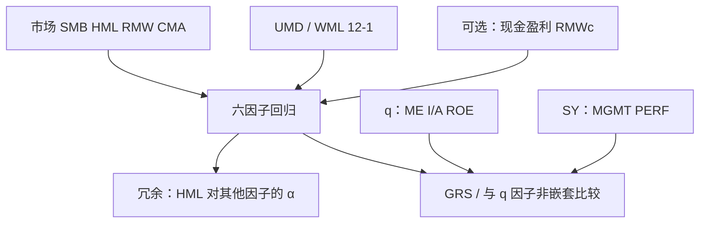

# Fama-French 六因子

在五因子之外加入动量，并用现金盈利替换或部分替换营业利润，是在已有定价核上补一块五因子系统性留不住的共同收益，而不是再发明一套截面故事。

<footer>—— Fama & French, Choosing factors, Journal of Financial Economics, 2018</footer>

[五因子](/quant/ff5) 对规模、B/M、盈利、投资交叉组合减 α 有效，对[动量](/quant/momentum-wml) 组合仍然不够。Carhart 很早就把 UMD/WML 加在三因子上。Fama 与 French 2018 年的 *Choosing factors* 把问题收成模型选择：在五因子、加动量的六因子、现金盈利版本、以及与 [q 因子](/quant/q-factor-hxz) 的对照里，用 GRS、α 的均方和冗余检验决定留哪些右侧变量。本篇写六因子的构造、HML 在更长右侧上是否更冗余、现金盈利（RMWc）与营业利润率的差别，以及如何避免把「六」当成闭合截面的广告。投资与盈利的会计细节仍见各自专篇。

## 问题

因子模型的目标不是 $R^2$，而是左边检验资产的 α 是否联合为零。五因子在动量十分位、行业动量、部分反转组合上留下显著 α，因为 2015 年模型的右侧没有相对强度。直接把 WML 加进去，几乎一定改善这些组合的 α——这既可能是补上真的定价因子，也可能是用一条高换手腿去拟合另一条高换手腿。选择问题是：加动量之后，原来的 HML、RMW、CMA 是否变成冗余（对其他因子回归 α 为零），以及盈利该用营业利润还是现金利润。

第二件事是赛马纪律。q 因子用 I/A 与 ROE、不含 HML；[Stambaugh–Yuan](/quant/sy-mispricing) 用 MGMT 与 PERF，PERF 已含动量。在同一套检验资产上比 GRS，必须锁定检验资产与样本期。用动量组合当唯一检验资产，六因子必赢；用投资×盈利格子当唯一检验资产，q 因子或五因子更好看。2018 年论文的贡献是把这些比较写清楚，而不是宣布最终模型。

### 冗余检验不是把因子从经济里删掉

HML 对其他因子回归 α 接近零，意味着作为**右侧因子**，它的平均收益已被其余因子的 β 说明，再留它主要增加共线。价值特征仍然可以预测收益，只是预测被盈利、投资、动量的暴露吸收。投资组合若按 B/M 排序，持仓与「无 HML 的五因子加动量」仍不同。冗余是时间序列语句，不是「价值已死」。国际样本与不同盈利定义下，HML 不必冗余。

六因子有两种常见实现：五因子加 UMD，盈利仍是营业利润；以及把 RMW 换成现金盈利 RMWc 再加 UMD。French 数据库的脚注必须对齐，否则 SMB 的中性定义（对哪一套 2×3 平均）会对不上。

## 方法

动量腿与 Carhart/French 的 UMD 一致：过去 12−1 个月收益，NYSE 断点，与规模 2×3，价值加权，赢家减输家，月度再平衡，跳过最近一个月以免混进[短期反转](/quant/short-term-reversal)。五因子部分仍是市场、SMB、HML、RMW、CMA 的 2×3 构造；加入 UMD 后，SMB 是否要对动量也中性，属于实现细节，主表通常保持 2015 年的 SMB 定义以免改写历史序列。回归为

$$
\begin{aligned}
R_{it}-R_{ft}&=\alpha_i+\beta_{iM}(R_{Mt}-R_{ft})+\beta_{iS}\mathrm{SMB}_t+\beta_{iH}\mathrm{HML}_t\\
&\quad+\beta_{iR}\mathrm{RMW}_t+\beta_{iC}\mathrm{CMA}_t+\beta_{iU}\mathrm{UMD}_t+\varepsilon_{it}.
\end{aligned}
$$

现金盈利版本用现金营业利润（扣应计）替代或补充营业利润，动机是应计操纵与投资-应计重叠。RMWc 与 CMA 的相关往往低于应计制 RMW 与 CMA，因为扩张公司应计高、现金利润更弱，现金盈利把一部分「假盈利真扩张」从 RMW 挪走。选择现金还是应计，会改变 HML 冗余是否成立，也会改变对 q 因子 ROE 的相对表现。

### GRS、嵌套与检验资产

嵌套：六因子相对五因子，用 UMD 的 α（对其余回归）或 GRS 增量。相对 q 因子，非嵌套，应用 Barillas–Shanken 一类比较或双方互为左侧的拼盘回归：q 因子的 I/A、ROE 对六因子是否还有 α，UMD、HML 对 q 因子是否还有 α。检验资产应同时包含：FF 风格交叉组合、动量组合、文献异常组合。只报告对自己有利的那一张表，是模型选择而不是发现。

SMB 在六因子里仍然敏感于小盘动量与小盘盈利。价值加权检验组合会让六因子看起来更成功；等权微型组合会让任何模型都留下 α。可投资结论以前者为准，诊断用后者。

## 机制

动量进入定价核的机制仍是开放的：风险方面，赢家在市场状态好时更敏感，UMD 补偿该协方差；行为方面，反应不足与资金流让相对强度持续。五因子的股利贴现启发式覆盖不了 12−1 的价格路径，所以 α 留着。六因子用一条可交易腿把这块共同收益收进来，对冲动量暴露，而不是解释动量从哪来。现金盈利的机制是：应计制利润把投资与盈余管理写进分子，现金利润更接近可分配的经济利润，盈利因子与投资因子的分工更干净——这与 Ball 等人主张现金营业利润预测收益的文献一致。

HML 在六因子里更常显得冗余，因为动量的输家偏价值、赢家偏成长，UMD 与 HML 负相关；盈利与投资又从基本面侧拆走价值的一部分。三者一起，价值腿的独立平均收益变薄。这不阻止在约束组合里保留价值暴露：若投资政策要求价值风格，应直接持有 HML 或 B/M 排序，而不是假设六因子 β 会自动给出同样的持仓。

### 与 q 因子、错误定价因子的邻接

q 因子不加动量，对 WML 组合往往不如六因子；六因子的年度或现金盈利不如季频 ROE 对盈余路径敏感。SY 的 PERF 已经混合动量与盈利，与 UMD+RMW 共线。没有一个六或四在所有检验资产上包办。工程选择取决于要对冲的暴露：交易动量就要有 UMD 或 PERF；交易资产增长就要有 CMA 或 I/A；声称「截面已闭合」则任何一张表都不够。

2018 年论文的标题是选择因子，不是「六因子模型正式取代五因子」。实务下载六条序列时，应写明盈利口径与动量定义，并单独报告无 UMD 的五因子 α，以免动量腿单独贡献全部改善。

## 边界与工程取舍

动量换手高、崩溃月剧烈，六因子对冲动量时会在崩溃月留下大残差——模型在样本里吸收的是平均 α，不是左尾。不要用六因子回归的高 $R^2$ 当业绩归因的全部：市场因子仍主导共同波动。不要把 UMD 加进右侧后再对动量组合检验并宣称胜利，那是同义反复；压力应放在未用于构造 UMD 的异常上。

财务滞后、6 月重构、跳月仍适用。现金盈利需要现金流量表，覆盖与季节性与应计制不同。A 股动量与价值的相关结构不同，HML 冗余不必复制。「六」不是上限：流动性、低波动仍在模型外，是否加入取决于投资宇宙，而不是把 2018 年的选择写成宇宙定律。

出处：Fama & French, *Choosing factors*, Journal of Financial Economics, 2018；五因子为 2015 年 JFE；动量为 Jegadeesh–Titman 1993 与 Carhart 1997。q 因子为 Hou, Xue & Zhang, RFS 2015。不要把六因子标成 2015 年论文的内容。

## 小结

- 六因子是五因子加动量（UMD），可选把盈利换成现金利润；针对五因子留不住的动量 α。
- HML 在更长右侧上更常冗余，价值特征仍可交易，只是作为因子的独立溢价变薄。
- 模型选择看 GRS 与互为左侧的拼盘，看检验资产是否被挑选；同义反复的动量表不算胜利。
- 与 q 因子、SY 错误定价因子各有擅长的压力组合，没有闭合截面。
- 出处：Fama & French, Journal of Financial Economics, 2018。
