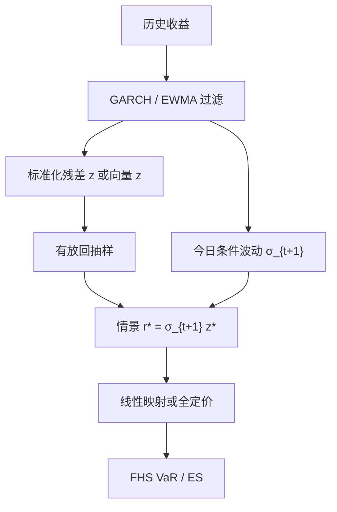

# Filtered Historical Simulation

历史模拟的残差里既有当时的波动水平，也有收益的横截面依赖；先用条件方差把波动滤掉，对标准化残差重抽样，再配上今日的波动，历史情景才能对当前体制说话。

<footer>—— Barone-Adesi, Giannopoulos and Vosper, VaR without Correlations in Nonlinear Portfolios, Journal of Futures Markets, 1999</footer>

朴素 [历史 VaR](/quant/var-methods) 把过去 $n$ 日的因子变化等权应用到今日头寸上。Pritsker（2006）指出它的核心迟钝：窗口里大部分日子来自旧体制，今日若已处于高 $\sigma_t$，等权经验分位数会偏低。Barone-Adesi、Giannopoulos 与 Vosper 的过滤历史模拟（Filtered Historical Simulation, FHS）把「形状」和「尺度」拆开：用 [GARCH](/quant/garch)（或 EWMA）估计条件方差，取出标准化残差 $z_t=r_t/\sigma_t$，从 $\{z_t\}$ 有放回抽样，再乘上从今日出发的预测波动，得到情景收益。相关结构不必另估一张矩阵——多资产时直接重抽样历史残差**向量**，经验依赖留在向量里。本篇写这一滤–抽–配的步骤、非线性定价，以及它仍不是压力测试。

## 问题

历史法想保留的是经验分布：厚尾、偏度、某些非线性，都不必写成参数族。它不想保留的是「过去每一天的波动水平与今天相同」。波动聚类使无条件分位数与条件分位数分家：危机刚开始时，$\sigma_t$ 已经跳起，窗口中位数仍是平静期。参数法用 $\sigma_t\Phi^{-1}(\alpha)$ 解决尺度，却把形状钉成正态（或 $t$）。FHS 的问题设定是：形状用历史残差的经验测度，尺度用条件方差模型，二者分开校准。

第二句话是相关。多元参数 VaR 要估 $\Sigma_t$，维数高时噪声大，且高斯相关没有尾依赖。FHS 不对残差估相关矩阵：一次抽出某日的整条残差向量，该日各资产如何同涨同跌，原样进入情景。Barone-Adesi 等人标题里的 “without correlations” 不是「假设不相关」，而是「不显式参数化相关」。

### 过滤必须在信息集上可测

$\sigma_t$ 必须关于 $t-1$ 可测。用含当日收益的已实现波动去标准化当日残差再「预测」当日 VaR，是前视。GARCH 一步预测 $\sigma_{t|t-1}$、RiskMetrics 的 EWMA 更新，都合法。过滤模型本身若在全样本上估一次再回看，参数含未来；严谨做法是滚动估计，或至少用当时生产参数回放，与 [VaR 回测](/quant/var-backtest) 的信息集要求一致。

残差 $z_t$ 应接近无条件方差为 1 的白噪声。若 GARCH 滤不干净，平方残差仍有自相关，重抽样会低估波动持续性。先做残差诊断，再谈分位数。

## 方法

**单资产、单步。** 拟合 $r_t=\mu_t+\sigma_t z_t$，例如 GARCH(1,1)。保存 $\{z_s\}_{s=1}^{n}$。今日预测 $\sigma_{t+1}$。从 $\{z_s\}$ 抽 $z^\ast$，情景收益 $r^\ast=\mu_{t+1}+\sigma_{t+1}z^\ast$。对组合线性时，损失 $L^\ast=-w r^\ast$。重复 $M$ 次，取经验 $\alpha$ 分位数，即 FHS-VaR；超过该分位数的平均即 FHS-ES。$M$ 可以大于 $n$（有放回），但有效信息仍由 $n$ 个残差决定，99.9% 不会因为 $M$ 很大而变得可靠。

**多步地平线。** 十日 VaR 不能对一日残差乘 $\sqrt{10}$。应迭代：抽 $z^\ast_1$，更新 $\sigma$ 到下一步，再抽 $z^\ast_2$，得到路径收益之和。路径上的波动会随抽到的大残差而升高，这是 GARCH 反馈，平方根法则没有。期权时间衰减与路径依赖必须在这条路径上重定价，而不是对期末现货做一次静态全定价了事。

**非线性组合。** 对每个情景的因子路径，用全定价器算组合价值变化。这正是 FHS 相对 delta–gamma 参数法的要点：残差可以来自线性因子，定价可以非线性。深度虚值期权在历史残差里若从未被「走到」，凸性仍不会出现——FHS 不能创造未见过的跳，只能把见过的跳按今日 $\sigma$ 重新缩放。

### 多元残差向量与 DCC 变体

基础 FHS：多元 GARCH 或各资产一元 GARCH 后，标准化残差向量 $\mathbf{z}_t$ 整向量重抽样，保留同期经验 Copula。若各资产波动模型不同步（一个用 GARCH，一个用 EWMA），向量里的「同日」仍必须是日历同日，否则假独立。更参数化的变体先用 [DCC](/quant/dcc) 滤相关，再对去相关残差抽样、用今日相关矩阵配回去；这能让相关随今日 $\Sigma_t$ 变，但把尾依赖交给了 DCC 的椭圆假设。Barone-Adesi 原意更接近前者：少估矩阵，多信历史同日。

残差窗口与波动模型窗口可以不同：GARCH 用较长样本估持续性，$z$ 的经验测度用较短窗口以跟上尾形状。两个带宽都要写进模型卡，并且不得用回测通过率去搜。

## 机制

过滤的机制是尺度分离。$z_t$ 的经验分布近似无条件形状；乘 $\sigma_{t+1}$ 之后，分位数随今日条件方差平移。高波动日限额自动收紧，这正是条件覆盖所要求的，也是等权历史法做不到的。重抽样向量的机制是非参数 Copula：把各边缘的概率积分变换留给经验残差，联合结构就是历史同日的联合。高斯 Copula 的 $\lambda=0$ 问题，在样本里曾经一起崩过的日子上，会被那些向量带进尾巴；样本里从未一起崩过，FHS 同样看不见。

与 [Cornish–Fisher](/quant/cornish-fisher-var) 的差别：CF 把形状收成两个矩；FHS 保留残差的整个经验测度，包括矩表达不了的双峰与非对称。与 MC 的差别：MC 的形状来自你写下的过程；FHS 的形状来自过滤后的历史。FHS 仍有模型风险，只是模型主要在波动方程，不在联合正态。

### 残差里还有什么没被滤掉

均值设定、隔夜跳、除权事件、错误印记，都会变成「形状」。不清洗则一个错误脉冲在每次抽到它时按今日 $\sigma$ 放大，FHS-ES 会被单个点主导。过度清洗又会削掉真尾巴。预指定清洗规则，并报告抽到极值残差的频率。体制切换若表现为残差分布的改变而不仅是 $\sigma_t$ 的改变，单一窗口的 $z$ 会把两体制混成一个形状；这时应缩短残差窗口，或对压力期单独做 [压力 VaR](/quant/stressed-var-frtb)，而不是指望 GARCH 吸收一切。

## 边界与工程取舍

FHS 依赖波动模型：GARCH 估爆、IGARCH 不均值回复、多元维数下一元过滤不一致，都会进入分位数。它不创造样本外的跳幅：把 1998 年的残差配上 2026 年的 $\sigma$，得到的是「当时那种标准化冲击在今天的尺度上」，不是「今天可能出现的新冲击」。监管压力期与 FHS 日常条件 VaR 应分开：前者换测度，后者换尺度。

回测上，FHS 的违反应比等权历史更接近独立（条件覆盖），这是它存在的经验理由。若独立性仍失败，过滤不够或残差有时变偏度。不要把 FHS 的 $M$ 次抽样误差当成模型不确定度的全部；有效样本是 $n$ 个历史日。期权账簿必须全定价；对过滤后的现货做 delta 近似，会把 FHS 退回带 GARCH 尺度的参数法。

标题里的 “without correlations” 常被误读成忽略依赖。实现检查：多元情景是否整向量抽出。若对每个资产独立抽 $z_i$，你加回的是独立 Copula，组合 VaR 会系统性偏低。

## 小结

- FHS 用条件方差过滤历史收益，对标准化残差重抽样，再配上今日波动，得到条件经验分位数。
- 多元时整向量抽样，经验依赖不必另估相关矩阵；独立抽各资产会毁掉这一优点。
- 多步地平线应迭代更新 $\sigma$，并在路径上重定价，不能乘平方根。
- FHS 不创造未见过的跳跃；压力期与日常条件 VaR 是不同测度。
- 出处：Barone-Adesi, Giannopoulos and Vosper, *Journal of Futures Markets*, 1999；相关讨论见 Barone-Adesi 等 “Don't look back”；Pritsker 对朴素历史法迟钝的批评，*Journal of Banking & Finance*, 2006。
