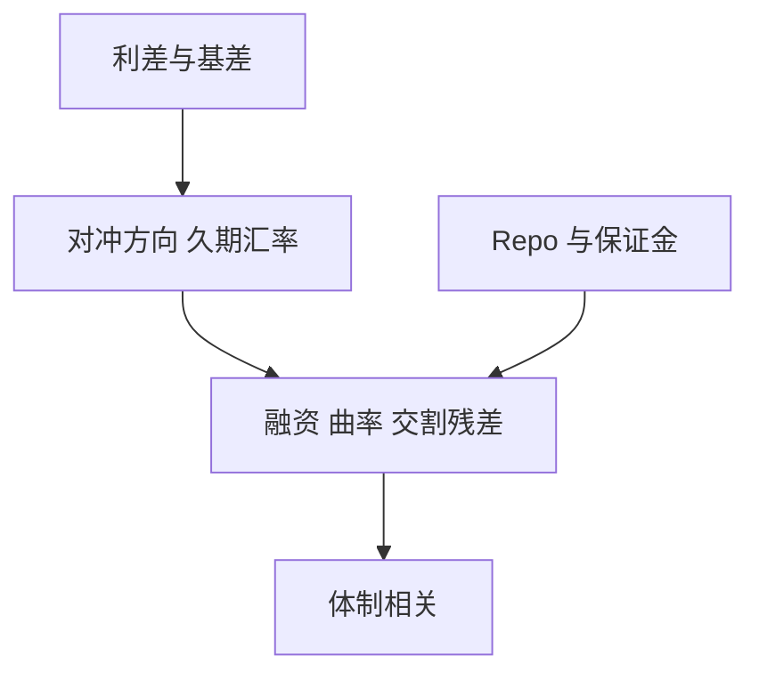

# 固定收益相对价值

固收相对价值卖的是利差均值回复，买的是融资、基差与尾部相关；平静期像在压路机前捡硬币，压力期硬币和压路机一起砸过来。

<footer>—— Duarte, Longstaff and Yu, Risk and Return in Fixed-Income Arbitrage, Review of Financial Studies, 2007</footer>

[上一课](/quant/global-macro)的宏观常保留净方向：久期、美元、商品。固收相对价值（FI RV）的缺口是**把方向对冲掉，只留曲线、基差与互换利差**。主干 [曲线蝶式](/quant/curve-butterfly)、[期限结构 Carry](/quant/ts-carry)、[CDS–债券基差](/quant/cds-bond-basis) 已写单条腿。本课给策略族位置：RV 是杠杆加约束的利差组合，不是「看对央行」的缩小版。

## 问题

把国债、互换、MBS、期货 CTD 的价差当成无风险套利，忽略：融资（repo、保证金）、交割期权、凸性与违约相关。Duarte–Longstaff–Yu 把互换利差、收益曲线、抵押、波动等 RV 策略放到同一张风险–收益表上：平均收益来自承担难对冲的残差，不是来自免费午餐。问题是风险预算：RV 的夏普在低波动体制里好看，在 1998、2008、2020 年融资与相关同时坏掉。地图要按**融资敏感 vs 曲率/波动敏感**分桶，而不是按券种标签。

与宏观：同一基金里常混「曲线陡峭」（有净久期）和「蝶式中性」。报告必须拆开，否则宏观的方向会被叫做 RV 的 alpha。

### 杠杆把利差分母变成危机分子

RV 的利差以基点计，要靠高杠杆才达到股权波动。杠杆的约束在 repo 与保证金，不在借券。利差走阔时，VAR 与 haircut 同向上升，被迫平仓把均值回复打断。这与股票多空的挤仓同构，工具不同。

LTCM 的教科书教训不是「不该做互换利差」，而是相关 1 与融资同时出现时，分散的 RV 桶并不是独立赌注。

## 方法

分类：互换–国债利差、曲线杠铃/蝶式、期货基差与 CTD、MBS OAS 对冲、跨币种基差。每类写：对冲后剩余风险、融资链、容量。组合：用情景（融资消失、曲线扭转）而不是历史 $\Sigma$ 的 99%。执行：报价惯例与应计见主干报价课，不要用收盘中价回测。

## 机制

无摩擦时，相近现金流的工具应由同一贴现核定价。摩擦（抵押品、资本、交割、流动性）打开基差。RV 赚的是摩擦补偿的一部分，付的是摩擦突然变大。宏观赚重估；RV 尽量对冲重估、暴露在摩擦上。拥挤时摩擦补偿被压薄，剩下的是尾部。

## 边界

本课不写如何交易未公开的拍卖信息或操纵基准。新兴市场 RV 还有可兑换与 NDF，见宏观课边界。负基差「锁定」在融资消失时不是锁定。

## 小结

- 固收 RV 是对冲方向后的利差与基差，风险在融资和尾部相关。
- 平静期夏普不可外推到杠杆去杠杆。
- 与宏观分报：净久期不是 RV。
- 出处：Duarte, Longstaff and Yu, *RFS*, 2007；单腿定价见曲线与 CDS 基差课。
