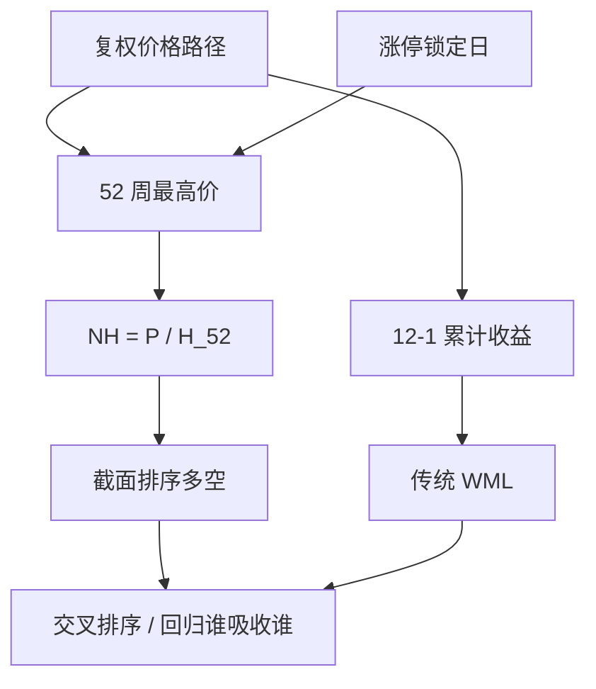

# 52 周高点动量

股价相对过去五十二周最高价的位置，能够预测后续收益，并且在很大程度上解释了中间期限的动量利润；投资者把五十二周高点当成锚。

<footer>—— George & Hwang, The 52-Week High and Momentum Investing, Journal of Finance, 2004</footer>

[WML](/quant/momentum-wml) 用过去累计收益排序。George 与 Hwang 换成一个更窄的状态变量：当前价格离过去 52 周最高价有多近。接近高点的股票继续强，远离高点的继续弱；把这个近邻度放进回归后，传统 6 个月或 12−1 动量的解释力明显下降。机制叙事是锚定：交易者不愿在「已经创了年内新高」之上继续出高价，也不愿在远离高点时承认基本面已经变差，于是调整不足，趋势在中间 horizon 延续。A 股的 52 周高点经常是涨停板上的不可成交价，复制必须先定义「可交易高点」。

## 问题

动量的排序变量是一段窗口上的累计收益，把路径折成一个数。52 周高点只问：今天的价格在过去一年的极差里站在哪一档。两只累计收益相同的股票，一个反复创新高、一个从深坑爬回，近邻度可以差很多。George–Hwang 认为投资者对「高点」这个显著数字更敏感，累计收益只是高点近邻度的粗糙代理。

要检验的是：在控制规模、价值与传统动量之后，

$$
\mathrm{NH}_{i,t}=\frac{P_{i,t}}{\max_{s\in[t-252,t]}P_{i,s}}
$$

对 $t+1$ 期收益是否仍有单调性。$\mathrm{NH}$ 接近 1 表示站在高点附近。问题从「过去涨得多不多」换成「价格有没有碰到那个被盯着看的天花板」。

### 高点是显著数字，不是波动标准化收益

把收益除以波动再累计，得到的是信息比一类的强度，与 $\mathrm{NH}$ 不同。高波动股票更容易碰到 52 周高点，也更容易远离它；$\mathrm{NH}$ 本身已含路径。不要把「距离 52 周高点的收益标准差」当成 George–Hwang 的定义。也不要把价格站上 250 日均线叫做 52 周高点动量：均线是中心趋势，高点是极值锚。

52 周按交易日约 252 根 K 线，按日历年则含节假日缺口。A 股还要处理停牌：停牌前的高点是否仍算「过去 52 周」里的有效观察，必须预指定。用复权价还是不复权价会改变高点——分红除权会人为制造「远离高点」。默认用后复权或对除权做调整后的可比价。

## 方法

每月（或每日）计算 $\mathrm{NH}_{i,t}$，在截面上排序，多最高一组、空最低一组，价值加权或等权，持有一个月。George–Hwang 用独立双重排序把 $\mathrm{NH}$ 与过去收益动量交叉：若动量利润集中在 $\mathrm{NH}$ 的高组，且在控制 $\mathrm{NH}$ 后动量 α 下降，则高点近邻度是更接近的状态变量。

A 股必须改高点的定义。涨跌停使收盘价可以连续多日钉在涨停板上，这个「高点」不是出清价，只是走廊上沿，见[涨跌停与集合竞价](/quant/cn-limit-auction)。可选处理：（1）高点只在未触及涨停的交易日更新；（2）用当日可成交的最高价（若有成交）而不是涨停价；（3）计算 $\mathrm{NH}$ 时把锁定板日从窗口里标记为审查日。不处理则 $\mathrm{NH}\approx 1$ 的组会堆满近期连板股票，因子变成「连板动量」而不是锚定。跌停对称地污染 52 周低点；若策略同时用高低点极差标准化，两端都要清洗。

与传统动量的分工：12−1 跳过最近一个月，是为了躲开[短期反转](/quant/short-term-reversal)；$\mathrm{NH}$ 用的是含今天的价格水平，最近一个月的新高会直接把股票推进高组。因此 $\mathrm{NH}$ 与一个月反转、与连板后的延迟发现纠缠。报告时应给：跳过最近 5 个交易日再取高点、以及不跳过，两列。

### 极差位置与纯高点比

有人用 $(P-L_{52})/(H_{52}-L_{52})$ 把位置放进高低点极差。这与 $P/H_{52}$ 相关但不是同一排序：低点很深时，即使远离高点也可能看起来「在极差中上部」。George–Hwang 原文强调的是相对**高点**的锚，不是极差分位。预指定用哪一个；两者都试再留 t 大的，算进[多重检验](/quant/harvey-liu-zhu)。

## 机制

锚定与处置效应给出同一方向的预测。高点是账户与媒体都展示的数字；价格接近高点时，卖出意愿上升（兑现账面盈利）、买入意愿不足（觉得「贵了」），需求被暂时压住，好消息写入价格偏慢。一旦突破或消息足够强，延迟的买盘进来，形成延续。远离高点的股票被当成「已经跌了很多」，投资者不愿止损，坏消息同样写入偏慢，继续弱。这与累积前景理论的参考点故事相容，参考点就是 52 周高点。

风险解释更弱：$\mathrm{NH}$ 高的股票不一定是高 β 或高久期。它们往往是近期赢家，与 WML 共线，因此任何「高点因子的 α」都要相对动量报告。George–Hwang 的贡献是：在共线里，高点比累计收益更接近那个被投资者盯着的状态。这并不自动等于可交易 alpha——近高点股票流动性与关注度都高，容量相对传统输家腿更好，但拥挤也更快。

### A 股的锚更硬，也更脏

散户账户软件默认显示「距 52 周高点」；涨停板本身又是另一个显著数字。两个锚叠在一起：接近涨停与接近 52 周高点经常同时发生。把 $\mathrm{NH}$ 当因子时，须同时控制[涨跌停邻近](/quant/cn-limit-proximity)，否则测到的是板的配给与次日开盘跳空，不是年度高点锚定。T+1 使当日创了新高也不能当日卖出，见[T+1](/quant/cn-tplus1)，处置效应的实现被推迟到次日，开盘集合竞价承担一部分「高点附近的供给」。

科创板与创业板 20% 走廊下，年内高点更少被涨停钉死，主板 10% 则更脏。跨板块混用同一个 $\mathrm{NH}$ 过滤器，等于用不同的截断过程比同一锚。应分板块估，或在 $\mathrm{NH}$ 之外加走廊宽度这一列状态。

## 边界与工程取舍

不要用未复权价算 52 周高点。不要把连板股票的涨停价当可交易高点还声称复制了 2004 年美股结论。不要在 $\mathrm{NH}$、极差位置、距高点的交易日数、突破高点哑变量之间搜完只报一个。新股上市不足 52 周没有合法高点，应设为缺失而不是用上市以来高点冒充——后者把次新股动量混进来。

国际复制上，George–Hwang 的逻辑在多个市场被重复，但幅度随零售占比与涨跌停制度而变。A 股的公开结论应来自当地样本与当地高点定义，而不是把美股多空夏普贴到「年线策略」产品说明上。均线金叉、布林上轨、创新高家数，都不是本篇的排序变量。

出处：George & Hwang, *Journal of Finance*, 2004。动量原构造见 Jegadeesh & Titman, 1993。锚定的心理证据是解释，不是交易许可；执行仍受涨跌停与 T+1 约束。

## 小结

- 52 周高点动量用 $P/H_{52}$ 做截面排序，强调相对显著高点的位置，而不是窗口累计收益。
- George–Hwang（2004）发现该近邻度能吸收相当一部分传统动量利润，机制是锚定导致的调整不足。
- A 股高点常被涨停价污染，须定义可交易高点，并与涨跌停邻近、连板分开。
- 用复权价、处理停牌与次新股缺失；不要与均线策略混名。
- 与 12−1 共线，报告应含交叉排序，而不是只给单因子 t。
- 出处：George & Hwang, *The 52-Week High and Momentum Investing*, Journal of Finance, 2004。
