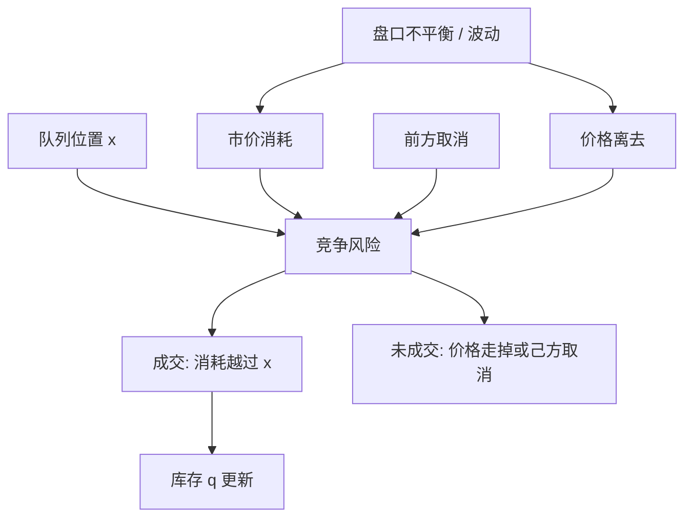

# 排队与成交概率

限价单不是报价上的确定成交，而是队列里的一张期权：前面的量要先被市价单吃掉，价格还不能走掉。成交概率是队列状态、市价流与取消流的函数，不是挂单价距离中间价的确定性函数。

<footer>—— 据 Cont, Stoikov and Talreja, A stochastic model for order book dynamics, Operations Research, 2010；Lo, MacKinlay and Zhang, Econometric models of limit-order executions, Journal of Financial Economics, 2002</footer>

[上一课](/quant/inventory-skew)用报价中点平移改变下一笔成交方向的概率：宽度与偏度是两个控制量，只加宽不改变库存漂移。偏度假定成交强度已知。缺口是把未成交限价单当成随机时刻才会变成成交的合约：真正决定何时开始成交的是前面剩余量，而不是这一档的总量。成交概率由队列位置、市价消耗、取消与价格离去共同决定，不能还原成「距离中间价几个 tick」。本课把 $\lambda(\delta)$ 写成必须通过位置来实现的对象。不讨论如何插入队列。

## 问题

一张买限价单挂在价格 $p$，数量 $q_i$，前面剩余量 $x$（队列位置），该档总深度 $Q$。它最终完全成交、部分成交还是取消，取决于三条随机流在「价格仍等于 $p$ 且该档仍是可成交档」这一窗口内的竞争：对手方市价（或可立即成交限价）从队头消耗；前面的单取消使 $x$ 下降；价格向不利方向移动使整档失效。只报一个与距离 $\delta=m-p$ 有关的成交概率，相当于把这三条流平均掉，对做市控制不够用：同样的 $\delta$，队头与队尾的成交概率可以差一个数量级。

Lo 等人把执行时间当生存对象，协变量包括距离、大小、波动。这是无条件或半条件的约化模型，适合估计「这种单平均多久成交」。结构问题是：在给定当前 $(x,Q)$ 与可观测的流强度时，下一段时间的填成概率是多少，以便决定是等待、改价还是取消。后者必须把 [撤单与队列位置](/quant/cancel-queue-position) 当作状态，而不是当作噪声。

### 队头消耗与价格离去是两种死亡

把「未成交」当作存活，死亡有两种：成交，以及价格离去（或自己取消）。竞争风险框架里，成交概率是在价格离去之前被消耗越过 $x$ 的概率。价格离去的强度与中间价波动、该档是否仍是 BBO、对面是否出现更优报价有关。队头消耗的强度与市价单到达、以及隐藏量有关。取消是第三种跳：它改变 $x$ 但不一定结束自己的生命。把三种强度混成一个「距离越近越好成交」的单调函数，会在波动升高时误判——近的档也可能很快被价格跳过。

L2 只给 $Q$ 不给 $x$。自己刚挂上时，若假定加在可见队尾，则 $x$ 约等于挂单前的 $Q$。挂出之后，$x$ 的演化在没有 L3 编号时不可点名，只能用对该档的成交与净撤单做滤波。方法必须声明识别集。

## 方法

Cont–Stoikov–Talreja 一类模型把每一档的量看成计数过程：限价到达使 $Q$ 增加，取消使 $Q$ 减少，市价使 $Q$ 从队头减少。对位于 $x$ 的自己，相关的是队头一侧的净消耗过程 $C_t$。若在价格离去时间 $\tau_{\mathrm{px}}$ 之前 $C$ 超过 $x+q_i$，则完全成交；超过 $x$ 但不到 $x+q_i$ 则部分成交。强度可以是常数（校准到短期）、随队列长度变化（短队列更容易被打穿或被取消），或随 [盘口不平衡](/quant/order-imbalance) 变化。

约化式上，常用 logistic 或风险模型：

$$
\mathbb{P}(\text{fill}\mid x,\delta,\sigma,\mathrm{imb})
= F\bigl(\beta_0+\beta_x x+\beta_\delta\delta+\beta_\sigma\sigma+\beta_{\mathrm{imb}}\mathrm{imb}\bigr).
$$

$\beta_x<0$：前面量越大越难成交。$\delta$ 的符号取决于 $p$ 在簿的哪一侧：更优的价格缩短等待，但更优也更接近被逆向选择。Lo–MacKinlay–Zhang 估计的是执行时间分布，可转换成给定地平线的成交概率。做市 HJB 里的 $\lambda(\delta)$ 应理解为：在典型队列状态下，距离 $\delta$ 的**条件**成交强度；把队尾的经验成交率塞进 Avellaneda–Stoikov，会系统性高估被动收入。

### 队列反应：深度自己改变强度

Huang–Lehalle–Rosenbaum 指出，到达与取消的强度依赖于当前队列大小：队列很长时，新限价更少、取消更多或相反，取决于该档是否「看起来便宜」。这意味着 $x$ 的下降速度不是外生常数。短 BBO 队列被市价打穿的概率高，但也更容易被新限价补上。成交概率因此是队列状态的非线性函数：从队尾晋级到队中，概率上升快；已经在队头时，再增加的深度主要保护的是后面的人。对做市而言，挂在已经很长的档上，边际成交概率低，库存却同样暴露于该价被选中时的逆向选择。

## 机制

时间优先把位置变成一种资本：你用等待换取更高的条件成交概率。它也把取消变成对别人位置的外部性：前面的人撤单，你的 $x$ 下降，你免费晋级。市场整体取消远多于成交，与这一外部性相容——大量限价是在探询、在管理存货、在撤销过时的期权，而不是在队尾真诚等待。Harris 把取消视为与提交对称的市场行为。成交概率模型若忽略取消，会把历史填成率当成未来填成率，而取消率一变（波动或毒性上升时通常上升），填成率立刻变。

限价单作为期权：你把自由选择权交给市价单，对方在对自己有利时行使。成交更可能发生在价格朝你的限价走来的时候，也就是对你不利的时候。这是被动策略相对主动策略的结构性折价，与 Glosten–Milgrom 的「被选中」是同一机制的队列版本。因此高成交概率不是免费午餐：队头的高填成伴随着更高的有毒成交份额。把填成最大化当目标，会把做市商推到逆向选择最重的位置。

部分成交改变的是自己的剩余量，不是 $x$。统计生命周期时要把一次挂单拆成若干成交与一次最终取消或完全成交，否则会把大单的部分填成当成多张独立小单的成功。

### 强度 $\lambda(\delta)$ 与队列状态如何对接

Avellaneda–Stoikov 的 $\lambda(\delta)=A e^{-\kappa\delta}$ 是对「距离」的平均。把距离理解成价格档位数可以，但 $A$ 必须条件于 $x$：例如 $\lambda=A(x)e^{-\kappa\delta}$，$A(x)$ 随 $x$ 下降。偏度报价改变 $\delta$ 的两侧，也改变你愿意站在哪一档、因而改变 $x$ 的分布。库存管理与队列管理不是两件独立的事：为了减库存去贴到 BBO 队尾，成交概率未必立刻上升，因为 $x$ 可能很大；贴到 BBO 却排在队头，成交快，库存风险下降快，但被知情市价单选中的窗口也最大。架构上应把 $(q,x,\delta)$ 当作联合状态，而不是先决定价格再把队列当执行细节。

## 边界与工程取舍

生灭模型通常假设强度在短窗口平稳、无隐藏量、单一场所、价格网格固定。隐藏单与冰山让 $x$ 的可见值不是真正前面量。多交易所并行时，你的档在一处排队，价格可能在别处先走。比例分配规则下没有严格 $x$，成交概率改由相对量决定，本篇的 FIFO 叙述不适用。涨跌停、拍卖、开收盘集合竞价的成交是批量规则，不是连续生灭。

估计上，生存分析的删失必须处理：自己取消是一种删失还是一种竞争风险，取决于问题。若问「若我不撤，会成交吗」，自己取消是删失；若问「这张单的命运」，取消是结局。用含高频改单的数据却按第一种解释，会高估成交概率。微观结构噪声与数据档位见 [L2 / L3](/quant/l2-l3-data)。模型服务于库存与执行的期望填成，不服务于对撮合引擎时序的利用。

提高成交概率的正当手段是：更优的价格、更靠前的合法到达、接受更大的逆向选择。把延迟、插队、伪造深度当作「队列策略」已经离开本篇的理论对象，也离开可公开讨论的做市架构。

## 小结

- 限价成交概率由队列位置、市价消耗、取消与价格离去共同决定，不能还原成「距离中间价几个 tick」。
- Cont–Stoikov–Talreja 用各档生灭过程描述深度；Lo–MacKinlay–Zhang 用生存分析估计执行时间。
- 成交与价格离去是竞争风险；取消改变位置，不一定结束生命周期。
- 高填成与高逆向选择在队头绑定；把填成当唯一目标会恶化做市的事后收入。
- Avellaneda–Stoikov 的 $\lambda(\delta)$ 应条件于位置；队尾的经验强度不能直接代入 HJB。
- L2 无法点名 $x$；识别取决于是否有订单编号以及如何处理自身取消。
- 出处：Cont, Stoikov and Talreja, *Operations Research*, 2010；Lo, MacKinlay and Zhang, *Journal of Financial Economics*, 2002；Huang, Lehalle and Rosenbaum 队列反应模型；优先规则与取消见 Harris, *Trading and Exchanges*。
