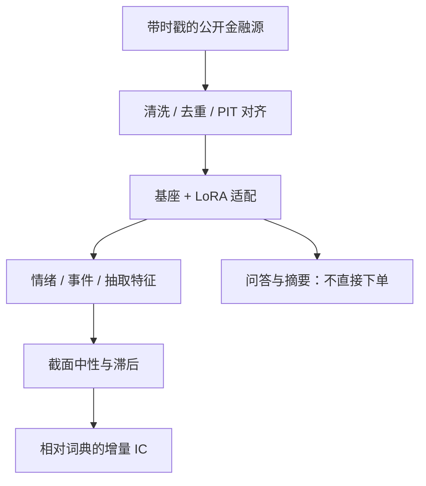

# FinGPT

    
彭博一类专有模型吃的是独占数据；开源金融大模型的瓶颈首先是数据策展与低成本适配，而不是再从零训一个 50B。

    <footer>—— Yang, Liu and Wang, FinGPT: Open-Source Financial Large Language Models, arXiv:2306.06031，FinLLM @ IJCAI 2023</footer>

Yang、Liu 与 Wang 把 FinGPT 写成面向金融的开源框架，而不是单一封闭权重。对照物是 Wu 等人的 BloombergGPT：50B、FinPile 混训、权重与语料不公开。FinGPT 的主张是数据中心：自动采集与清洗互联网上的金融文本，再用 LoRA / QLoRA 把通用基座适配到金融任务，成本比从零预训练低几个数量级。配套仓库 `AI4Finance-Foundation/FinGPT` 与 `FinNLP`。后续的数据中心长文（arXiv:2307.10485）补充实时数据管道与用市场价格当反馈的 RLSP；Instruct-FinGPT（arXiv:2306.12659）把指令微调对准情绪分类。本篇写框架的四层与它在量化研究里能合法承担的角色——特征提取、文档问答、情绪分数——以及它不能承担的角色：时间机器、自动下单、替代[点-in-time](/quant/point-in-time) 基本面。

## 问题

金融 NLP 的数据问题与通用语料不同：时效强、信噪比低、格式杂（网页、API、PDF、表、图）、版权与再分发受限，历史「当时可见」与数据库「现在看见」不一致。专有终端用内部新闻、研报与票据堆出领域优势；开源若只下载几份 10-K，适配出来的模型会在情绪与新闻分类上显得能打，一到实时与多源对账就塌。FinGPT 把问题从「有没有一个金融 GPT」改写成「有没有可复现的数据策展 + 轻量适配」。

第二个问题是目标错位。框架论文列举智能投顾、算法交易、低代码开发，作为应用层示例。量化研究若把示例当成已验证的 alpha，会把聊天能力与可交易预测混为一谈。Lopez-Lira 与 Tang（2023）表明新闻上的 LLM 情绪可以形成简单多空；那是受控实验，不是 FinGPT 仓库的默认策略。正确的问题是：在冻结的模型版本与冻结的时间戳下，文本特征相对 Loughran–McDonald 词典有多少增量，见[舆情与文本](/quant/news-nlp-alpha)。

### 从零预训练并不是开源的对称物

BloombergGPT 的贡献是混训配方与评测协议，见[BloombergGPT](/quant/bloomberggpt)。开源对称物不是「大家凑 700B token 再训 50B」，而是承认通用基座已经吸收了大量公开文本，金融增量主要在：专有时效数据、表格与数字、指令格式、以及偏好。LoRA 把增量放进低秩旁路，基座可换、适配可版本化。这与量化里「风险模型冻结、alpha 叠加」是同一类工程直觉。RLHF / RLSP 则把「什么叫好的金融回答」参数化；若奖励误用未来收益，适配本身就成为前视。

用事后发布的 GPT 给 2018 年的新闻打标签，知识截止日期与训练语料污染会造成系统性前视。文本因子的模型 ID、量化位数与提示词必须随 vintage 保存，与财务报表的 as-of 同一纪律。

## 方法

**四层。** 数据源层：新闻、社交、公告、研报等尽可能广的覆盖，强调时效。数据工程层：去重、清洗、对齐时间戳，处理金融文本的低信噪与高时效。LLM 层：在通用基座上 LoRA / QLoRA，而不是改全部权重；可选 RLHF。应用层：情绪、投顾问答、低代码原型。数据中心论文把采集写成 $\ge 34$ 个公开源的自动化管道，并讨论 RLSP：用价格变动当弱监督，让模型对「事后涨了的新闻」更高权重——这在研究里极危险，必须把价格滞后到文本可获得之后，否则就是用 $r_{t+1}$ 监督对 $\mathcal{F}_t$ 文本的拟合。

**适配配方。** 指令数据应任务化：情绪、分类、摘要、抽取，而不是「请给出买入建议」。Instruct-FinGPT 用金融情绪指令微调，评测应落在分类 F1，而不是回测夏普。基座选择（ChatGLM、LLaMA、后续 Qwen 等）改变分词与中文能力，中英新闻不可混成同一 IDF。量化（QLoRA）省显存，但金融数字对分词敏感：价格、代码、百分号被切碎后，数字推理会 silently 错，评测必须单列。

**量化管道。** 合法用法：把冻结模型当特征函数 $f(d_t)$，输出情绪、主题、事件类型，再截面 rank、行业市值中性，walk-forward。非法用法：让模型读到当日收盘后再解释当日新闻、或在回测环里调用会检索「当前网页」的工具。检索应指向带时间戳的本地语料快照，见[FinSearchComp](/quant/finsearchcomp) 对时效与来源对账的要求。

### 开源许可与版权不是评测指标

框架鼓励共享数据管道，不鼓励把受版权保护的研报全文重分发进训练仓。特征应是计数、嵌入与模型输出。个人社交媒体定向与未授权全文，既有法律风险，也不是 alpha 必需。中文分词、否定与反讽使英文金融词典不能硬译；中文适配需要中文指令与中文评测，见[CTBench 中文金融基准](/quant/ctbench)。

LoRA 秩与训练步数是超参。在测试年的情绪准确率上挑秩，等于用测试做训练。适配只允许在验证段早停，与[GBDT](/quant/gbdt-alpha) 的早停是同一规则。

## 机制

数据中心起作用的机制是覆盖与新鲜度：同一事件在路透、本地媒体与监管公告上的到达时间不同，模型若只在英文通用语料里见过公司名，对中文公告的实体与数字会弱。轻量适配起作用的机制是：通用基座已有句法与世界知识，金融任务需要的是术语、格式与「何谓负面」的领域校准（Loughran–McDonald 对通用词典的批评在 LLM 里变成「通用情绪头」）。LoRA 不创造新的市场信息，它改变条件分布 $p(\text{标签}\mid\text{文本})$。

RLSP 若用同期收益，学到的可能是风险溢价与关注度，而不是因果情绪。价格已经是公开信息的函数；文本的增量必须来自尚未进入价格的注意或尚未进入会计数字的信息。用 $r_{t}$ 强化对 $t$ 日新闻的解释，模型会把「大跌当日的新闻」记成负面模板，样本外遇到同样模板但价格已调整时失效。合法的弱监督是滞后收益或分析师修订，并且报告相对词典基线的增量，而不是绝对准确率。

与 BloombergGPT 的分工：混训从零改的是先验，适配改的是任务头。闭源模型在内部票据分类上可以很强，却无法进入可复现研究。FinGPT 的可复现性来自管道与适配器，不来自「开源所以更会交易」。

### 幻觉、数字与代码

生成式应用层会编造未出现的营收数字、把表格加错行。量化使用应把 LLM 限制在分类与抽取，数字计算交给确定性代码，再在[长文档基准](/quant/edinet-bench)与[多模态文档](/quant/finmmdocr)上测抽取误差。低代码「生成策略」若直接下单，把自然语言的不稳定性送进订单状态机；正确边界是生成假设，假设必须编译成可审计的算子树，对照[101 公式](/quant/kakushadze-101-alphas) 或冻结的特征定义。

## 边界与工程取舍

不要用在线 API 回放历史：供应商模型会升级，网页会变。不要把 FinGPT 演示笔记本里的交易示例当样本外。不要用未经授权的全文做继续预训练后对外发布权重。评测应同时报金融任务与通用任务，以免适配把模型变成只会选 ABCD 的考试机。中文公告的到达时钟以本地可获得为准。

版本治理：基座哈希、LoRA 文件、提示词、语料截止日期、分词器，五者绑定。换基座必须重跑验证，而不是假设适配器可热插拔。闸门上，模型输出不得直接改仓位；仓位来自特征与优化器，模型只是特征函数之一，见[交易闸门](/quant/trading-kill-switch)。

「Democratizing FinLLMs」是数据与权重的政治学表述。交易上没有民主：容量与冲击仍按[平方根](/quant/sqrt-impact)收费。开源降低的是研究准入，不是市场冲击。

## 小结

- FinGPT（Yang, Liu, Wang, arXiv:2306.06031）是数据中心的开源 FinLLM 框架：策展管道 + LoRA，对照 Wu 等人闭源的 BloombergGPT。
- 合法量化用途是冻结版本下的文本特征；非法用途是用未来模型或未来网页给历史打标签、或把生成建议直接当订单。
- Instruct-FinGPT 与数据中心续作补充指令微调与弱监督；RLSP 必须把价格严格滞后。
- 数字计算与策略逻辑应落在确定性代码，LLM 负责分类、抽取与假设草稿。
- 出处：Yang, Liu and Wang, arXiv:2306.06031；数据中心框架 arXiv:2307.10485；Instruct-FinGPT arXiv:2306.12659；对照 Wu et al., BloombergGPT, arXiv:2303.17564。
