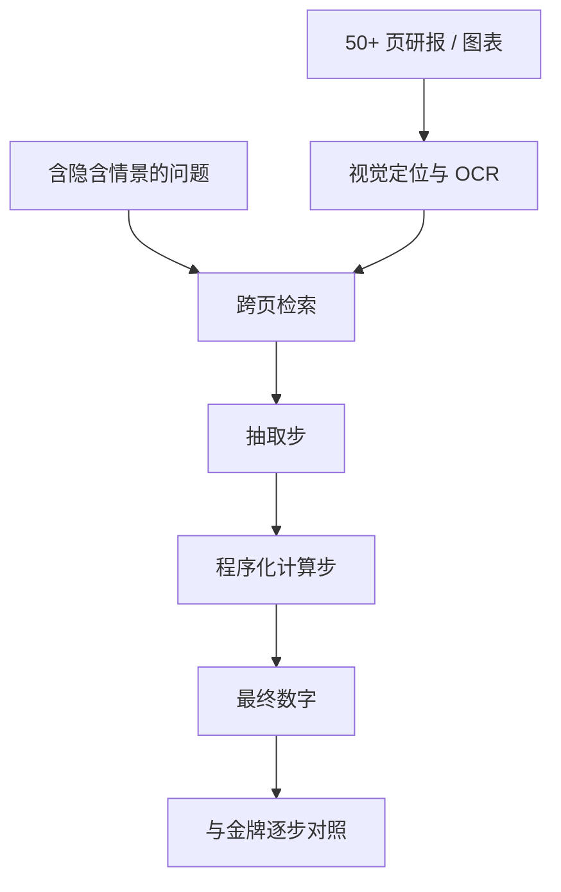

# FinMMDocR 多模态文档基准

    
1,200 道专家标注的双语数值推理题，平均十一跳，六成五要跨页取证；最强多模态模型准确率也只有 58%。

    <footer>—— Tang, E, Li et al., FinMMDocR: Benchmarking Financial Multimodal Reasoning, arXiv:2512.24903，AAAI 2026</footer>

北京邮电大学唐子琛、鄂海红等提出 FinMMDocR：面向真实金融数值推理的双语（中英 1:1）多模态基准。相对先前的表问答，它强调三件事。情境意识：1,200 题中约 57.9% 含 12 类隐含金融情景（如组合管理），需要按行业惯例补假设，而不是题面给全条件。文档理解：837 份中英文文档、9 类（如公司研究），平均 50.8 页，视觉元素密。多步计算：平均约 11 步（约 5.3 步抽取 + 5.7 步计算），65% 要跨页证据（平均 2.4 页）。最强 MLLM 约 58.0%（论文中的 o4-mini-high），不同 RAG 方法分差很大。本篇写视觉文档为何让纯文本 FinLLM 失效、评分为何要逐步而不是只对最终数字、以及量化流水线应把「看图」限制在抽取层。

## 问题

研报、招股书、路演 PPT 的信息经常不在可复制的 HTML 表里，而在折线、堆叠柱、脚注小字与跨页续表。纯文本模型看到的是 OCR 噪声或干脆看不到图。FinQA 给的是已经结构化的表；真实研究助理的工作从「这一页的图 3 里 2022 年毛利率是多少」开始。FinMMDocR 把文档平均长度推到约 51 页，使问题同时成为检索、视觉定位与数值推理。

隐含情景是第二层。题面不写「忽略一次性项目」或「用期末汇率」，但组合管理或估值惯例要求这些假设。模型若只做字面抽取，会在情景题上系统偏差。这与考试型[中文知识基准](/quant/ctbench) 不同：那里选项闭合，这里必须自行补上分析师默认值，再进入计算图。评测若只看最终数字，无法区分「看错图」与「用错惯例」。

### 视觉、检索与算术是三条失败链

准确率 58% 是三条链的乘积。视觉：坐标轴截断、双轴、堆叠图上的百分比与绝对额混淆。检索：证据在第 40 页，模型在第 2 页的摘要里取了未调整数字。算术：抽取对了却把同比和三年 CAGR 算乱。论文给出金牌 Python 解与证据页标注，使逐步评分成为可能。65% 跨页意味着单页截图协议会系统性低估难度。

RAG 分差大，说明「加检索」不是单调改进。错检会把更像样的错误数字送进计算。报告时应拆：检索命中率、抽取准确、计算准确，而不是一个端到端百分比。

## 方法

**数据。** 1,200 题，中英各半；837 文档、9 类；专家标注证据页、逐步解与精确答案。12 类隐含情景覆盖组合、估值、风险等分析惯例。文档含专业图表，平均视觉密度高于教材型基准。发布需注意版权：研报全文可能不能随意再分发，评测代码与样本应遵循作者许可。

**协议。** 模型输入是页面图像（或图像+OCR），输出答案；可选 RAG 先检索页面再答。逐步监督：抽取步与计算步分开计。跨页题要求引用多个 page id。对照包括通用 MLLM、带 RAG 的流水线、以及纯文本 OCR 基线。58% 的上限表明尚未饱和。

**与长文档文本基准的分工。** [EDINET-Bench](/quant/edinet-bench) 测整份法定披露上的分类（舞弊、盈余、行业），输入以解析表+文本为主。FinMMDocR 测视觉富文档上的数值题，更接近卖方研报与演示文稿。两者都打击「把片段贴进 LLM」的幻想，但失败模式不同：前者是长程综合与稀有事件，后者是看图与多步算术。

### 接入量化特征时的收缩

合法收缩：把 MLLM 当抽取器，输出带页码的结构化字段（毛利率、指引、拆分表），校验规则用确定性代码（高 $\ge$ 低、百分比在合理区间），再进入 PIT 特征。非法收缩：让模型在研报上直接给「买入/增持」并回测。卖方评级有自己的偏差结构，不是文档理解基准的标签。计算步应尽量落到金牌式的程序执行，而不是用 LLM 做算术——模型算术是 5.7 步误差的主要来源之一。

隐含情景等于未写出的超参。评测可以要求模型显式陈述假设；交易研究必须把这些假设写成特征定义的一部分并冻结，否则「按惯例调整」会在不同年份指向不同会计口径。

## 机制

多模态起作用，是因为关键数字只存在于像素：条形高度、图例颜色、水印下的脚注。OCR 先损失一层，再让语言模型猜，误差不可逆。端到端视觉编码器保留布局，但仍受分辨率与切页影响：跨页表在装订处断开，模型需要「续表」概念。多步计算把对错变成过程：一步抽错，后面的 CAGR 全错。这与 ConvFinQA 的对话式数值推理相同，只是证据在图里。

情境意识测的是领域先验。组合管理情景可能要求用市值加权而不是等权；模型若用题面三个数字简单平均，路径错误但「看起来在算」。58% 里有多少来自情景失败，应分桶报告。双语 1:1 暴露另一机制：中文研报的图表标注、单位「亿元」与英文 million 的换算；只在一侧强的模型会在另一侧掉到随机以上不多。

RAG 的机制是压缩上下文：51 页不能无损失全进。好的检索器按问题找证据页；坏的检索器按关键词找到「毛利率」一词出现的综述页，而精确值在附录图。金融文档的重复表述（摘要、正文、图表三处数字不一致）会惩罚浅检索——分析师会做对账，模型常取第一处。

### 版权、幻觉与可引用性

研报受版权保护，基准发布通常只能提供页面图像的评测子集或需授权。研究管道应存页码与截图哈希，便于审计「数字从哪来」，而不是只存模型生成的段落。幻觉在视觉任务上表现为自信地读错坐标轴。闸门规则：没有证据页 id 的数字不得进入特征库。

## 边界与工程取舍

不要用测试题的金牌 Python 微调后再测同一题。不要把 58% 的模型输出当「足够好的基本面」——四成错误在组合里是噪声或更糟的系统性偏（总是读错双轴）。分辨率与页面裁切是超参，必须在验证集上锁死。中英两套提示分开调，不要平均。计算用程序执行，抽取用模型。

对生产研究，FinMMDocR 是文档理解的压力测试，不是行情模型。它与[检索基准](/quant/finsearchcomp) 串联：FinSearchComp 找外部网页与数据库，FinMMDocR 在已给定的长 PDF 里找图。两者都失败时，不应当把锅只扔给「基座不够大」。

逐步金牌解使强化学习类过程奖励变得可做，也使过拟合变得更容易：模型学会模仿解的书面格式而不读图。持出应以新文档、新图类型为准，而不是新的同模板数字。

## 小结

- FinMMDocR（Tang et al., arXiv:2512.24903，AAAI 2026）是中英双语金融多模态数值推理基准：1,200 题、837 文档、平均约 11 步、65% 跨页。
- 三条失败链是视觉、检索、算术；RAG 不保证提升。最强模型约 58%。
- 量化上只把带页码的抽取接入 PIT，计算用代码；卖方评级式生成不进入回测。
- 隐含情景必须写成冻结假设。版权限制全文再分发。
- 出处：Tang, E, Li, Liu, Jia, Hao et al., *FinMMDocR*，arXiv:2512.24903，AAAI 2026；资源 `BUPT-Reasoning-Lab/FinMMDocR`。
