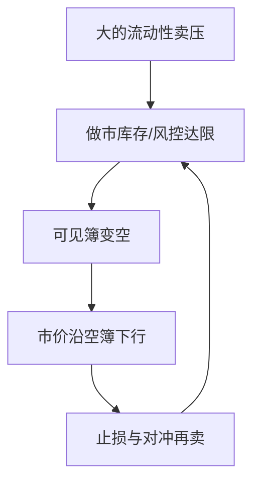

# 2010 闪电崩盘

2010 年 5 月 6 日，美国指数在数分钟内崩落又回抽。事后来看，那不是一个「有人知道价值腰斩」的信息事件，而是流动性供给在压力下撤退、市价卖单打进空簿的路径。

<footer>—— Kirilenko, Kyle, Samadi and Tuzun, The Flash Crash: High-Frequency Trading in an Electronic Market, Journal of Finance, 2017；机制背景见 CFTC–SEC, Findings Regarding the Market Events of May 6, 2010</footer>

[Brogaard](/quant/brogaard-hft-discovery)写平静期与一般样本里 HFT 的发现与做市。缺口是压力路径：当临时流动性需求极大、供给撤退时，连续 LOB 的 $P(Q)$ 可以走到与永久价值无关的价格。Kirilenko、Kyle、Samadi 与 Tuzun（2017）用账户层期货数据刻画闪电崩盘中的高频与中介行为；Easley、López de Prado 与 O'Hara 从订单流毒性角度讨论同一事件。本课写机制，不复述逐分钟新闻。

## 问题

Grossman–Miller 的暂时折让在 $M$ 突然变小时可以极大。电子簿上 $M$ 变小的实现是：做市账户达到库存或亏损限额、算法关闭、挂单撤空。此时若仍有大的市价卖（包括对冲与止损），价格沿空簿下行，触发更多算法卖，反馈完成。问题是把这条路径与「新的宏观信息」区分开：若主要是暂时成分，应有快速回复；若 HFT 是主因，应看到他们净卖在跌势中放大。Kirilenko 等人的结论更接近：高频交易者在事件中仍高频买卖，但没有吸收全部压力，传统中介与互惠型卖压才是流量主体——细节以原文账户分类为准，本课要的是**供给弹性在压力下不是常数**。

Easley–O'Hara 事件不确定的反面：这是无（匹配的）信息事件却有极端价格路径，PIN 式「有事件」会被量与不平衡误触发。

### 空簿上的市价单

[LOB 结构](/quant/lob-structure)里深度是冲击路径。空簿时路径没有定义上的边界，直到碰到远期挂单、熔断或有人愿意接。Glosten 曲线假定竞争性限价供给还在；闪电崩盘是供给函数暂时消失。均场密度 $\rho$ 在几分钟内可以接近零，PDE 稳态无用。

不要把闪电崩盘写成「HFT 发明了崩盘」。更准确的句子是：连续电子簿加市价指令、加相互挂钩的指数产品，在供给撤退时允许价格走得比人工楼层时代更快。HFT 既是供给也是可能的加速器。

## 方法

事件研究用账户分类：高频做市、中介、基本面卖盘。看净持仓路径、是否在最低点附近买入（吸收）还是继续卖。监管报告重建 Waddell 等大单在 E-mini 上的执行与跨市场传导（期货领先股票、ETF）。机制检验：回复速度、跨品种同步、是否触发熔断逻辑。事后政策是 LULD 与期货熔断校准，那是设计课的对象。

毒性：VPIN 一类度量在事件前升高的叙述，争议在于事后拟合。本课只保留：订单流不平衡在供给薄时对价格的映射变陡，与 Kyle $\lambda$ 时变同方向，不是新的价值发现。

## 机制

反馈有三层。库存：Ho–Stoll 偏度把报价下移，若限额是硬约束则直接撤单。信息推断：看到暴跌的人提高「有事件」后验，限价更不敢挂，被捡预期升。机械：止损、杠杆强平、跨市场套利在错误价格上反向（套利者若也被风控关掉，纠错消失）。Budish 式狙击在崩盘中不是主叙事：问题不是一跳公共新闻，而是持续的单向流遇到无弹性供给。

回复证明永久成分有限，符合 Grossman–Miller 而不是新的 $V$。但回复过程中仍有人在错误价格成交，分配效应真实。效率度量若用全日 VR，会把这几分钟平均掉。

## 边界

2010 年美股/指数期货结构不能外推到涨跌停市场：后者用价格栅格截断路径，换成开板与排队问题。加密与外汇有过类似闪崩，供给撤退逻辑同构，清算与做市义务不同。把每一次大幅回撤叫做闪电崩盘，会失去「无信息、空簿、快速回复」这三个要件。

执行上的教训不是「永远不要用市价」，而是大单在供给可能撤退的状态下不能假设 $P(Q)$ 仍由平时宏观形状给出。

## 小结

- 闪电崩盘是流动性供给撤退后市价单打空簿的路径，永久信息不必匹配价格幅度。
- 高频账户是结构的一部分，原文分类并不支持「HFT 单方面造成崩盘」的简单句。
- $\lambda$ 与深度在压力下内生崩溃，平静期做市画像不能外推。
- 出处：Kirilenko, Kyle, Samadi and Tuzun, *Journal of Finance*, 2017；CFTC–SEC, *Findings Regarding the Market Events of May 6, 2010*；毒性讨论见 Easley, López de Prado and O'Hara 对闪崩微观结构的论述。
