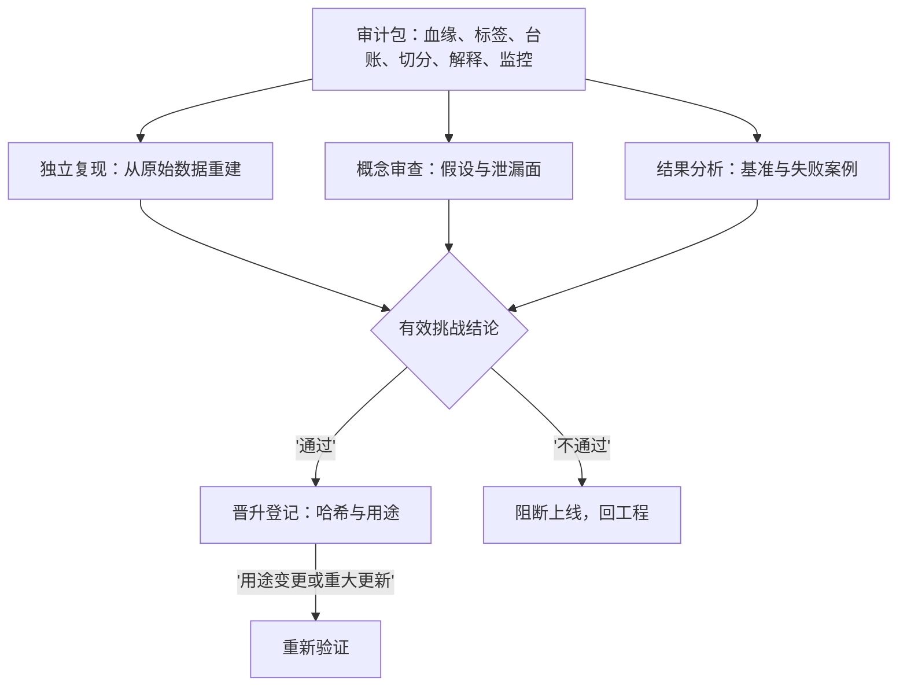

# ML 审计

有效挑战不是礼貌性的异议，是有权访问、有权否定的独立复现；审计因此是工程约束，不是归档义务。

<footer>—— 据 Board of Governors of the Federal Reserve System, SR 11-7: Supervisory Guidance on Model Risk Management, 2011 整理</footer>

[上一课](/quant/fml-drift-management)给漂移装了分流器，重训、降仓、停机都要求留痕。缺口：留痕给谁看、凭什么信——审计不是事后补文档，而是让「该被信任」变成可检验的工程约束。[SR 11-7 模型风险管理](/quant/sr-11-7-model-risk)立了三支柱与有效挑战，[模型风险清单](/quant/model-risk-inventory)立了清单口径。本课把它们落到 ML：审计包里装什么、验证人复现什么、审计约束怎么反过来改工程。

## 问题

ML 给传统审计添了三类困难。复现链长：一个模型等于数据快照、特征定义、标签契约、切分、超参与种子的连乘，任何一环的哈希缺失，复现即失败——而传统模型的「模型」两个字就够定位。行为空间大：传统审计问「假设对不对」，ML 还要问「在哪些区域它会怎么错」——外推区、类别失衡区、各体制下的行为，没有一张地图就没有可审的对象。变更更快：逐日更新的在线模型没有「一个版本」，审计对象必须改成版本流加更新规则。审计若后置，事后重建血缘的成本随系统规模膨胀，且永远补不齐当时的口径——重建出来的不是证据，是回忆。

## 方法

审计包按「边建边装」的规则组织，前九课的每份契约都是其中一节：数据血缘与三元哈希（[特征存储](/quant/fml-feature-store-deep)）、标签四元组、$N$ 台账与协议文档、切分参数与路径分布、解释口径与消融验证、监控状态机与衰减预算。装订规则只有两条：全部随模型哈希不可变存档；用途变更触发重新验证——同一套参数换个用途就是[清单](/quant/model-risk-inventory)里的新条目。独立验证做三件事：独立复现，验证人从原始数据出发重建一次结果；概念审查，审假设、代理变量与泄漏面，包括桌下尝试是否可能逃逸出台账；结果分析，对照基准与失败案例读表现。验证人的权限写进治理：读权限到原始数据层，否定权落在晋升流程上——不通过则不得上线。

## 机制

审计为什么必须前置：记录与重建的成本不对称——上线时多写一行哈希，事后免一次考古；特征店的版本、协议的台账、模型的日快照，表面是研究设施，实质是为审计而建的组件。有效挑战的制度设计比清单更重要：挑战者的考核不能挂在被审模型的绩效上，否则独立是名义的；只给报告不给数据的挑战，是把仪式写进了流程。相称性原则调节深度而不删除义务：执行参数模型与组合级信号模型分档审计，但厂商模型、小型模型、以及「只是内部用用」的模型都不豁免登记——SR 11-7 对这几类的措辞是明确的。审计也不担保模型正确：它担保的是错误的成本可追溯、可归责、可关闭，这与[模型风险清单](/quant/model-risk-inventory)「每个条目可关闭」的口径一致。

复现测试的最小集：每季度随机抽一个历史模型哈希，由验证人从原始数据重建训练与折外分数，误差超出浮点容差即判失败。跑不过的血缘缺口当场暴露，而不是等监管检查或事故复盘时才暴露。

## 边界

SR 11-7 三支柱的原文结构与机器学习条款已有专课，本课只做工程映射。审计不评价策略该不该存在——那是[协议](/quant/fml-model-selection-protocol)与投委会的事；各地区监管对模型治理的具体条文是全球市场制度课程的对象；多人协作下的评审流程与知识沉淀归下一课的工作流。也别把审计包当保险箱：它的价值在被反复读取——季度复现、事故溯源、交接培训——只写不读的审计包，等于把回忆又存了一遍。

## 小结

- ML 审计的三个新对象：复现链、行为地图、版本流；后置审计重建的是回忆不是证据。
- 审计包由前九课的契约装订而成，随模型哈希不可变存档，用途变更触发重验。
- 独立验证三件事：复现、概念审查、结果分析；验证人有数据访问权与晋升否定权。
- 可审计性是架构需求：哈希、台账、快照都是为审计而建的组件。
- 出处：Federal Reserve SR 11-7 / OCC 2011-12, 2011；Sculley et al., *NeurIPS*, 2015（Hidden Technical Debt in Machine Learning Systems）。
