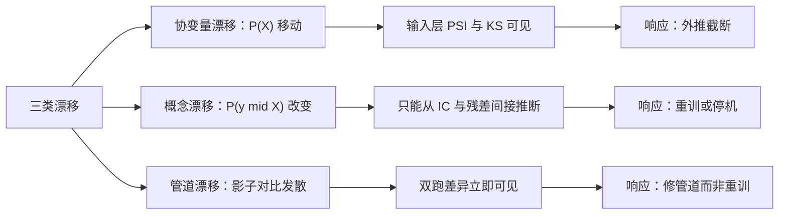
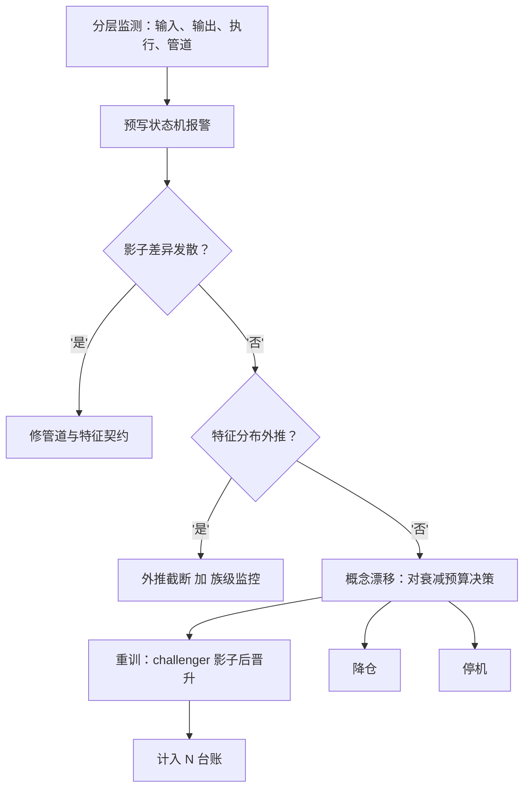

# 漂移管理

漂移管理的前提是把漂移拆开：特征的分布变了、关系变了、还是管道变了——三者的响应完全不同，合并成一句「模型旧了」只会带来错误的补丁。

<footer>—— 据 Gama et al., ACM Computing Surveys, 2014；McLean and Pontiff, Journal of Finance, 2016 整理</footer>

[上一课](/quant/fml-online-learning)让参数能跟住缓慢变化，但不是所有变化都该被追：有些漂移该触发重训，有些该触发降仓甚至停机。缺口是分流器：怎么发现、怎么归因、怎么响应。[实盘漂移监测](/quant/live-drift-monitor)已立顺序检验与预指定原假设的纪律——监测只读，穿带后的改动是新试验。本课深化发现之后的另一半：分类、诊断与处置路径。

## 问题

漂移分三类，响应各不相同。协变量漂移：$P(X)$ 移了，模型在被外推进没见过的区域使用；概念漂移：$P(y\mid X)$ 变了，同样的特征不再同样兑现——alpha 衰减或反转；管道漂移：[影子对比](/quant/fml-feature-store-deep)发散，是管道不是市场。混淆的代价不对称：把管道漂移当概念漂移，会无谓重训，而重训修不了管道；把概念漂移当协变量漂移，会继续追一个正在消失的信号，在噪声上加仓。实务的根本难点：概念漂移不可直接观测——$y$ 要等滞后才知道，只能从 IC 与残差间接推断，而推断可用的窗口与信号半衰期同量级，检测天然滞后于伤害。

PSI（群体稳定性指数）翻译成大白话：把新数据的特征分箱，跟训练时比每一箱的占比，差距越大分越高——就像点名时数每个座位区到了多少人，坐的位置明显变了就报警。经验上 PSI 超过 0.25 通常认为分布显著移动。

## 方法

三段式。发现：分层监测，输入层看特征分布的 PSI 与 KS，输出层看加权 IC 与扣费残差（主路径），执行层看实现缺口（辅助路径），管道层看双跑差异；每层的状态机与阈值在上线时定带，与[实盘漂移监测](/quant/live-drift-monitor)的预指定纪律一致。诊断走分流树：先查管道（影子差异归因到列），再查协变量（哪族特征移了、是否进入外推区），最后才轮到概念（条件关系是否仍成立）。响应按诊断分流：管道问题修管道；协变量漂移做外推截断并加强该族监控；概念漂移按衰减预算决定重训、降仓或停机。响应的账：每次重训都是新试验，计入 $N$；重训产物走 challenger 影子盘，按晋升判据顶替，不许直接换。

## 机制

为什么「追」要分情况：在线学习能吸收的是慢变参数漂移，概念漂移里信号消失的那部分追不动——重训是在残存信号上重新拟合，期望收益是残存信号的收益减去切换成本；若信号已死，重训的最优输出其实是「不交易」，而重训流程没有这个输出选项时，它必然产出另一个会交易的模型。重训作为响应因此有系统性正偏差：它总是给出一个新模型，从不给出「不该有模型」。阈值为什么必须含衰减预算：若原假设写成「IC 等于回测」，一切真实策略都会报警——衰减是常态；原假设应写成「衰减不超过事前声明的预算」，报警才携带信息。停机不是失败：与[模型选择协议](/quant/fml-model-selection-protocol)的弃权同构，它是分流树的合法出口，而且是长期最常见的出口。

衰减预算的数字实例：上线时声明「IC 从 0.05 起，年衰减不超过 0.01」，那么两年后带内下限就是 0.05 − 2×0.01 = 0.03；实测加权 IC 掉到 0.025 时先降仓，而不是等它转负才动作。

重训的正偏差可以类比成只带锤子的修理工：无论什么毛病，交付物永远是一次敲打。信号已死时正确答案是「不交易」，但重训流程的产品目录里没有这一项，它只能交付一个还会交易的新模型——工具决定了答案。

常见误区：把回撤变大直接当成概念漂移。回撤可能来自执行缺口恶化或者纯粹运气，特征分布与 IC 都没变；分流树第一层先查管道，就是在防止把执行问题错当信号问题来治——药方完全不同。

衰减预算的写法：上线文档应写「预期 IC 年衰减不超过 $x$，加权 IC 低于带 $y$ 触发降仓」，而不是「IC 转负才停」。把停机线画在转负处，等于把整段衰减全额兑现后才承认它。

## 边界

顺序检验的统计量（CUSUM、递归残差）已有专课，体制识别（HMM 一类）与检验的分工亦已交代，本课只做分流。漂移管理不回答「信号为什么死」——归因到因子层面是因子研究的题目；特征修复与回填的工程归[特征存储](/quant/fml-feature-store-deep)。也不把回撤当漂移：执行缺口恶化不是概念漂移，分流树第一层就把它们分开听。最后，漂移管理的所有动作——重训、降仓、停机——都必须留痕进审计包，这是下一课的对象。

## 小结

- 漂移三类：协变量、概念、管道；分流树按「先管道、再协变量、后概念」排序诊断。
- 概念漂移不可直接观测，检测天然滞后；阈值必须含预声明的衰减预算。
- 重训是系统性正偏差的响应：它总会产出新模型，从不输出「不该有模型」。
- 每次重训计入 $N$，challenger 影子盘后按判据晋升；停机是合法出口。
- 出处：Gama, Žliobaitė, Bifet, Pechenizkiy and Bouchachia, *ACM Computing Surveys*, 2014；McLean and Pontiff, *JF*, 2016；Brown, Durbin and Evans, *JRSS-B*, 1975。
