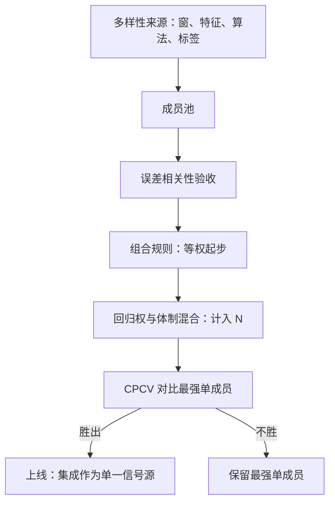
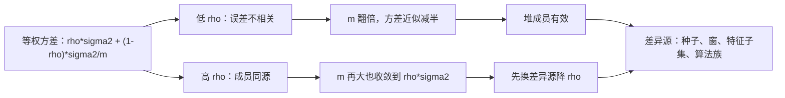

# 模型集成

组合预测的老定理：把误差不太相关的预测平均，方差下降而期望不变；挑权重的那份聪明，常常被权重自身的估计误差吃掉。

<footer>—— 据 Bates and Granger, Operational Research Quarterly, 1969；Stock and Watson, Journal of Business &amp; Economic Statistics, 2004 整理</footer>

[上一课](/quant/fml-tscv-deep)给协议配了配得上它的裁判，单个模型由此拿到折外证书。缺口：单模型的折外 IC 本身是抽样噪声——换个随机种子重跑，排名可能翻转。要不要用一台更大的机器把这份噪声摊平，就是本课的问题。集成发生在预测层：多个模型对同一目标给出预测，合成一个信号；权重层面的组合是组合构建课程的对象，不在这里。

## 问题

集成的收益来自方差削减，代价从两个方向来。成员相关性：若成员共享特征、样本与超参，误差高度相关，平均之后方差下不去——有效成员数远小于名义成员数。权重过拟合：金融信号弱，日频 IC 常在 $0.02$ 到 $0.05$ 之间，估计一组最优权重所需的样本远大于数据能给的数量；Granger–Ramanathan 式的回归权重在小样本上追噪声，stacking 的二级学习器还要自己过一遍时序清洗，而多数实现没有——把四课以前刚堵上的泄漏，从二级学习器的后门又放了回来。

回归权（Granger–Ramanathan）翻译成大白话：拿各成员的折外预测当自变量、真实值当因变量做一次回归，把回归系数当权重。日频 IC 只有 0.02–0.05 时信号太弱，权重的真实差异常淹没在抽样噪声里——估 20 个权重的误差，可能比不用权重本身还大。

## 方法

装配分三层。第一层制造多样性：种子、训练窗、特征子集、算法族、标签视野都可以当差异源；验收多样性的口径是成员间误差相关性，不是成员各自的 IC——两个 IC 都平庸但误差几乎不相关的成员，比两个优异但同源的成员更有用。第二层组合规则从简到繁：等权，按折外精度反比加权，回归权，体制条件混合；默认等权，任何更复杂规则的采用都按[模型选择协议](/quant/fml-model-selection-protocol)计入 $N$ 台账。第三层验收：集成后的折外分数在 CPCV 路径分布上与**最强单成员**比，不与平均成员比——基线错了，集成永远在赢。

## 机制

方差分解给出预算表：$m$ 个成员误差方差 $\sigma^2$、两两相关 $\rho$，等权平均的方差是 $\rho\sigma^2+(1-\rho)\sigma^2/m$，随 $m$ 增大收敛到下限 $\rho\sigma^2$；$\rho=0.6$ 时堆再多成员也只降到六成——降低 $\rho$（换差异源）比增加 $m$ 有用。等权为什么常胜：权重估计的方差是二阶代价，信号弱时「真权重」本身难辨，[宏观预测里「$1/N$ 几乎不可击败」](/quant/pf-regularized)的发现在这里更成立；回归权的收益要覆盖它的估计方差才值得上账。体制条件混合的诱惑与代价：若体制判定本身不稳定，混合权重把体制噪声乘进信号，集成变成切换噪声的放大器——先验证体制分类器的稳定性，再谈条件权重。

把方差公式代入数字：取 $\sigma^2=1$、$\rho=0.6$，10 个成员的等权方差 $=0.6+0.4/10=0.64$，堆到 100 个也只到 0.604；而若把 $\rho$ 压到 0.3，同样 10 个成员就到 $0.3+0.7/10=0.37$。换差异源的收益远大于堆数量。

「跟最强单成员比」的直觉类比：拔河比赛的裁判不能因为你队里平均力气大就判你赢，要看你能不能赢过对面最强的那个壮汉。基线选成平均成员，集成几乎永远在「赢」，但这胜利不带来扣费后的效用。

有效成员数 $m_{\mathrm{eff}}=m/(1+(m-1)\rho)$：取 $\rho=0.5$、$m=20$ 时 $m_{\mathrm{eff}}\approx 1.9$。二十个同源模型的集成，在方差上约等于两个独立模型；先看这张表，再决定要不要上 stacking。

## 边界

Bagging 与 boosting 的算法细节不在此展开，树内嵌套是模型自身的事；集成不创造信息——它压预测方差，不提高信息含量，成员共享的泄漏会被集成原样平均保留，[特征存储](/quant/fml-feature-store-deep)的契约与[切分](/quant/fml-tscv-deep)的清洗对每个成员同样有效。

常见误区：以为 stacking 一定优于等权。二级学习器要重新估一组权重、自己也是一次模型选择，金融信号弱时它的估计方差常把理论收益吃光；若它没重过一遍时序清洗，泄漏还会从后门回流——复杂规则的账要算全。集成也不豁免解释义务：成员变多后「模型在看什么」更难回答，这是下一课的题目。若集成只服务稳定性而不服务扣费后效用，保留最强单成员是合法结论，上一课的弃权在这里同样适用。

## 小结

- 集成的预算表是误差相关性：方差下限 $\rho\sigma^2$，降 $\rho$ 优先于堆 $m$。
- 多样性按成员间误差相关性验收，不按各自 IC 验收。
- 组合规则等权起步，复杂规则计入 $N$；stacking 的二级学习器必须重过全部时序清洗。
- 基线是最强单成员，不是平均成员；不胜保留单成员是合法输出。
- 出处：Bates and Granger, *Operational Research Quarterly*, 1969；Granger and Ramanathan, *Journal of Forecasting*, 1984；Stock and Watson, *JBES*, 2004。
