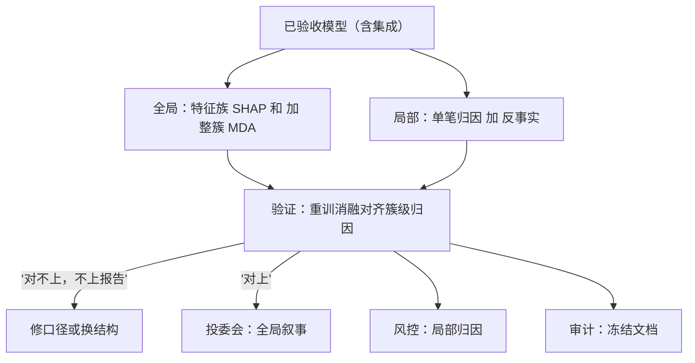
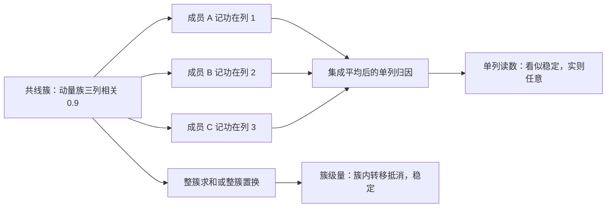

# 可解释性的深化

事后解释可以与被解释的模型不一致；高风险决策要的不是对黑箱的道歉，而是值得信任的结构。

<footer>—— 据 Rudin, Nature Machine Intelligence, 2019 的立场整理</footer>

[上一课](/quant/fml-ensembles)把预测方差摊平，代价是模型更像一只黑箱——投委会、风控与审计都要问「它在看什么」。[SHAP 因子归因](/quant/shap-factor-attribution)立了 Shapley 会计的定义与干预型、条件型之别，[MDA 特征重要性](/quant/mda-importance)立了置换口径与共线簇的坍缩。本课深化解释的工程与误读：全局与局部怎么分工、相关特征下各口径怎么读、解释怎么进验收与监控，以及解释自身的过拟合。

## 问题

解释有三类消费者，需求不同：投委会要「钱从哪个假设来」的全局叙事；风控要「这只票为什么被砍」的局部归因；审计要随版本稳定的特征与假设文档。错配因此成灾。拿局部的 Shapley 分摊拼全局故事——局部分摊不可加总成因果叙事；拿分裂增益说重要性——[MDA](/quant/mda-importance) 已把它记在共线族最先被问到的那一列上；相关特征下单列归因在成员间任意转移，集成让这更糟：每个成员把同一份功劳记在不同的共线列上，平均之后看似稳定，实则谁也没说清。最静默的一类：解释被当监控探针用（哪列的归因突变），但探针自身没有基线，报警与噪声不可分。

Shapley 值翻译成大白话：把预测看成一桌人合点的菜钱，轮流问「少了他这份特征，分数会差多少」，再把所有加入顺序下的差额取平均——每人分到的份额就是他对这次预测的贡献。它回答「怎么分账」，不回答「谁导致谁」。

## 方法

分口径做四件事。全局：预指定特征族的 SHAP 和，与整簇置换的 MDA 并列双口径——共线簇整簇求和、整簇置换，簇内转移互相抵消后剩下的才是可辨识的量。局部：单笔归因配反事实——「把该列拨回截面中位数，分数变多少」，用数值回答「为什么砍仓」，而不是一段修辞。验证：解释对不对，用重训消融当近似真值——删整簇特征重训，折外变化应对齐簇级归因；对不齐的解释不上报告。文档：解释口径随模型哈希冻结，与[特征](/quant/fml-feature-store-deep)和[协议](/quant/fml-model-selection-protocol)同账，版本间的解释差异进变更记录。

## 机制

相关特征为什么让单列归因任意：共线族的预测贡献真实存在，但「功劳属于哪一列」没有唯一解——Shapley 定义在特征集合上，且依赖背景分布的取法；干预型与条件型在相关特征上可给出符号相反的归因，报告不写明口径，两份「都正确」的归因就会在同一个会上打架。簇级量为什么稳定：转移在簇内互相抵消，簇和与整簇置换的折外变化是几乎与分摊约定无关的量。解释的二次过拟合：用解释结果反过来挑特征、调模型，解释误差就进入选择环路——要么把这类尝试计入 $N$ 台账，要么承诺「只读不改」；把 SHAP 排名直接当特征淘汰名单，是最常见的自欺，它等于用一份有偏估计做了第二轮选择。

干预型与条件型的差别用数字说：若动量 5 日与 20 日相关 0.9，干预型把 20 日列「按住」不动、只拨动 5 日列，看分数变化；条件型允许 20 日列跟着联动。同一簇上两者可以给出符号相反的归因——报告不写明口径，两个都「对」的数字就会在会上打架。

用 SHAP 排名反挑特征，就像照着哈哈镜减肥：镜子（解释）本身是有偏估计，按它调整姿势（挑特征、调模型），下一张照片只会更歪——解释误差从此进入选择环路，回测成绩的改善分不清是真信号还是镜子的偏好。

监控探针要配基线：归因突变的报警阈值应在模型上线时按训练折的归因波动定带，而不是上线后看哪次「像」突变。探针没有基线，它的第一次报警就会消耗掉组织对它的信任。

## 边界

解释不是因果，也不是 PnL 归因——分数来源与收益来源之间隔着执行、成本与组合构建，中间每一环都能改写「哪列在赚钱」。它不替代[SR 11-7](/quant/sr-11-7-model-risk) 的独立验证：有效挑战要独立复现，不能只读开发者自备的解释报告。白箱与黑箱是两条路线，本课不替你选：线性、浅树、单调约束 GBDT 一类内生可解释结构在弱信号世界里常常只损失可忽略的精度；选择的标准是——上了黑箱就要付解释工程的账，付不起就换白箱。

## 小结

- 三类消费者三种口径：全局叙事、局部归因、冻结文档，不可互相顶替。
- 相关特征下单列归因任意，报告用簇级量并写明干预型或条件型。
- 解释以重训消融验证，对不齐不上报告；探针要配上线时定带的基线。
- 用解释反挑特征是第二轮选择，计入 $N$ 或只读不改。
- 出处：Lundberg and Lee, *NeurIPS*, 2017；Rudin, *Nature Machine Intelligence*, 2019；Breiman, *Machine Learning*, 2001。
