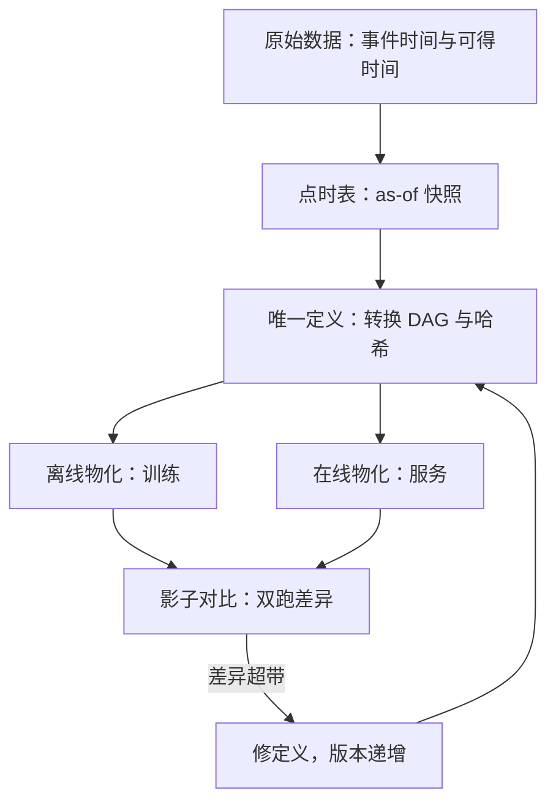
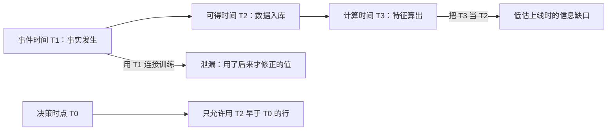

# 特征存储的深入

同一个特征在训练表与线上服务里各有一份实现，系统便有两个真相；特征工程的深钻不是算得更多，而是只留一个真相。

<footer>—— 据 Croushore and Stark, Journal of Econometrics, 2001；López de Prado, Advances in Financial Machine Learning, 2018 整理</footer>

[上一课](/quant/rc-case-map)把利率与信用的三个案例收在一条判据上——判据先于模型，能否事前写进引擎与限额决定及格；那门课到此收束。金融 ML 工程把同一条纪律搬进机器学习流水线：那台机器——特征、标签、选择、验证、上线与运维——每一环都要有事前的契约与验收，本课从特征侧开工。[特征商店与研究平台](/quant/feature-store-research)已经立了三原则：特征 API 强制 as-of、定义版本不可变、训练与生产钉同一哈希。本课把三原则落成工程细节：双路径一致性、回填、实体对齐与新鲜度账。后课默认特征已有一份可复用的只读快照。

## 问题

回测里的特征来自研究代码，实盘里的特征来自服务代码，这是两条流水线。偏差有三类来源。实现差异：同一转换两份代码，小数精度、缺失值填充、窗口边界的处理各不相同。时间语义差异：训练用全样本统计量（全历史的标准差、全截面的分位数），线上只有当时可得的数据，同一「列」实际是两个变量。实体差异：证券更名、代码复用、公司行动之后，新主人顶了旧公司的历史行，样本在标的维度上悄悄串了。后果是回测测离线实现、实盘跑在线实现，IC 一旦衰减便无法归因——来自市场还是来自管道，不可分。缺口因此不是「特征怎么算」，而是「怎么让两条路径只有一个定义」。

两条流水线可以想象成同一道菜的两个厨房：菜单（特征定义）相同，但两位厨师各自凭记忆做，咸淡与出锅时间必有差别。特征店做的事是把菜谱写成一份代码，让两个厨房照着同一份执行——差别只剩火候（延迟），不再有做法。

## 方法

单定义、双物化。转换逻辑写成一份有向无图：输入是点时表，节点是转换，输出带定义哈希；离线批量物化供训练，在线低延迟物化供服务，两者消费同一份代码而非两份等价代码。落地四件事。

其一，点时连接。每个特征行带两个时间戳：事件时间与可得时间。训练侧的 as-of join 只允许用可得时间早于决策时间的行；用事件时间连接是把「后来才知道的修正」当成了当时已知，[特征：滞后、截面 rank](/quant/cs-rank-features)对会计滞后讲过的纪律在这里逐列执行。其二，回填用重放。新特征上历史必须从原始数据重放，禁止用当下快照反写——反写会把幸存者偏差与事后修正漏进训练集。其三，版本即哈希。定义、依赖数据集、参数各给一个哈希，任何一次训练记录钉住三元组；「上周那个模型」因此可以被精确重建。其四，影子对比。在线特征服务每日抽一部分标的，把线上值与次日离线重算值对齐比较，差异分布进监控。

## 机制

双跑差异为什么是回测的隐形税：训练分布由离线实现生成，实盘分布由在线实现生成；两实现不等价，模型就在学一个实盘取不到的变量。看差异形状而非只看均值：若 $|\Delta|$ 是零点尖峰加薄尾，薄尾对应迟到数据与事后修正，是可解释的预算，写进验收；若方差随时间增大，是实现漂移，两份代码在分叉——按定义修，不按数值修。新鲜度账立三个时钟：事件时间、可得时间、计算时间；泄漏最常发生在把可得时间当事件时间，把计算时间当可得时间则低估了上线时的信息缺口。实体对齐用永久标识：代码会复用，永久号不复用；映射错一档，历史就混进了另一家公司的收益。

as-of join 翻译成大白话：给每个决策时点配上「当时已经能看到」的最新版本数据——像回看老照片只许用那天已经冲洗出来的部分，后来补拍重修的不算。用事件时间连接，等于把事后修正过的照片塞回过去的相册。

实体对齐的数字实例：某代码 2008 至 2014 年属 A 公司，2015 年被 B 公司复用。若按代码串历史，B 公司 2015 年的「五年动量」要回看到 2010 年，混着 A 公司 2010 至 2014 年的价格；映射到永久号后，这段动量被正确拆成两段互不相干的历史，串样本的偏差就此消失。

一个可执行的量级：盘前截稿时间设为开盘前 $T$ 分钟，晚到的供应商数据按可得时间入行、不入当日特征；晚到率超过 1% 的数据源单独挂监控，它决定影子对比薄尾的宽度。

## 边界

本课不重讲 as-of 与截面 rank 的基础构造（见上引两课）；存储引擎与表格式选型是数据工程课程的对象。特征店不回答「特征该不该存在」：增量有效性仍要靠[MDA 特征重要性](/quant/mda-importance)一类的样本外置换来裁决。也不把双跑差异当成误差项处理——它是需要归因的信号，压掉报警等于拔掉烟感。

## 小结

- 回测与实盘的特征偏差分三类：实现、时间语义、实体；每类都有对应的工程闸门。
- 单定义双物化：训练与服务消费同一份转换代码，版本由定义、数据、参数三元哈希钉住。
- 回填必须从原始数据重放，禁止快照反写历史。
- 影子对比看差异形状：薄尾是预算，发散是漂移。
- 新鲜度账立三个时钟，泄漏多发生在时钟错位。
- 出处：Croushore and Stark, *Journal of Econometrics*, 2001；López de Prado, *Advances in Financial Machine Learning*, Wiley, 2018。
