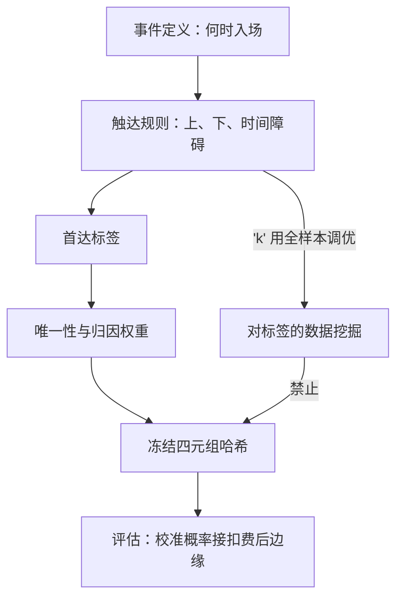
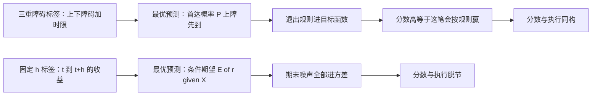

# 标签工程的深化

标签定义了模型在学什么：折叠成固定期的终点收益，学的是期末；挂在退出规则上的首达标签，学的才是可执行的触发概率。

<footer>—— 据 López de Prado, Advances in Financial Machine Learning, 2018，第 3 章；Hansen and Hodrick, JPE, 1980 整理</footer>

[上一课](/quant/fml-feature-store-deep)把特征钉成带版本哈希的只读快照，$X$ 侧有了契约。缺口转到 $y$ 侧：多数流水线里标签仍是一段裸收益——固定预测期的折返收益，与任何退出规则都不同构。[标签、预测期与重叠](/quant/label-horizon-overlap)已讲重叠标签的推断代价，[Triple Barrier 标签](/quant/triple-barrier)立了首达标签的定义。本课深化标签工程本身：障碍宽度的标定、样本权重、标签形态的选择，以及标签自己的数据挖掘风险。后课的选择协议默认标签已经冻结。

## 问题

裸收益标签有四处硬伤。其一，与执行不同构：固定 $h$ 的终点收益混着模型无法预测的期末噪声，而真实持仓会因止盈止损提前离场。其二，重叠：$h$ 期滑动窗口让相邻样本共享路径，有效样本数远小于名义 $N$。其三，类别失衡跟着体制走：牛市里上涨类占优，分类器学会的是先验而不是信号。其四，最隐蔽：障碍宽度若用全样本校准，就是对标签本身的数据挖掘——泄漏不经过特征，直接进 $y$，任何特征侧的清洗都拦不住。

固定期终点收益标签，好比考驾照只看终点的照片：中途变道、急刹全被抹掉，而真实驾驶恰恰发生在路上。持仓常因止盈止损提前离场，裸收益标签却假设你一定拿满 $h$ 天——学的和做的不是一回事。

## 方法

把标签写成四元组：事件、触达规则、权重、评估口径，四项各自冻结、随模型哈希入库，与[上一课](/quant/fml-feature-store-deep)的特征版本同账管理。障碍宽度用当时可得的波动率标定：上下障碍取 $k\sigma_t$（$\sigma_t$ 为 EWMA 波动），时间障碍取流动性允许的最短持有期；标定 $k$ 的每一次尝试都计入 $N$。权重有两层：唯一性权重按样本生命期与同时重叠的标签数分摊，$w_i\propto 1/\sum_j \mathbb{1}\{[t_{i,0},t_{i,1}]\cap[t_{j,0},t_{j,1}]\neq\emptyset\}$；收益归因权重则给「该样本独享的那段收益」更大话语权。评估口径写死：分类输出接概率校准与扣费后边缘，准确率不进验收表。

唯一性权重翻译成大白话：同一段行情被 5 个重叠样本共享，每个样本就只算五分之一份证据——像合租的水电费按人头分摊，谁也不能把同一度电重复报五次。不加权，模型就把一段行情当五段行情来学。

常见误区：把障碍宽度 $k$ 当普通超参做网格搜索。障碍宽度决定正负样本怎么划，全样本调 $k$ 是在给标签本身挑好看的分法——这条泄漏路径不经过特征，特征侧清洗再严格也拦不住，只能靠预声明加计入 $N$。

## 机制

标签决定「模型在学什么」。固定 $h$ 标签下，最优预测器是条件期望 $\mathbb{E}[r_{t:t+h}\mid X_t]$，期末噪声全部进方差；三重障碍下，最优预测器是首达概率 $P(\tau_{\mathrm{up}}\lt\tau_{\mathrm{down}},\,\tau_{\mathrm{up}}\le T\mid X_t)$——退出规则从后处理搬进了目标函数，分数高才对应「这笔会按规则赢」。权重为什么必须：重叠样本不是独立证据，不加权则有效样本被同一段行情重复计数，一切 $t$ 统计量虚高，下一课选择协议的全部显著性都建立在失效的地基上。$k$ 全样本调优的泄漏路径：障碍决定正负样本的分布，调优会把 $k$ 推向「历史更好分」的那一侧，模型于是学会了 $k$ 的选择过程，而不是市场。

以 5 日持有、样本逐日重叠为例：名义 5000 个样本的独立观测可能不足 1000，未修正的 $t$ 统计量虚高约 $\sqrt{5}\approx 2.2$ 倍；这是不加权、不清洗的默认后果，不是极端假设。

## 边界

重叠的推断修正与泄漏窗口的删除分别由[标签、预测期与重叠](/quant/label-horizon-overlap)与[Purge 与 Embargo](/quant/purge-embargo)承担，本课不重推。Meta-labeling 的次级标签协议已有[专课](/quant/meta-labeling)，只引用不展开。标签形态不替你选，由执行语义决定：有离散退出规则的策略用障碍标签，只做组合权重微调的用连续或排序标签——把障碍硬套在日频再平衡上，是给不会发生的离场打分。标签随体制的分布漂移是本课程漂移管理一课的对象，此处不展开。

## 小结

- 标签写成四元组：事件、触达规则、权重、评估口径，冻结并与特征同账管理。
- 障碍宽度用当时可得的波动率标定，标定尝试计入 $N$；全样本调 $k$ 是对标签的数据挖掘。
- 唯一性权重修正重叠计数，归因权重给独享收益话语权；不加权则显著性普遍虚高。
- 障碍标签把退出规则搬进目标函数，分数对应可执行的触发概率。
- 出处：López de Prado, *Advances in Financial Machine Learning*, Wiley, 2018，第 3 章；Hansen and Hodrick, *JPE*, 1980。
