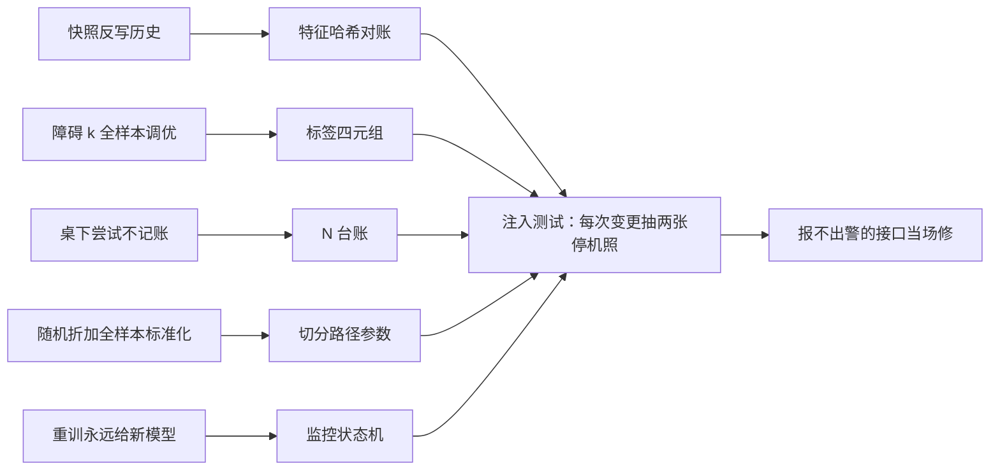
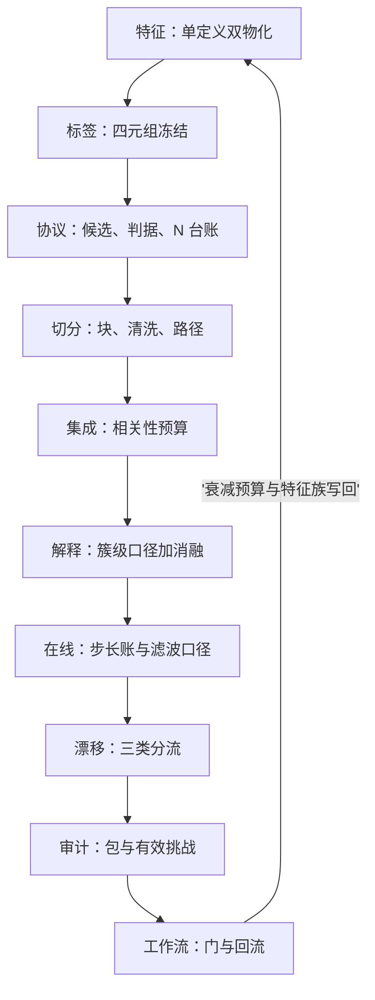

# 失败模式与收束

失败不是反例集，是同一台机器在不同接口上的停机照；把停机照并排挂起，机器的图纸才第一次完整。

<footer>—— 据 López de Prado, Advances in Financial Machine Learning, 2018；Arnott, Harvey and Markowitz, Journal of Financial Data Science, 2019 的口径整理</footer>

[上一课](/quant/fml-research-workflow)把十课的工程装进一条带门的流水线，本课是金融 ML 工程的收束。先倒着走一遍机器：十站各自的停机照；再给课程地图。本课程到此收束。

## 问题

失败模式按站点挂账。特征层：双跑差异发散被当噪声压掉，管道漂移吃掉 alpha 而监控一路绿灯；快照反写历史，幸存者漏进训练。标签层：障碍宽度全样本调优，模型学会的是 $k$ 的选择过程；唯一性权重缺失，$t$ 统计量虚高约 $\sqrt{5}$ 倍。选择层：桌下尝试不进台账，$N$ 被系统性低估，极值门槛失守；判据漂移，夏普不够就换 Calmar。切分层：随机折加全样本标准化，折外分数向样本内收敛。集成层：成员同源，有效成员不到两个，方差没降而复杂度照付；stacking 的二级学习器把泄漏从后门放回。解释层：SHAP 排名当特征淘汰名单，解释误差进入选择环路；探针无基线，第一次报警耗尽信任。在线层：步长在打乱顺序上调，实盘跑的不是被验收的模型；无激励期系数沿噪声漂移无人看。漂移层：原假设写成「IC 等于回测」，报警要么天天响要么从不响；重训流程没有「不交易」输出，响应永远给出新模型。审计层：审计包后置，重建的是回忆；挑战者考核挂在被审模型上，独立是名义的。工作流层：跨区通道被汇报顶替，协议仪式化；影子盘按三个月日历转正，证伪职能落空。

停机照可以类比飞机的黑匣子报告：每起事故都不是孤立的怪事，而是同一套系统在某个接口上的失效方式。对应的修理不是换个飞行员（调参数），而是改程序与检查单（修契约）——这正是「按接口读」的含义。

数字实例：唯一性权重缺失时，5 日逐日重叠让 $t$ 统计量虚高约 $\sqrt{5}\approx 2.2$ 倍——真实只有 1.0 的信号会被记成 2.2，轻松越过 1.96 的显著性门槛；账面上多出来的那批「显著」策略，多半是重叠计数重复报的票。

## 方法

清单的用法是应力测试，不是背诵。按接口读：每张停机照都指认一份失效的对账单——特征哈希、$N$ 台账、监控状态机——修复落在契约上，而不是落在参数上。把清单挂进变更流程：数据源、基础设施或模型族的每次变更，抽两张停机照做注入测试；报不出警的接口当场修，清单随系统演化，而不是挂在 wiki 上过期。

注入测试翻译成大白话：故意往系统里放一份已知的坏东西（比如偷偷改回全样本标准化），看清单上的接口报不报警——像消防演习放烟测的是烟感器，不是消防员。报警失灵当场修，这比任何评审PPT都诚实。

## 机制

十张停机照有同一个根：每一层都有一台「局部看起来在进步」的诱惑机器——泄漏让折外分数变好，漏记让 $N$ 变小，回退让可用率变好，重训让响应总有产出。单点防御都会被相邻层的激励绕开，所以地图的读法是接口：每份契约——特征哈希、标签四元组、$N$ 台账、切分参数、监控状态机——都是两层之间的对账单，失败模式清单是接口的应力测试集。三句话带走这门课：训练与实盘读同一个真相；每一次选择都被计数；每一个响应都有合法出口——协议的弃权、集成的保留单成员、漂移的停机。流程的终点不是「有了模型」，而是「无论有没有模型，账都对得上」。

最贵的停机照是「绿灯照」：所有监控正常，净值却缓慢跑输。它不触发任何一层的状态机，只有把扣费后残差与事前衰减预算逐期对账才能发现——主路径的判据必须事前写成数字，而不是事后看图，理由在此。

## 边界

清单不穷尽：失败模式随市场制度与工具栈演化，台账与复盘是清单的更新机制。地图与相邻课程的接口：上游吃因子研究交付的信号清单与[组合构建](/quant/pf-case-map)的执行假设，下游把信号与衰减预算交回组合层与执行层；深度模型在定价与信号上的延伸是深度学习与定价课程的对象，另类数据源的工程是另类数据课程的对象。收束也不给「最佳实践参数包」：窗长、$E$、影子时长、衰减预算都是组织按自身信号与成本标定出来的，本课程给的是标定与验收的方法，不是替你标定好的数。

## 小结

- 失败的共同根是局部在进步：每层的诱惑机器都能被相邻层的激励重新打开。
- 十站的契约就是十张对账单：哈希、四元组、台账、路径、状态机，失败模式清单是接口的应力测试集。
- 三个合法出口贯穿全程：协议弃权、保留最强单成员、漂移停机；永远产出新模型的系统最可疑。
- 课程地图十站：特征、标签、协议、切分、集成、解释、在线、漂移、审计、工作流；上游接因子与组合，下游接执行。
- 出处：López de Prado, *Advances in Financial Machine Learning*, Wiley, 2018；Arnott, Harvey and Markowitz, *Journal of Financial Data Science*, 2019；Harvey, Liu and Zhu, *RFS*, 2016。
