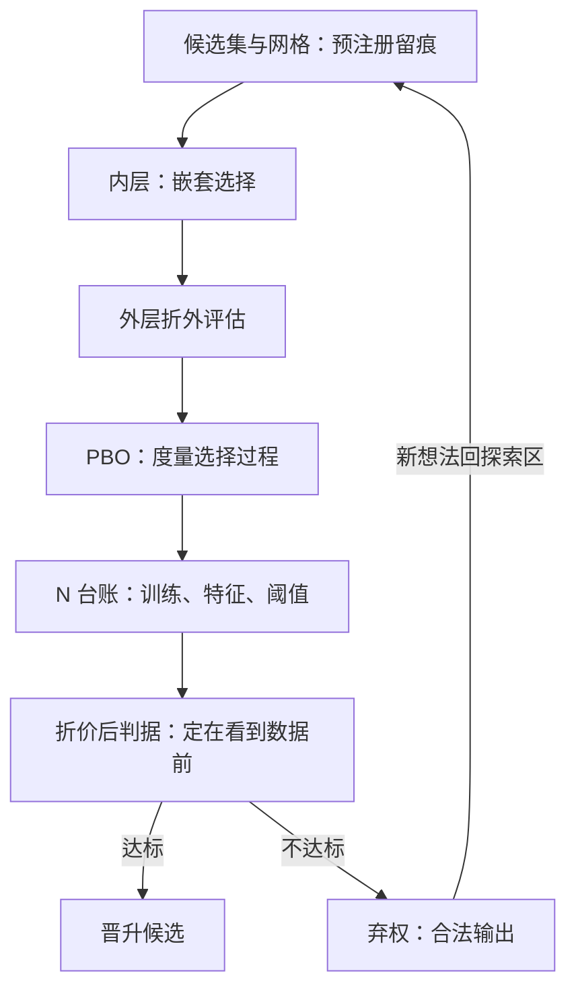
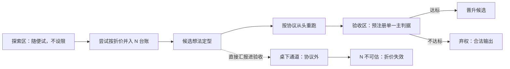

# 模型选择协议

在 $N$ 次尝试里挑最大值，最大值本身就是被选择过程污染的统计量；协议的作用不是让尝试变少，而是让每一次尝试都被计数。

<footer>—— 据 Harvey, Liu and Zhu, Review of Financial Studies, 2016；Bailey and López de Prado, Journal of Portfolio Management, 2014 整理</footer>

[上一课](/quant/fml-label-engineering-deep)把标签冻结成四元组，$X$ 与 $y$ 都有了契约。缺口在中间那一步：「在候选里挑谁」这件事本身是统计过程，却常常没有过程——网格扫一遍、挑折外最好的那个，选择的有偏性顺着这条缝进验收。[嵌套交叉验证](/quant/nested-cv)已把选择关进内层，[Probability of Backtest Overfitting](/quant/pbo)已度量选择过程的质量。本课写协议：候选集、网格、判据、$N$ 台账与晋升判据怎么落成制度。后课的切分是这协议的裁判。

## 问题

选择是一个估计器：非嵌套的「折外最优」是候选最大值的期望，有系统性上偏，这是[嵌套交叉验证](/quant/nested-cv)的结论。协议要堵的是三种实践中更常见的失真。$N$ 不可见：网格条数写进了文档，但桌下的「顺手试了两个特征」「换个种子再跑一次」不进任何台账，名义 $N$ 被系统性低估。判据漂移：看到结果之后改验收线——夏普不够就换 Calmar，扣费后不够就改报扣费前——判据变成了被选择的第二个候选。冠军外推：内层赢不保证外层赢，外层赢更不保证实盘赢；把三层证书压成一张是选择协议最常见的省略。缺口：把「谁顺手谁说了算」变成可审计的程序。

选择污染可以类比 1000 只猴子各扔 10 次硬币：大概率有一只十次全正，但「表现最好」不等于「会扔硬币」。从 $N$ 个候选里挑出的最高分，被挑选过程系统性地抬高了——冠军的分数不能按字面读，这正是协议要先于数据定判据的原因。

## 方法

协议五要素。候选集与网格预注册，修改留痕；判据定在看到数据之前，单一主判据加若干次要观测，明写「次要观测不用于翻案」；$N$ 台账对每次训练、每次特征增删、每个阈值计数，其输出直接对接 [Deflated Sharpe](/quant/deflated-sharpe) 的 $N$ 输入；评估关用外层折加 [PBO](/quant/pbo)，前者评候选，后者评选择过程本身；晋升判据含弃权——全部不达标是合法输出，且应按零假设的先验预期其最常见。运行上分两区：探索区随便试，notebook 不设限；验收区必须按协议从头重跑，探索次数按折价并入 $N$ 台账。两区的唯一通道是重跑，不是汇报。

PBO（回测过拟合概率）翻译成大白话：把数据切成两半各选一次冠军，反复做，统计「两半选出的冠军不是同一个」的频率——频率高，说明「选冠军」这道工序本身在追噪声，冠军的折外成绩多是挑选红利。

## 机制

多重检验折价为什么不可豁免：$N$ 个零真候选里，最大统计量按 $\sqrt{2\log N}$ 随 $N$ 增长，[Deflated Sharpe](/quant/deflated-sharpe) 与 Harvey–Liu–Zhu 的多重折价都是这一极值直觉的落地。金融里候选彼此相关——同一批数据的不同变换——有效 $N$ 小于名义 $N$，这本是好消息；但「没写下来的尝试」让有效 $N$ 从可估计变成不可估计，台账的首要功能因此不是精确计数，而是阻止 $N$ 被系统性低估。弃权为什么是功能：若零假设为真，协议的产出分布应以「无新模型」为众数；一个每轮都产出冠军的协议只是仪式，它的真假设早已在探索区被消耗。

常见误区：把换判据当成「换个角度看」。看到夏普不够再改用 Calmar，等于考砸后换一张评分表——判据本身成了被挑选的第二个候选，多重检验的账要再翻一倍，而这份翻倍通常没人记进 $N$。

$\sqrt{2\log N}$ 的量级：$N=100$ 时约 $3.0$，$N=1000$ 时约 $3.7$。台账只记了 10 次而桌上实际发生过 100 次，门槛就低了约 $0.9$ 个标准差——被低估的是 $N$，被低估的门槛放进来的是噪声。

## 边界

嵌套结构与 CSCV 的机制、Reality Check 与 SPA 的检验量选择都已有专课，本课只引用。协议不保证找到 alpha：它约束的是假阳性率，不是功效；真信号稀薄时，弃权率高是协议正常工作的证据而非失败。协议也不替你定判据——主判据选扣费后效用还是截面 IC，是投资目标的问题，协议只要求它先于数据被写下。桌面下的尝试无法被协议观测，只能被组织约束，这是本课程工作流一课的题目。

## 小结

- 选择是估计器，非嵌套折外分数是候选最大值的有偏期望。
- 协议五要素：预注册候选、先于数据的判据、$N$ 台账、外层加 PBO 的评估、含弃权的晋升判据。
- 探索区与验收区分离，唯一通道是按协议重跑，探索次数折价并入 $N$。
- 台账的首要功能是阻止 $N$ 被系统性低估；每轮必出冠军的协议是仪式。
- 出处：Harvey, Liu and Zhu, *RFS*, 2016；Bailey and López de Prado, *JPM*, 2014；Cawley and Talbot, *JMLR*, 2010。
