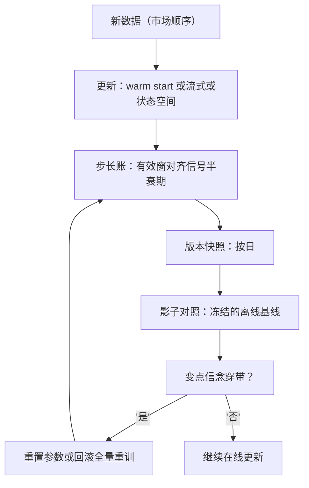

# 在线学习

递归辨识的收敛不看步长多小，而看激励是否持续；市场不保证持续激励，在线更新因此不是免费的自适应。

<footer>—— 据 Ljung, IEEE Transactions on Automatic Control, 1977；Ljung and Söderström, Theory and Practice of Recursive Identification, 1983 整理</footer>

[上一课](/quant/fml-explainability-deep)给模型配了能被质询的语言，静态模型由此上线。缺口：市场在动，静态模型的系数是某个历史窗口的化石——什么时候允许模型边跑边学、学多快、出事怎么退，是本课的问题。[BOCPD 在线变点检测](/quant/bocpd-online-changepoint)已给在线变点信念的滤波器，[Kalman 价差](/quant/kalman-spread)一类状态空间已给参数漂移的最小模型。本课把在线学习当运维对象写：更新方式、步长账、遗忘与重置、验收。

## 问题

静态部署与每日全量重训之间有一段光谱：warm start 用新数据微调旧模型，快但继承旧结构的偏；流式更新（SGD、递归最小二乘）逐条或逐批改系数，跟得快，却把「样本顺序」变成新的超参；状态空间把参数当状态，漂移显式建模，代价是结构受限。三个坑横在这段光谱上。步长与漂移速度错配：太快，每条微观噪声都写进系数；太慢，体制已换而系数还在原地。遗忘不对称：旧体制回归时，被遗忘的参数要从头再学——灾难性遗忘在金融的形态，是回归的均值回复策略突然不会做。顺序偏差：流式模型是训练顺序的函数，同一份数据换个顺序就是另一个模型；回测与实盘的更新顺序若不同，上线的不是被验收的那个模型。

## 方法

步长账。遗忘因子 $\lambda$ 对应有效样本窗 $N_{\mathrm{eff}}=1/(1-\lambda)$，恒定学习率 $\eta$ 亦同量级；按信号半衰期选窗——衰减快则窗短，慢则窗长，标定窗长的尝试计入 $N$ 台账。重置规则预写成状态机：变点信念（[BOCPD](/quant/bocpd-online-changepoint) 或 CUSUM）穿带，触发参数重置或退回全量重训；分流逻辑归下一课，这里只接接口。验收只认滤波口径：$t$ 时刻的预测必须在用 $t$ 及之前数据完成更新之后做出，用了未来更新再回头预测的平滑口径是泄漏；上线后模型按日做版本快照，与冻结的离线基线影子对照。

## 机制

在线为什么不是免费的自适应：递归辨识的收敛条件是持续激励——数据要持续「问」到参数的各个方向；低波动横盘期市场不给激励，系数沿噪声方向缓慢漂移，参数动了不等于信号更新了。锚因此必要：在线正则（向冻结的先验收缩）把无激励期的漂移拴住，先验就是上次通过验收的那组系数。顺序偏差为什么实盘更大：实盘的更新顺序就是市场顺序，回测若在打乱顺序上调步长，调出的步长必然错——步长与窗长的标定必须在时间序上做，与[时序交叉验证](/quant/fml-tscv-deep)的切分纪律同源。遗忘不对称的缓解是结构性的：把「快变部分」（如当前波动）与「慢变部分」（如因子载荷）分给不同时间尺度的两个状态，慢变部分少遗忘，快变部分放开追。

窗长对照：$\lambda=0.99$ 对应 $N_{\mathrm{eff}}\approx 100$ 个样本。若信号半衰期约 60 个交易日，这个窗记住近一个半衰期的市场；窗再长，旧体制的样本就在系数里占了多数。

## 边界

Bandit 与强化学习对执行参数的在线优化是执行课程的对象，此处不展开。在线学习不替代漂移检测：它假设漂移可被步长吸收，哪些漂移该追、哪些该停机，分流逻辑归下一课。参数服务的分布式工程（参数服务器、增量特征回灌）不在本课粒度内，本课到「逐日批更新还是逐笔流式」为止。在线模型同样受审计约束：每次更新可复现（数据顺序、随机种子入账）是它进入生产的前置条件，标准与本课程审计一课一致。

## 小结

- 更新方式是光谱：warm start、流式、状态空间；选择标准是漂移速度与结构约束，不是先进性。
- 步长账按信号半衰期定有效窗；标定在时间序上做，计入 $N$。
- 无激励期系数沿噪声漂移，在线正则向已验收的先验收缩。
- 验收只认滤波口径，平滑是泄漏；版本按日快照与离线基线影子对照。
- 出处：Ljung, *IEEE TAC*, 1977；Ljung and Söderström, *Theory and Practice of Recursive Identification*, MIT Press, 1983；Adams and MacKay, 2007。
