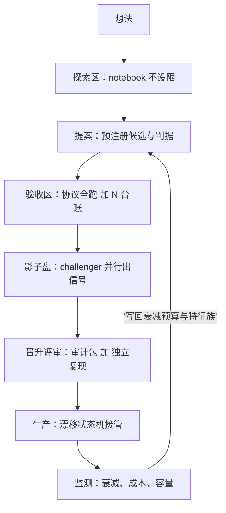

# ML 投研工作流

机器学习时代的回测协议首先是一条流程纪律：探索的自由以重跑为门票进入账本；组织真正的记忆不是人，是台账。

<footer>—— 据 Arnott, Harvey and Markowitz, A Backtesting Protocol in the Era of Machine Learning, Journal of Financial Data Science, 2019 整理</footer>

[上一课](/quant/fml-audit)把信任写成可检验的记录，审计包装订了前九课的契约。缺口：这些单点工程要有人每天去走、组织能复制——特征、标签、协议、切分、集成、解释、在线、漂移、审计，串成一条研究员走得动、门跳不掉的流水线，是本课的任务。

## 问题

个人研究者靠记性和自觉能走通全链，组织不行：人会走捷径（跳过协议直接上线），会离开（带走 $N$ 的记忆与口径），会重复犯错（同一类泄漏在三个小组各犯一遍）。断点有三处。探索与验收没有边界：第 3 课的「桌下尝试」在组织尺度被放大成系统性漏记。门是文档不是闸门：影子盘与独立复现都可以被「先上线再补」，而「再补」从未发生。没有回流：实盘发现的漂移、成本与容量经验不回到特征清单与衰减预算，同类错误的学费交了一遍又一遍。缺口不是缺工具，是缺一条让纪律比捷径更省力的路。

## 方法

流水线分区与门。探索区：notebook 不设限，无台账义务。提案：预注册候选集与判据，进入[协议](/quant/fml-model-selection-protocol)的视野。验收区：协议全跑，$N$ 台账与 CPCV 路径分布齐备。影子盘：challenger 与在产模型并行出信号，时长按信号半衰期定，不按日历定。晋升评审：审计包齐全、独立复现通过，哈希与用途登记。生产：进入[漂移管理](/quant/fml-drift-management)的状态机。回流：监测经验以载体写回——衰减预算修订、特征族降权、标签视野调整——不是一场复盘会。三条硬规则贯穿：跨区唯一通道是重跑，不是汇报；每个门有明确交付物（契约、台账、包），没有口头门；回流体必须落到可执行的条目上。

## 机制

门为什么不可跳过：每道门兑换一种自由——探索区的无代价自由，兑换成进入验收区时按协议重跑的成本；重跑一旦可以被汇报顶替，协议立刻退化成仪式，第 3 课「每轮必出冠军」的病在流程尺度复发。影子盘为什么按半衰期：日历时长与信息量无关，影子盘要积累到足以区分「衰减在预算内」与「预算外」；这个样本量由 IC 量级决定，弱信号下以年计——所以影子盘只承担证伪职能：快速暴露预算外的衰减、成本失控与管道故障；证明职能由验收区的多重折价承担，两条腿各干各的。工作流为什么是组织的记忆：人走了台账还在，新人从哈希读口径而不是从老员工脑子里读；[失败与成功同模板归档](/quant/research-postmortem)的纪律在流程尺度同样成立——不可检索的教训等于没有教训。

证明「活着」的统计成本：区分真实 IC $0.02$ 与零约需 $1.96^2/0.02^2\approx 9600$ 个独立观测。这就是影子盘不能承担证明职能的原因，也是「看三个月就转正」这道工序的真实含义。

## 边界

通用 MLOps 基建（CI/CD、编排、特征店的实现）不在此课，存储与平台的选型是数据工程课程的对象；团队分工、评审会议与知识库制度是研究协作课程的对象。工作流也不加速 alpha 的产生——它加速的是「判死刑」与「防复发」，这两件事恰恰是组织最缺的速度；把它当提效工具去压缩验收，等于把整条流水线倒过来用。流水线本身也进审计包：门的跳过记录、影子盘的提前转正，都是可被质询的事件。

## 小结

- 探索与验收分区，跨区唯一通道是重跑；提案预注册，验收交台账。
- 门有交付物：契约、台账、审计包；口头门等于没有门。
- 影子盘承担证伪不承担证明，时长按半衰期与样本量定，不按日历定。
- 回流必须有载体：衰减预算修订与特征族降权，不是复盘会。
- 出处：Arnott, Harvey and Markowitz, *Journal of Financial Data Science*, 2019；López de Prado, *Advances in Financial Machine Learning*, Wiley, 2018。
