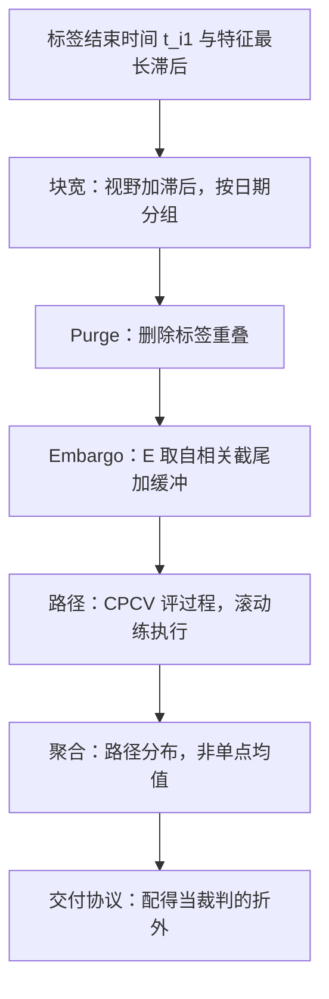
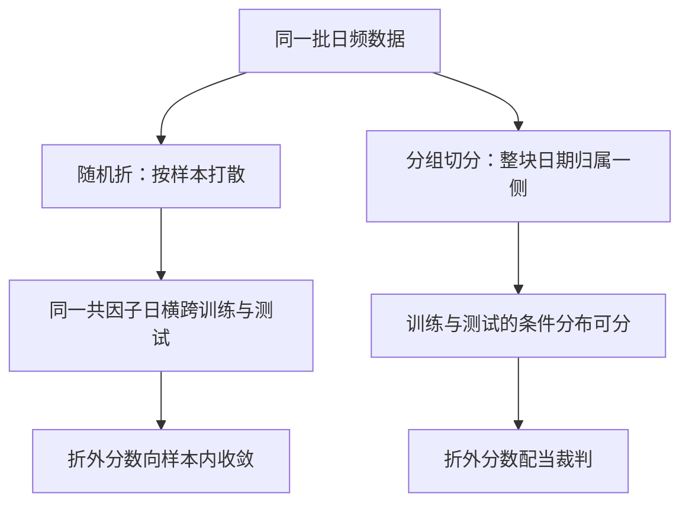

# 时序交叉验证的深化

折怎么切，决定折外分数配不配当裁判；对相依数据，随机打乱不是切分，是重写了数据的生成过程。

<footer>—— 据 Racine, Journal of Econometrics, 2000；López de Prado, Advances in Financial Machine Learning, 2018 整理</footer>

[上一课](/quant/fml-model-selection-protocol)把「挑谁」写成协议，协议的裁判是折外分数；缺口是裁判自身的资格——折怎么切，决定折外还算不算折外。[交叉验证在金融中的泄漏](/quant/cv-leakage-finance)立了泄漏路径，[Purge 与 Embargo](/quant/purge-embargo)给了清洗机制，[Combinatorial Purged CV](/quant/cpcv-lopez)给了路径视角。本课深化切分工程：四个参数怎么标定、截面与时序怎么组合、路径怎么聚合。

## 问题

切分是四参数决策：块结构、清洗规则、路径数、聚合口径；实践里它们常被默认值顶替——五折随机、固定 $h$ 的 purge、单条滚动路径。三个具体的坑。Embargo 长度拍脑袋：与特征最长滞后无关的 $E$，小了不够（测试块后的训练点仍携带同一冲击），大了白白扔掉稀缺样本。截面策略用单资产时序折：截面信号按日期分组切分才成立，否则同一共因子日横跨训练与测试两侧。单路径幻觉：一条滚动路径只是路径分布的一个实现，拿一个样本做推断，冠军的选择判据本身就是噪声。

Embargo 可以类比考试隔离：考完的班级（测试块）与还没考的班级（训练侧）之间隔一段走廊时间，防止答案——同一次冲击的信息——通过相邻座位传出去。走廊多长，取决于回声在数据里传多远。

## 方法

切分按四步落参数。块结构：时间块宽度不小于标签视野加特征最长滞后；截面信号按日期分组切分，块内保持完整交易日。清洗：purge 按每条样本的真实标签结束时间 $t_{i,1}$（[Triple Barrier](/quant/triple-barrier) 的首达时间）删除，不用固定 $h$ 的保守上界；embargo $E$ 由特征与残差的滞后结构标定——看自相关截尾的位置加缓冲，不看习惯。路径：评估用 [CPCV](/quant/cpcv) 生成多条 purged 路径看分布，部署演练用遵守时间顺序的单条[滚动](/quant/walk-forward)；前者评选择过程，后者排练执行，两者不互相替代。聚合：报告路径分布的中位数、分位与低于中位的频率，不只报均值；所有预处理的 `fit` 停在各折训练段内。

块宽的数字实例：标签视野 5 天，特征含最长 22 天滞后的月频宏数据，块宽就得不小于 $5+22=27$ 个交易日。用「五折随机」的默认值，等于让 22 天的回声留在训练与测试两侧互相偷听。

CPCV 翻译成大白话：把时间轴切成若干块，每次抽 2 块当测试、其余当训练，穷举各种组合——同一段行情会在不同组合里轮换「考题」与「复习材料」的角色，最后得到冠军成绩的一个分布，而不是一次运气的抽样。

## 机制

随机折为什么失效：泄漏的三条通道——重叠标签、全样本统计、共同因子日——共享一个根源，训练看到了测试的时间邻居；相依数据的泛化误差要可估，训练与测试的条件分布必须可分，随机折让二者几乎重合，折外分数向样本内收敛。Embargo 为什么有长度：短程自相关让相邻点共享同一冲击，$E$ 的功能是让测试块信息在训练侧衰减到可忽略；自相关在滞后三处截尾，$E$ 就取三加缓冲，与「习惯上隔一天」无关。多路径为什么必要：单路径上的冠军排名是路径噪声的函数；多路径回答的是「冠军是否稳定地好」，其分布直接接上一课 [PBO](/quant/pbo) 的输入——过程质量与候选质量在同一个坐标系里读。

常见误区：多路径只报平均分。两条路径一优一劣、均值尚可，与两条都平庸，是完全不同的结论；分布的中位数与「低于中位的频率」才回答上一课的问题——冠军是稳定地好，还是碰巧这次好。

$E$ 的单位是样本不是天：若特征含月频宏数据，可得滞后约三周，用「隔一天」定的 embargo 在这类特征面前形同虚设；标定 $E$ 先列特征清单里最慢的可用滞后。

## 边界

滚动检验的协议细节与 CPCV 的组合机制已有专课，本课只定参数。切分不修复前视、成本与生存偏差——这些错误会被忠实复制进每一条路径，路径越多样，错误的置信度反而越高。切分也假定[特征存储](/quant/fml-feature-store-deep)的点时契约成立：可得时间错位的列会让最严格的清洗也拦不住泄漏。块宽、$E$、路径数本身是超参数，标定它们的尝试计入 $N$ 台账；在切分方案上挑最好看的那个，是第二层选择，仍归上一课的协议管。

## 小结

- 切分四参数：块结构、清洗规则、路径数、聚合口径；默认值顶替它们是折外失效的主因。
- Purge 用每条样本的真实 $t_{i,1}$，embargo 由滞后结构标定，不用习惯值。
- 截面信号按日期分组切分；块宽不小于标签视野加特征最长滞后。
- CPCV 多路径评选择过程，单条滚动演练执行；报告分布而非均值。
- 出处：Racine, *Journal of Econometrics*, 2000；López de Prado, *Advances in Financial Machine Learning*, Wiley, 2018，第 7 章；Bergmeier and Benítez, *Pattern Recognition*, 2012。
