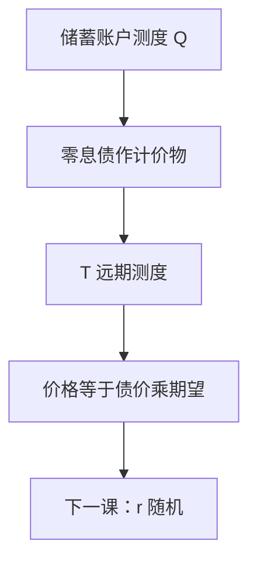

# 远期测度

$T$-远期测度以到期 $T$ 的零息债为计价物。该测度下，到期 $T$ 的未定权益价格是远期价格的普通期望，贴现从期望里提出。

<footer>—— 据 Geman, El Karoui and Rochet, Journal of Applied Probability, 1995；Jamshidian, 1989；Shreve, Stochastic Calculus for Finance II, 第 9 章整理</footer>

上一课[对数正态与 Black 公式](/quant/lognormal-black-formula)在常数利率下把 $d_2$ 读成 $Q$ 概率。缺口是：利率一旦随机，贴现因子 $\mathrm e^{-\int r}$ 与 $S_T$ 相关，不能再写成 $\mathrm e^{-rT}\mathbb E_Q[H]$ 这种常数贴现。换计价物到零息债 $P(\cdot,T)$，期望与贴现分离。本课只定义 $T$-远期测度，并为下一课「利率不是常数」留下接口。

## 问题

储蓄账户 $B_t=\exp(\int_0^t r_s\mathrm d s)$ 作计价物时，价格是 $\mathbb E_Q[H/B_T]$。$r$ 随机则 $1/B_T$ 与 $H$ 一般不独立，Black 里那个提出来的 $\mathrm e^{-rT}$ 没有了。缺口是另选计价物 $N_t=P(t,T)$（$T$ 到期的零息债），定义 $Q^T\sim Q$，使所有以 $N$ 贴现的可交易资产为 $Q^T$-鞅。此时

$$
V_t=P(t,T)\,\mathbb E^{Q^T}[H\mid\mathcal F_t]\qquad(H\text{ 在 }T\text{ 支付}).
$$

$P(t,T)$ 可从债券市场观察，期望里不再夹随机贴现。

### 远期测度不是「把股票换成远期」的口误

股票测度（$S$ 作计价物）给出 $d_1$；$T$-远期测度给出与 $d_2$ 同类的概率。两者都是计价物变换，对象不同。把「远期测度」说成「标的改成期货」，会把 $Q^T$ 和期货风险中性（Black 76 在确定利率下的 $Q$）混在一条。随机利率下期货与远期还要再分，本课先钉债券计价物。

密度过程正比于 $P(t,T)/B_t$ 相对其初值，即贴现债券价格。这是 RN 导数课 Bayes 公式的具体化。

## 方法

设 $P(t,T)=\mathbb E_Q[B_t/B_T\mid\mathcal F_t]$。定义

$$
\frac{\mathrm d Q^T}{\mathrm d Q}\Big|_{\mathcal F_t}=\frac{P(t,T)/B_t}{P(0,T)}.
$$

则 $T$ 到期的可交易支付用 $Q^T$ 取期望再乘 $P(t,T)$。远期价格 $F(t;T)=S_t/P(t,T)$（合适的再投资约定下）是 $Q^T$-鞅。因此「远期对数正态」精确地指：在 $Q^T$ 下 $\ln F(T;T)$ 正态。Black 公式在随机利率下仍然可用，只要对数正态写在 $Q^T$ 上，$\sigma$ 是远期波动率。

多个到期 $\{T_i\}$ 对应多个 $Q^{T_i}$，这是利率衍生的标准日历；本课只需要一个 $T$。

## 机制

计价物变换是 Girsanov 的有限维版本：密度等于两个计价物的价值比。随机积分的漂移按两者波动率之差平移。$Q$ 下贴现债券有波动，所以 $W$ 在 $Q^T$ 下会改漂移；标的的远期波动率是相对波动，不是现货 $\sigma$ 的原样拷贝。常数 $r$ 时 $P(t,T)=\mathrm e^{-r(T-t)}$ 确定性，$Q^T=Q$，本课退化成上一课。

数字支付 $1_{\{S_T>K\}}$ 的价格是 $P(t,T)Q^T(S_T>K)$。这给了 $d_2$ 在随机利率下的正确定义：它是远期测度概率，不是储蓄账户测度概率。

## 边界

本课不引入 HJM、LIBOR 市场模型，不写交换期权的 Margrabe 之外的多计价物。下一课只预告 $r$ 不能再当常数，不把期限结构建完。后课默认：随机贴现时先换到 $Q^T$，再谈对数正态。下一课[利率不是常数](/quant/stochastic-rate-preview)说明为何主干公式里的 $r$ 会裂开。

## 小结

- $T$-远期测度以 $P(\cdot,T)$ 为计价物，把贴现提出期望。
- 远期价格是 $Q^T$-鞅；Black 的对数正态写在 $Q^T$ 上。
- 常数 $r$ 时 $Q^T=Q$，与上一课重合。
- $d_2$ 是远期测度下的实值概率。
- 出处：Geman–El Karoui–Rochet 1995；Shreve SDE II 第 9 章。
