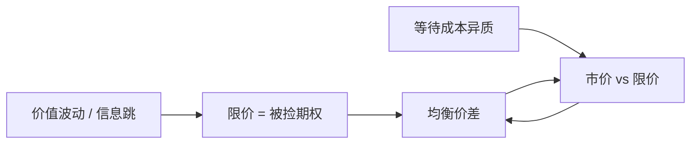

# Foucault 限价簿竞争

挂限价单是出售免费期权：你在等待成交的同时，价值可能走掉，期权被知情者或公开新闻「捡走」。价差必须补偿这份被捡便宜的风险，而不仅补偿排队。

<footer>—— Foucault, Order flow composition and trading costs in a dynamic limit order market, Journal of Financial Markets, 1999</footer>

[Parlour](/quant/parlour-lob)让执行概率随队深下降，主摩擦是轮不到你。缺口是对称的另一风险：你排到了，但成交发生在价值已经对你不利之后。Copeland 与 Galai（1983）把做市报价写成被知情者捡走的期权；Foucault（1999）把它放进动态限价簿：交易者在限价与市价之间选择，均衡价差补偿 picking-off。本课不重推队列马尔可夫的状态转移。

## 问题

限价单在成交前可被公共信息或知情市价单击中。若价值向上跳而你的卖限价还挂着，你被买走，相当于把低价卖给已经知道该买的人。等待越久、波动越大、信息事件越密，这份期权越贵。交易者比较：(i) 市价，立刻付价差；(ii) 限价，省价差但承担非执行与被捡。问题是均衡里限价单比例、价差与波动如何一起决定，而不把专家当作外生供给。

Parlour 的深度回复在此仍然在，但驱动价差宽度的主要是被捡风险，不是处理成本。这与 Glosten-Milgrom 的价差同族（逆向选择），实现场所换成了限价簿竞争。

### 耐心与即期需求

Foucault 让交易者带不同的等待成本。高等待成本者更常吃市价，成为流动性需求；低等待成本者挂限价，成为供给。组成内生：价差宽时更多人愿意挂，价差窄时更多人吃——与 Parlour 的队列反馈一起，给出限价比例随状态变化。Admati–Pfleiderer 的择时在这里变成「挂还是吃」的静态权衡，时钟可以仍是平稳的。

Foucault, Kadan, Kandel（2005）进一步把簿写成流动性市场，强调执行等待时间。1999 年文章已足够本课：组成与被捡。等待时间的连续化留给 Roşu。

## 方法

每期随机到达一个交易者，观测当前价差（或 BBO）与自己的估值、等待成本，选择市价或限价（限价通常放在优于或等于当前最优的一个网格上）。价值服从随机游走或带跳的公共信息。均衡是平稳策略：给定状态，限价与市价的概率使做市期望利润（价差收入减去被捡损失）与执行概率一致。

比较静态：波动 $\sigma$ 上升，被捡风险上升，均衡价差加宽，市价单比例可能上升（因为限价更贵）。到达率上升，等待缩短，被捡窗口变窄，价差可以下降。这与「成交越密越流动」的直觉一致，机制是期权时间价值，不是外生 $\sigma_u$。

### 从期权到价差

Copeland–Galai 的专家必须始终挂出被捡期权。限价簿上这份期权由自愿挂单者分散持有，谁挂谁收权利金（价差），谁也可以选择不挂。供给弹性因此比单一专家大：波动冲击下价差跳开、深度暂时变薄，但不需要一个垄断专家加价。

## 机制

价差是权利金。权利金高，愿意做期权卖方的人多，簿厚；权利金低，只剩最有耐心的人挂着，簿薄、被捡后补给慢。公共新闻到达的瞬间，未及撤单的限价被扫，这就是后文速度竞赛的慢版本：在 1999 年模型里「快」体现在谁先到达下一期，还没有连续时间的抢先。

与 Easley–O'Hara 事件不确定对照：有事件的日子被捡概率高，限价供给应撤退，价差宽——与事件后验升时 Glosten-Milgrom 价差宽同方向，但供给侧是挂单者退出而不是专家改条件期望。经验上两者纠缠。

## 边界

网格粗糙、常无多档深度选择、撤单往往被简化。真实 HFT 把被捡窗口从「下一期」压到微秒，模型的等待成本参数不能直接校准。逆向选择若来自长期内幕而非公共跳，限价期权的希腊值不同，Back 的平滑释放不会表现为一次性扫簿。tick 约束会把价差钉在一档，比较静态失效，见价格栅格课。

不要把「波动升、价差升」只写成 Foucault。库存风险（Ho–Stoll）与事件不确定给出同号预测。识别需要看随后中点是否永久移动（信息）还是回复（库存 / 补给）。

## 小结

- Foucault（1999）把限价单写成被捡便宜的期权，价差补偿 picking-off，下单组成由等待成本内生。
- 波动与信息跳加宽价差、改变市价/限价比例；到达率提高可缩短被捡窗口。
- 相对 Parlour：主摩擦从「排不到」变成「排到了但价值已走」。
- 出处：Foucault, *Journal of Financial Markets*, 1999；期权直觉见 Copeland and Galai, *Journal of Finance*, 1983。
