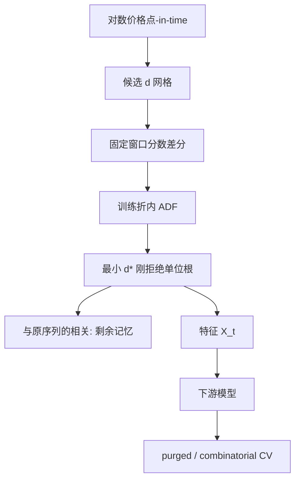

# 分数阶差分

整数差分把价格里的记忆一起删掉；分数阶差分的目标是找到使序列通过平稳性检验的最小 $d$，以便在平稳与记忆之间做一个可检查的折衷。

<footer>—— López de Prado, Advances in Financial Machine Learning, Chapter 5, 2018；分数差分的经典表述见 Granger and Joyeux, Journal of Time Series Analysis, 1980</footer>

对数价格通常像 I(1)，一阶差分后的收益像 I(0)，但收益几乎白噪声，长期记忆被抽空。机器学习特征若用原始价格，单位根让样本均值没有锚，模型会把水平当信息；若用收益，又丢掉缓慢的均值回复与趋势结构。Granger 与 Joyeux、Hosking 把分数阶差分（$d\in\mathbb{R}$）写成 ARFIMA 的一部分：过程可以是平稳的长记忆，而不是只能在 0 与 1 之间跳。López de Prado 在 AFML 第 5 章把同一工具用到特征工程：对价格做 $d$ 阶差分，取仍能通过 ADF 的最小 $d$，使特征尽量保留记忆。本篇写这个折衷怎么算、权重怎么截断；单位根检验本身见[单位根与协整预备](/quant/unit-root)。

## 问题

滞后算子 $L$，$d$ 阶差分是 $(1-L)^d X_t$。$d=0$ 为原序列，$d=1$ 为 $\Delta X_t$。二项式展开给出权重

$$
\omega_k = -\omega_{k-1}\frac{d-k+1}{k},\qquad \omega_0=1,
$$

于是 $\tilde X_t=\sum_{k=0}^\infty \omega_k X_{t-k}$。$d=1$ 时 $\omega=(1,-1,0,0,\ldots)$，记忆被截断在一阶；$0<d<1$ 时权重缓慢衰减，历史价格仍进入今天的特征，但单位根被部分抽掉。问题是选 $d$：太小，ADF 仍不拒绝，特征非平稳；太大，接近普通收益，预测力若来自水平结构就会消失。

金融价格未必是真正的分数积分过程。$d$ 在这里是**特征变换的超参**，不是对数据生成过程的承诺。把 AFML 的 fracdiff 当成「证明了价格是 I($d$)」，超出了方法的范围。它只声称：在给定的平稳性门槛下，这是丢失记忆最少的线性滤波之一。

### 无穷权重必须截断

真实样本有限，$\omega_k$ 要在某 $K$ 处截断，或改用 López de Prado 的固定窗口分数差分（FFD）：窗口宽度固定，丢弃窗口外的权重，使每个 $\tilde X_t$ 使用同样多个历史点，避免样本头部的有效 $d$ 与尾部不同。截断引入近似误差：实际平稳性可能比理论 $d$ 更差。因此 ADF 必须做在截断后的序列上，而不是做在理论 ARFIMA 上。窗口太短，分数差分接近一个短 FIR 高通；窗口太长，头部样本无法计算，有效训练集缩短。

对已经是收益的序列再做 $d>0$ 的分数差分，往往是过差分：引入接近单位根的 MA，伤害后续的线性模型。先判断水平还是差分，再谈 $d$。

## 方法

对一条对数价格，扫描 $d\in\{0,0.1,\ldots,1\}$（或更细），每个 $d$ 计算 FFD 序列，跑 ADF（设定必须预先写死：常数项、滞后选择规则），记录最小的 $d^\star$ 使检验在预定显著性上拒绝单位根，同时报告该 $d^\star$ 下序列与原对数价格的相关——这是「还剩多少记忆」的描述统计。López de Prado 用这条相关对 $d$ 作图：随 $d$ 增加，相关下降、ADF 统计量变负。选用相关仍高且刚过临界值的 $d$，而不是选用 ADF 最负的 $d$。

$d^\star$ 只能在训练折内估计。用全样本 ADF 选 $d$ 再做预测，平稳性门槛看见了未来波动与未来水平，属于泄漏。不同资产的 $d^\star$ 可以不同；强迫所有股票同一个 $d$，是在用同一高通滤波器打所有记忆结构。截面模型里，更干净的是在每个训练窗对每列单独估 $d$，或预先冻结一类资产一个 $d$，并做敏感性。

### 与整数差分、协整残差的分工

配对交易的价差若已经协整，对象是 $y-\hat\beta x$，本身应近 I(0)，再 fracdiff 通常无益。指数、单价格、利率这类水平特征，才是 fracdiff 的主场。宏观比率可能是持久平稳（$d\approx 0$）或近单位根；ADF 势低时，$d^\star$ 会估得偏大。应把 $d$ 的选择当成管道超参，用 [purged CV](/quant/purge-embargo) 评估，而不是当成已发现的分整阶数去写论文标题。

实现上注意：权重 $\omega_k$ 对 $d$ 可解析计算，避免每期对历史做一次缓慢卷积之外的重复劳动；FFD 可以用固定核做相关。对数价格应先处理公司行为，否则拆股跳会被分数核拖成一长串虚假记忆。

ADF 的显著性水平是又一个超参。把门槛从 5% 改到 1%，$d^\star$ 通常上升，记忆被删得更多。应报告 $d$ 对门槛的敏感性，并冻结门槛，禁止看完预测结果再改。

## 机制

整数差分消除 $\lambda=1$ 的谱极点，也把低频增益打到零。分数差分把 $(1-e^{-i\lambda})^d$ 的增益在低频处压低但不按 $d=1$ 那样挖空，因此缓慢成分部分保留。对预测而言，被保留的是「相对自身历史的水平位置」的一部分，而不是一个会把价格拉回五年前均值的锚——若过程真是近随机游走，这部分「记忆」只是尚未衰减的冲击，没有交易含义。Fracdiff 不能把噪声记忆变成 alpha。

与波动、趋势特征的关系：许多技术指标是价格的非线性函数，本身已在做另一种滤波。对价格 fracdiff 后再送入这些指标，等于双重高通。更一致的做法是：需要平稳输入的模型（线性、某些核方法）用 fracdiff；树模型对单调变换不敏感，收益、价格、fracdiff 三列可能高度冗余，应在训练折内做共线性检查，而不是默认「AFML 第五章必须进特征表」。

### 结构突变会伪装成分数阶

一次水平断裂会让 ADF 偏向不拒绝，于是 $d^\star$ 被抬高，过滤更狠。危机、指数编制、拆股处理错误都是断裂。Fracdiff 不会修复断裂；它会把断裂的影响按缓慢权重涂到后续样本上，FFD 窗口有多长，污染就有多长。管道里应先做公司行为与已知事件对齐，再差分。

## 边界与工程取舍

不要声称找到了真实的 $d$。不要用全样本选 $d$。不要对已经平稳、或已经是协整残差的序列机械套用。高频价格有微观结构噪声，分数核会把噪声的持久相关写进特征，可能需要先抽样到信息驱动 bar，见[信息驱动 Bar](/quant/imbalance-bars)。$d$ 进入搜索空间后，$N$ 增加，评估要走 DSR/CPCV，而不能因为「只是预处理」就把它从尝试次数里拿掉。

Fracdiff 与预测期也要匹配。$d$ 很小的特征变化慢，对下一分钟的标签几乎常数，对月频标签才有变差。把慢特征拿去预测三重障碍的短 $h$，模型会用它当体制哑变量；这可以合法，但应显式承认，而不是当成短线方向信息。

固定窗口 FFD 在样本最左端没有足够历史，那些行应删掉，而不是用更短窗口「凑」出值——否则左端的有效 $d$ 与右端不同，平稳性检验被混合样本污染。

## 小结

- 分数阶差分用 $(1-L)^d$ 在单位根与白噪声之间取折衷；AFML 取其能通过平稳性检验的最小 $d$，以保留记忆。
- 实操用固定窗口截断权重，ADF 与 $d^\star$ 只在训练折内估计，相关图用来避免过差分。
- $d$ 是特征超参，不是已识别的分整阶；协整残差与已是收益的序列通常不应再差分。
- 断裂、公司行为与微观噪声会污染缓慢权重；窗口左端不足的样本应删除。
- 出处：López de Prado, *AFML*, 第 5 章；Granger and Joyeux, *Journal of Time Series Analysis*, 1980；Hosking, *Biometrika*, 1981；ADF 见 Dickey and Fuller, *JASA*, 1979。
