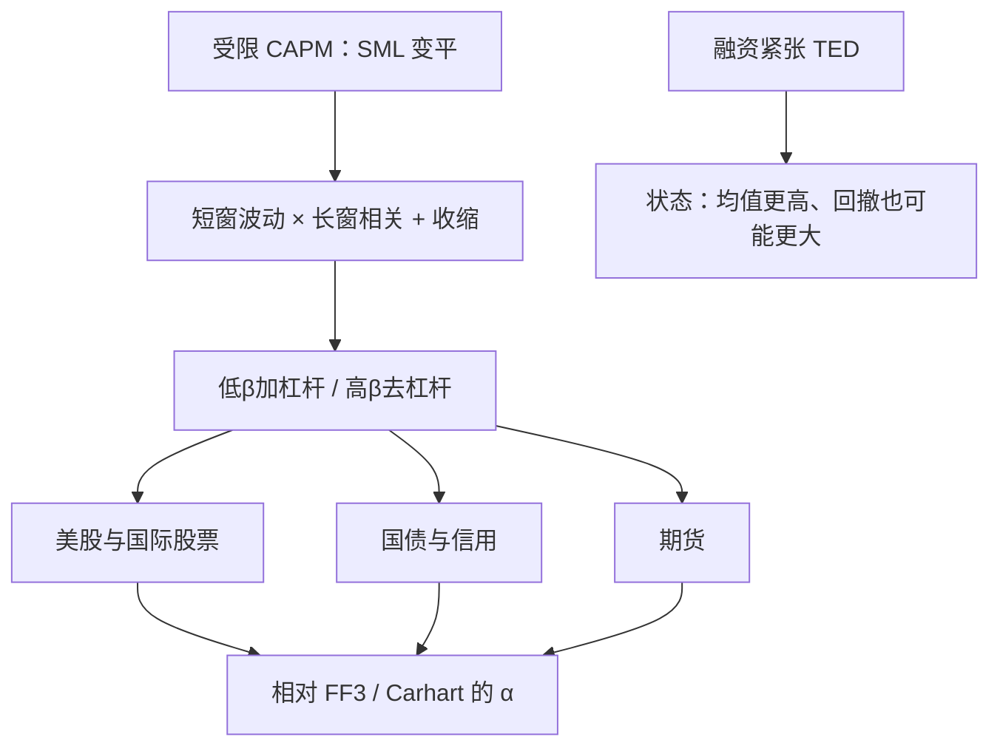

# Betting Against Beta 原文

受杠杆约束的投资者会超配高 β 资产，压平证券市场线；能用杠杆的投资者则应买入低 β、自行加杠杆，并把高 β 去杠杆后卖空。

<footer>—— Frazzini & Pedersen, Betting Against Beta, Journal of Financial Economics, 2014</footer>

[低波动 / BAB](/quant/low-vol-bab) 一文把 BAB 与特异波动之谜拆开，并写出 β 估计与 $1/\beta$ 杠杆。本篇回到 2014 年原文：理论从 Black 的受限 CAPM 来，实证覆盖美股、国际股票、国债、信用与期货，状态变量是融资紧张程度。读这篇是为了复制论文的主张，而不是为了再写一遍「低波产品」。低波动指数没有把 β 调到 1，第一主成分仍是减市场；BAB 赌的是**斜率**。

## 问题

CAPM 说 $\mathrm{E}[R_i]-R_f=\beta_i\bigl(\mathrm{E}[R_M]-R_f\bigr)$。若一部分投资者不能借贷或面临保证金上限，他们会用高 β 证券充当杠杆替代，把高 β 的当期价格抬高、预期收益压低。能加杠杆的投资者本应买低 β、借钱放大，但他们的资金同样有限。均衡不是证券市场线消失，而是变平：低 β 留下正 α，高 β 留下负 α。Black（1972）已经写出受限借款的 CAPM；Frazzini–Pedersen 要做的是把这条斜率不足写成可交易的多空，并在多类资产上检验。

需要回答三件事。第一，平的 SML 是不是只存在于美股小盘？第二，溢价在控制规模、价值、动量之后还在不在？第三，融资约束收紧时（TED 走阔、危机保证金上升），BAB 是否如机制所预测的那样更强——同时又会不会因为杠杆多头被强平而回撤？原文的结构就是理论、构造、跨资产表、再加融资状态。

### 嵌入杠杆与「自己加杠杆」不是同一约束

期货、期权、结构性产品本身带杠杆，受约束的投资者仍可能买高 β 的嵌入杠杆工具，而不是去期货市场按保证金最优配置。原文把国债期限、公司债评级、商品与股指期货也做成 BAB：在这些市场上，「β」是对当地市场因子的暴露（久期、信用利差、商品指数），约束叙事换成保证金与风险预算。若 BAB 只在个股上显著、在期货上消失，杠杆约束就很难当主机制。跨资产显著，是 2014 年论文相对 Ang 等人特异波动研究的增量。

TED 利差是原文用的融资代理，不是唯一合法的状态变量。政策利率接近零时 TED 压缩，账面 BAB 与可实现 BAB 的差距会改道到保证金与借券费。不要只回归 TED 就宣布机制已被「证明」。

## 方法

个股 β 拆成相关与波动：波动用约一年日收益，相关用约五年、重叠三日对数收益，以减轻非同步交易；再向 1 收缩，权重 $w=0.6$，

$$
\hat\beta_i=w\,\hat\rho_{iM}\frac{\hat\sigma_i}{\hat\sigma_M}+(1-w)\cdot 1.
$$

每个形成日按 $\hat\beta$ 分成低组 L 与高组 H（价值加权），记组合 β 为 $\beta_L,\beta_H$，策略收益为

$$
r_{t+1}^{\mathrm{BAB}}=\frac{1}{\beta_L}(r_{t+1}^L-r_f)-\frac{1}{\beta_H}(r_{t+1}^H-r_f).
$$

事前净 β 为零，两边都把超额收益放到 β=1 的尺度上。债券与期货上，用对基准的回归 β 做同样的加杠杆/去杠杆。检验回归包括 CAPM、[三因子](/quant/ff3)、Carhart 四因子：主张是 BAB 的 α 不被 SMB、HML、WML 吸收。与[质量](/quant/qmj)同时回归时，安全块会抢一部分解释，这是后文，不是 2014 年正文的义务。

### 跨资产表要各自定义市场

美股的市场是价值加权股票；国债的「市场」是债券指数或水平因子；信用是公司债指数；期货是该资产类的美元超额收益。把股指期货的 BAB 用股票 SMB 去解释，没有意义。原文的要点是：**同一套杠杆约束故事，在不同 β 的定义下重复出现**。复制必须按资产类重估 β、重做杠杆，而不是把股票 BAB 的权重搬到商品上。

## 机制

主叙事是资金约束。共同基金、部分保险与零售不能加杠杆，考核又相对基准，于是超配高 β；对冲基金可以加杠杆，但受保证金、VaR 与赎回限制，不能把 SML 完全扳直。约束越紧，低 β 越便宜、BAB 期望越高。危机里两条力对撞：事前期望上升，同时杠杆多头的融资被抽走，实现收益可以大负。因此机制预测的是**平均**为正、**条件**依赖，不是尾部保险。

行为补充是彩票偏好：投资者为高偏度、高波动支付过高价格。这条更贴近特异波动与低价股，原文并不靠它解释大盘与国债。代理问题：经理厌恶「借钱买公用事业」的跟踪误差，即使 CAPM α 为正。三条机制对交易的含义不同：资金约束怕融资利率与保证金；彩票怕散户风险偏好；代理怕基准与考核周期。

### 事后 β 不等于事前杠杆

收缩、重叠多日相关、滞后再平衡，都是为了减少「估高的 β 被做空、真实 β 没那么高」所制造的假市场空头。即使如此，实现净 β 常不为零。报告 2014 年策略必须同时给：平均收益、CAPM α、实现净 β、以及融资成本情景。只报未杠杆的低 β 组超额，那是低波产品，不是 BAB。只报假设零融资成本的杠杆多头，那是回测上界。

原文的 BAB 与后来的「对相关下注 / 对波动下注」分解不是同一篇文章。2014 年把 β 当整体排序键。若你把溢价全部归因于相关或全部归因于波动，需要另给出处，不要写进 Frazzini–Pedersen 2014 的定义里。

## 边界与工程取舍

杠杆成本随政策利率与信用利差变；空头借券在拥挤的高 β 成长股上可以贵到吃掉 α。[QMJ](/quant/qmj) 的安全块与五因子的 RMW 会吸收一部分低 β α，剩余取决于样本与行业控制。行业中性 BAB 更接近「同一行业内的 β 斜率」，通常仍在但更薄。A 股融资融券标的与杠杆限制使空头腿弱于美股。

不要把最低波动十分位的等权收益叫做本文的 BAB。不要把期权隐含波动的低 IV 策略直接引用 2014 年。不要在已经杠杆到 β=1 之后还用 CAPM 的市场超额去「再解释」一遍净市场——净市场应接近零，显著的剩余才是题目。

真实出处：Frazzini & Pedersen, *Betting Against Beta*, Journal of Financial Economics, 2014。理论前身是 Black, 1972。特异波动见 Ang, Hodrick, Xing & Zhang, 2006，对比见[低波动 / BAB](/quant/low-vol-bab)。证券市场线过平是更老的实证，不要写成 2014 年才发现。

## 小结

- 2014 年原文把受限杠杆下的平坦 SML 做成两边都调到 β=1 的多空。
- β 用短窗波动、长窗相关并收缩；跨股票、债券、期货重复。
- 融资约束解释均值与状态，也解释危机回撤；彩票偏好更贴近特异波动。
- 必须报告实现净 β 与融资成本，不能把低波指数当成 BAB。
- 出处：Frazzini & Pedersen, Journal of Financial Economics, 2014。
