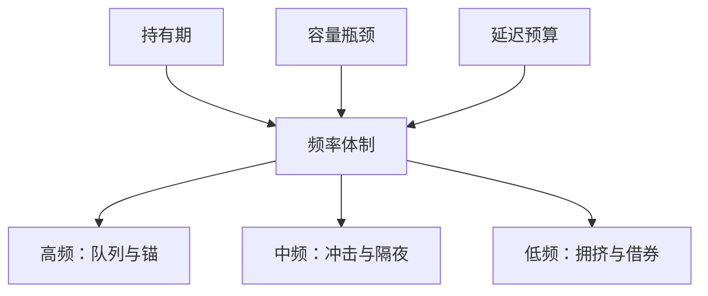

# 高频、中频与低频

高频不是「用了 tick 数据」，低频也不是「用了月度因子」。体制是持有期、容量约束与延迟预算的联合，名字只是打包。

<footer>—— 据 O'Hara 对高频市场微观结构的界定；对照 Hasbrouck and Saar 对低延迟交易的经验对象</footer>

[延迟预算](/quant/latency-budget)把端到端时间按 $H$ 分配。本课的缺口是命名：研究与交易台口头上的 HFT、中频、低频，若不对齐前面三课的 $(H,$ 容量，延迟），就会把做市的实现价差曲线套到价值因子上，或把月度再平衡接到盘中拒单监控上。O'Hara（2015）把高频界定为速度、撤单与极短持有的市场结构现象，而不是「量化」的同义词。本课给出可操作的分界，并声明后课高频数据清洗默认你已经知道：清洗规则随体制变，不是一套 tick 过滤器打天下。频率体制这一课序到此结束。

## 问题

没有官方的毫秒阈值。一种可工作的划分是：

- **高频**：$H$ 从一笔到数分钟，容量受深度与撤单约束，延迟预算在行情与网关，对象是队列、中点锚、开收盘拍卖的瞬时不平衡。做市、延迟敏感套利属此类。
- **中频**：$H$ 从数小时到数日，容量受 ADV 参与率约束，延迟预算在数据准时与拍卖截止，对象是订单流、隔夜跳价、事件驱动。许多所谓「统计套利日内」在这里。
- **低频**：$H$ 从数周到数季，容量受拥挤、借券与风格漂移约束，延迟预算在公司行为与指数生效，对象是因子与宏观。

缺口是禁止跨体制挪用度量。用五分钟实现价差去成本化低频价值，会低估永久冲击与借券；用 Amihud 去成本化高频做市，会把日度非流动性当成每笔成本。用 HFT 的撤单率去风控低频组合，会把正常的隔夜持仓当成异常。

### 数据频率 ≠ 交易频率

tick 数据可以服务低频研究（用逐笔构造更好的日度有效价差），日度数据不能服务高频决策。体制由决策与持有定义，由输入采样定义。把「我们有 Level-3」写成高频策略，只是数据采购。相反，低频策略若在再平衡日用 VWAP 执行，仍要懂连续与集合协议——执行可以比信号高频一档，会计必须分开：信号层用 $H_{\mathrm{sig}}$，执行层用 $H_{\mathrm{exec}}$。

A 股没有美股式的盘中碎片化速度竞赛，但有集合竞价截止与涨跌停排队。高频在 A 股的含义更接近「参与开收盘与处理停板队列」，而不是跨所 SIP 套利。标签要随市场改，不要进口三个英文字母。

## 方法

给每个策略填一张卡：$H_{50}$、年化换手、典型参与率、延迟 SLA、对照的成本度量（实现价差曲线的哪一段、或日度 ILLIQ、或借券）、主要容量瓶颈。卡片对不上上述三档中的任何一档，说明产品在混频：例如信号日频、执行抢 tick。混频合法，但成本与风控要按层拆，不能合成一个夏普再讲故事。

研究设计随体制切换。高频：事件时间、模拟撮合、队列假设的上下界。中频：会话分段、隔夜单独、公告窗剔除或事件研究。低频：点-in-time 基本面、公司行为、再平衡日历。把低频回测建成事件驱动引擎可以，但若仍用中点瞬时成交，体制声明是假的。

### 体制转换是产品变更

同一团队可以把中频信号降频成低频以换容量，或把低频在再平衡日交给中频执行台。这是显式的产品决策，应重画容量曲线与延迟预算，而不是继续用旧的监控阈值。拥挤来临时，有人把 $H$ 拉长「等流动性回来」——持有期已经变，alpha 衰减假设也要变。频率体制不是一次贴上的标签。

## 机制

三档对应三种紧的微观结构约束。高频紧的是时间优先与过时报价，价差分解里处理与存货的瞬时项主导，逆向选择以毒性流出现。中频紧的是冲击与隔夜跳跃，实现价差曲线的中段和隔夜截断主导。低频紧的是永久冲击、借券与拥挤，价差本身往往不是第一成本。O'Hara 强调高频改变了什么算市场：撤单、参考价、暗池锚。低频因子并不因此过时，只是执行时必须穿过已经被高频改写的微观结构。两层共存，会计分层。

不要说「Kyle 是低频、Glosten-Milgrom 是高频」。两个模型都是理论装置。经验上，短窗 lambda 偏高频深度，日度 ILLIQ 偏低频。模型名字不自动等于体制。

### 混频产品必须分层会计

信号低频、执行中频是合法产品，但夏普不能合成后再讲一个体制故事。成本、闸门、延迟 SLA 按层拆开，容量曲线也按层画。标签可以叫混频，不能叫高频。

## 边界

加密的「高频」受区块或撮合引擎状态限制，标签更乱。债券几乎没有股票意义上的 HFT 做市，OTC 询价是另一种中频。本课不规定组织架构必须按三档分仓。下一课程高频数据从 tick 清洗起，默认读者带着体制卡：清洗异常成交时，高频会当报价更新，低频可能当日度过滤。

数据频率不等于交易频率。用 tick 去估更好的日度有效价差，仍是低频研究。把 Level-3 采购写成高频策略，只是库存清单。

## 小结

- 体制 $= (H,$ 容量瓶颈，延迟预算），不是采样频率。
- 禁止跨体制挪用实现价差、ILLIQ、撤单率。
- 信号与执行可以差一档，会计必须分层。
- 改 $H$ 或改执行场所是产品变更，重画曲线。
- 高频微观结构是低频策略必须穿过的管道，不是低频的替代。
- 出处：O'Hara, *Journal of Finance*, 2015；Hasbrouck and Saar, 2013；成本与换手见 Novy-Marx and Velikov, 2016；持有期三课的内部接口。
