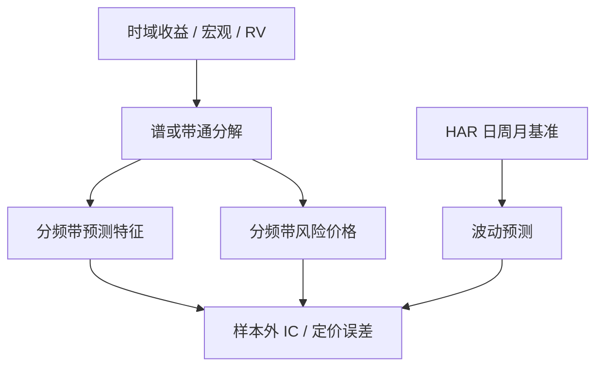

# 频域与时频模型

不同频率的效用与风险价格不必相同；把贴现与冲击分解到频谱上，才能看出长期成分是否比短期成分更贵。

<footer>—— Dew-Becker and Giglio, Asset Pricing in the Frequency Domain: Theory and Applications, Review of Financial Studies, 2016</footer>

时域模型把收益写成滞后与同期项的和。频域把同一协方差结构换成频谱：每个频率 $\omega$ 上有一份功率、一份相干、一份风险价格。Dew-Becker 与 Giglio（2016）把资产定价等式变换到频率上，使「长期风险是否被定价」变成频谱上的可估计对象，而不是只能在时域里选一个长期消费因子。Ortu、Tamoni 与 Tebaldi 讨论持久冲击如何进入长期风险；Bandi 与相关文献把长记忆与周期成分写成可估计的谱。工程上更短的谱是波动：Corsi 的 [HAR](/quant/har-rv) 用日、周、月已实现波动混合不同频率；小波与短时傅里叶则把谱变成时变的时频图。本篇写频谱作为**定价与预测的坐标系**，不是把价格拿去画一张好看的周期图就交易。

## 问题

消费资产定价里，长期风险模型声称投资者在乎增长的持久成分。时域检验把消费滤成一个长期因子，滤子选择本身就是超参。频域把定价核与收益的协方差按频率分解：若只有低频带上的协方差被定价，长期风险叙事得到支持；若高频带同样有价格，叙事要改。问题是估计：宏观序列短、谱泄漏、以及商业周期频率上只有几个独立波动。把月频股票超额拿去估「八年周期」的风险价格，有效样本极小。

预测侧的问题不同。收益接近白噪声，周期图上的峰大多是噪声。用带通滤波抽出「周期项」再回归未来收益，很容易把样本内的起伏当成周期。Hamilton 对 HP 滤波的批评在这里适用：滤波造成的相位与超前滞后可以制造虚假可预测性。合法的预测用法是：**预先指定频率带**（例如一周以内、一月、一年以上），在样本外比较各带特征的增量，而不是看全样本谱峰去命名周期。

### 频谱密度不是交易信号

平稳过程 $x_t$ 的谱密度 $f_x(\omega)$ 是自协方差的傅里叶交换。它描述方差在频率上的分配，不描述 $t+1$ 的条件均值。把 $f_x$ 的某个峰对应的周期当作持有期，是把二阶结构误当成一阶可预测。可预测性若存在，应出现在从 $x$ 到 $r$ 的交叉谱或在带通特征的样本外 IC 上。HAR 之所以有用，是因为它用三个时域滞后去逼近波动的长记忆，目标是预测波动，不是预测收益的周期。

对价格做傅里叶再「去掉高频重建」，接近未来函数：全样本 FFT 使用了窗口两端的点。实时时频必须用因果窗或只向过去的小波，否则与[前视偏差](/quant/look-ahead-bias)无异。

## 方法

**定价。** 按 Dew-Becker–Giglio：在频率 $\omega$ 上估计收益与定价核（或宏观因子）的谱协方差，积分得到该频带贡献的风险溢价。实现可用多元谱估计（加窗周期图、多窗口）或带通滤波后再做时域回归——后者更易沟通，但滤子必须在样本外固定。报告低频带与高频带的溢价及标准误；只报全频积分等于回到无条件 beta。

**波动。** HAR 把 $RV_t$ 对日、周、月 RV 回归，见已实现波动篇；[已实现 GARCH](/quant/realized-garch) 把已实现测度写进条件方差。这是三个粗频率的混合，参数少，适合作为时频模型的基准。小波方差把 $RV$ 分解到尺度上，可检验哪一尺度驱动预测；须用滚动窗，并在边界用反射或截断，声明边界处理。

**收益预测。** 把特征做成带通：例如估值与宏观用一年以上成分，微观结构用一周以内。各带分别进入[正则线性](/quant/regularized-linear-alpha)或 NN3，看增量。分数差分（$0\lt d\lt 1$）是另一种保留长记忆、去掉单位根的线性滤波，见[分数阶差分](/quant/fracdiff)，它与谱在低频的幂律相联系，但 $d$ 在特征工程里是超参，不是对 DGP 的承诺。

$$
\gamma(h)=\int_{-\pi}^{\pi} f(\omega)e^{i\omega h}\,\mathrm{d}\omega.
$$

自协方差与谱互为傅里叶对；选滞后阶与选频带是同一枚硬币的两面。报告时应说明硬币的哪一面被当成超参网格，并计入[过拟合次数](/quant/backtest-overfitting)。

### 时频：局部化之后仍要因果

短时傅里叶与连续小波给出 $t$ 与 $\omega$ 上的能量。资产定价关心的是 $t$ 时刻可获得的局部谱：例如「最近三个月的低频方差占比」。Morlet 一类双边小波在 $t$ 处使用未来样本；金融里应改用因果小波或只对 $s\le t$ 的数据做变换。危机时高频能量上升，局部谱可以当状态变量进入条件风险价格，与[宏观因子](/quant/macro-factor-set)的流动性状态类似。不要把时频图上的亮斑事后命名为交易区间。

## 机制

长期风险：持久的消费（或现金流）冲击在低频有功率；若定价核在这些频率上与收益更相关，低频溢价更高。这是谱上的 beta。商业周期频率（数年到十年）样本短，估计最吵，却是宏观叙事最爱用的带——应预注册，而不是搜完再命名。高频带更多是折现率噪声与微观结构；把高频功率当成 alpha 来源，通常是在交易噪声。

波动长记忆：已实现方差的自相关衰减慢，HAR 用加性的三个频率逼近。预测收益时，波动状态可以进入风险补偿（时变风险价格），见时间变化风险溢价一类条目；这仍是二阶进一阶，需要经济约束，不能从周期图直接读出多空。

与机器学习的接口：把各频带能量当作 GKX 特征表的额外列，增量往往小且与已有的动量、波动列共线。有价值的是预先指定的长期估值成分对短期反转的正交，而不是让网络自己学一组任意带通滤波器——后者等价于在频域里做无惩罚的弹性网。

季节性（周内、月内、财报季）是确定频率，不是谱估计的峰。应单独用日历哑变量处理，见日历与隔夜一类讨论，否则谱会把季节性误认为可交易周期。

### 中国市场的交易时钟

A 股有午休、集合竞价与涨跌停，日频 RV 的高频端含有制度间断，不是扩散的抽样误差。HAR 的「日」成分已混进开盘跳价。频带特征若用分钟收益构造，必须声明是否含集合竞价、是否剔除涨跌停不可交易区间。把美股连续交易的谱估计器原样套过来，高频带没有经济含义。

## 边界与工程取舍

不要用全样本 HP 或双边小波做「周期择时」。不要在周期图上搜峰再回测该周期的持有期。不要把 Dew-Becker–Giglio 的定价分解翻译成高频交易信号。可做的是：预注册频带、因果变换、HAR 作波动基准、分带溢价与分带 IC 分开报告。计算上多窗口谱估计比单张 FFT 稳，但仍救不了宏观序列太短。

出处：Dew-Becker and Giglio, *RFS*, 2016；Ortu, Tamoni and Tebaldi, *RFS*, 2013；Corsi, *Journal of Financial Econometrics*, 2009（HAR）；Granger and Joyeux, 1980（分数差分）；Hamilton 对 HP 滤波的讨论。小波方法见 Percival and Walden 的标准处理，使用时必须改成因果版本。

## 小结

- 频域把风险价格与协方差按频率切开；长期风险是低频带上的定价，不是周期图上的交易信号。
- 预测应预注册频带并做因果滤波；全样本谱峰与双边小波会前视。
- HAR 是波动上最省参数的多频率基准；收益预测的频带特征须相对已有动量与波动列报增量。
- 季节性用日历处理，不要留给谱去发现。
- 出处：Dew-Becker–Giglio, *RFS*, 2016；Ortu–Tamoni–Tebaldi, *RFS*, 2013；Corsi, 2009。
