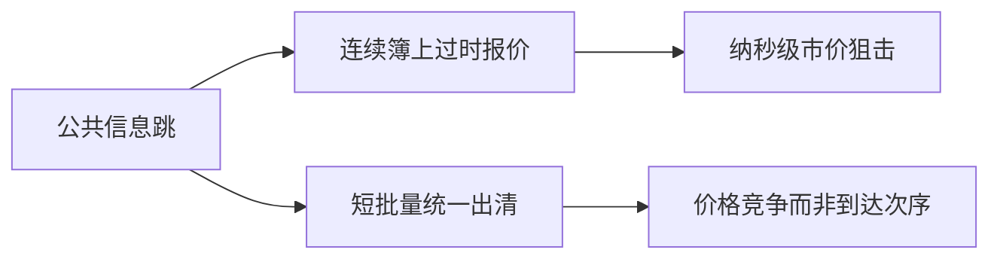

# Budish–Cramton–Shim 频繁批量拍卖

连续限价簿把时间优先细到微秒，公共信息一到，过时的挂单成为免费期权，速度竞赛抢的是这份期权而不是更优的价格。把连续时间改成很短的批量拍卖，可以让竞争回到价格上。

<footer>—— Budish, Cramton and Shim, The High-Frequency Trading Arms Race: Frequent Batch Auctions as a Market Design Response, Quarterly Journal of Economics, 2015</footer>

[均场极限](/quant/lob-mean-field)把簿写成密度，仍默认连续撮合。缺口是协议本身：连续双向拍卖在公共信息可被观察的速度差异下，会系统性地产生可抢的过时报价。Budish、Cramton 与 Shim（2015）把这个问题命名为速度军备竞赛，并提出频繁批量拍卖（FBA）作为设计回应。本课写机制与比较，不重画 LOB 几何，也不把 HFT 一律写成有害。

## 问题

公开新闻（指数期货跳、相关股票跳）到达后，连续簿上仍有人按旧公平价挂着。更快的人用市价吃掉这些挂单，利润来自被捡，不是来自提供更好的买卖价。慢的做市商被收割，只能加宽或撤退，价差含速度税。投资于更短线、更近机柜，私人有回报，社会上只是再分配谁去收割同一份过时期权。问题是：能否改匹配协议，使同一瞬间的竞争用价格而不是用到达纳秒来决胜。

FBA：把时间切成很短的批次（例如若干毫秒），批内订单累积，按统一出清价匹配，批内时间优先弱化或取消。过时报价在批内与新单一起竞价，狙击者不能靠「先到一纳秒」单独赢。

### 与 Kyle 批量的关系

Kyle 的单期拍卖是信息隐藏与线性出清。FBA 的批次要短到接近连续交易的即时性，长到让信息对称的人在同一批里用价格竞争。它不是回到开收盘那种稀疏拍卖，也不是重推 $\lambda$。连续 Kyle 的知情者平滑释放，与「公共信息瞬间过时」不是同一对象：后者是对称可观察的跳，前者是私有 $V$。

Aquilina、Budish 与 O'Neill 后来用交易所消息数据量化军备竞赛的规模。本课以 2015 年 QJE 的机制为主，实证数量不是定义。

## 方法

比较两个协议的均衡。连续 LOB：公共跳之后存在时间窗口 $\Delta$，窗口内吃过时报价有确定利润，投资延迟直到 $\Delta$ 的租金被速度成本吃尽。FBA：批长 $\tau$，批内统一价，$ \Delta$ 内的确定性狙击消失，剩余竞争是报价。权衡：$\tau$ 太大则即时性损失、日内对冲变贵；$\tau$ 太小则逼近连续，竞赛回来。设计是选 $\tau$，不是取消电子化。

相关市场（期货与现货）之间的滞后是竞赛的燃料。FBA 若只在一个场所实施，狙击转到仍连续的场所。设计必须考虑碎片化——后文 Reg NMS 与速度颠簸会碰到同一约束。

## 机制

连续时间优先把 Grossman–Miller 的「在场」变成「在场并且比所有人快」。FBA 把在场定义成「在这一批提交了有竞争力的价格」。做市的被捡下降，价差中的速度税可降；发现公共信息的速度变成批频，而不是线长。私有信息仍可在跨批的 Kyle 意义上交易，只是不能靠监听公共源去收割挂单。

对撤单博弈：批内撤单规则决定过时报价能否在出清前逃走。若允许批内无限撤，FBA 被掏空；若冻结，做市商要按批定价，价差含一批内的波动。细节决定优劣，口号不够。

## 边界

2015 年文章是机制设计，不是已实现的主流交易所形态。IEX 速度颠簸、频繁拍卖实验、批量开收盘，都是亲戚而不是 FBA 全文。延迟差异若来自人为速度颠簸而不是批量出清，效果不同，下一课写狙击、再后写 IEX。HFT 做市的实证好处（Menkveld）在 FBA 下可能保留其库存管理，去掉其狙击腿——这是经验问题。

不要把「反对连续 LOB」读成「反对电子交易」。BCS 反对的是连续时间优先对公共信息的处理，不是反对限价单或自动化。

批长、批内能否撤单、跨场所是否同时改协议，三件事一起决定 FBA 是否只是把竞赛挪到批与批的边界上。机制比较必须把这三项写进同一张表，不能只宣布「改成拍卖」。

## 小结

- 连续 LOB 在公共信息下把过时报价变成免费期权，速度竞赛抢期权而非报更优价格。
- 频繁批量拍卖用短批次统一出清，把竞争拉回价格；批长是即时性与竞赛之间的设计变量。
- 私有信息的 Kyle 交易与公共信息狙击不是同一现象。
- 出处：Budish, Cramton and Shim, *Quarterly Journal of Economics*, 2015。
