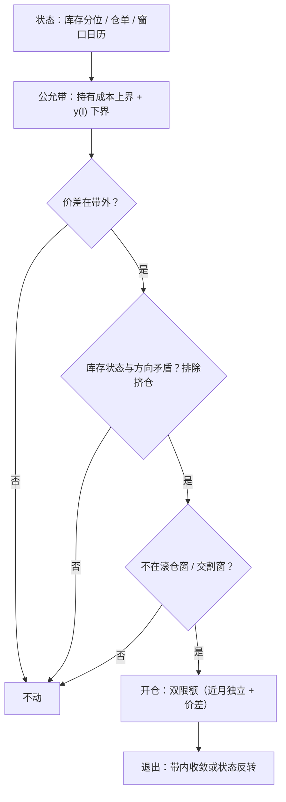

# 跨期套利深化

被动展期缴纳当前斜率，跨期套利交易斜率的变化；深化从「带」开始——带由仓储上界、库存状态与交割期权共同写成，z-score 只是最后一步。

<footer>—— Working, AER, 1949；价差波动与库存见 Ng and Pirrong, Journal of Business, 1994；交割选择权见 Gay and Manaster, JFE, 1984</footer>

[上一课](/quant/ft-index-roll-strategy)把围绕指数基准的滚仓写成约束优化：被动展期按公开答案缴纳或收取斜率。有人要问斜率本身错没错，[跨期套利](/quant/calendar-spread-arb)那一课已把基础写清：日历价差是仓储与便利收益的时间差分，内嵌近月的交割与挤仓期权。本课深化交易层：公允带怎么按状态定、偏离多少才是错价、蝶式怎么表达曲线二阶、组合层面怎么装。

## 问题

基础课留下的缺口是「带」的定量化。持有成本给出上界：升水不能长期超过融资加仓储，否则现货买入加交割套利入场。下界没有同样的硬约束——空头现货做不成，贴水可以深而持久，便利收益 $y$ 恰是缺口。深化的问题是：把这个非对称写成可操作的判定。错在哪：对日历价差套无条件 z-score，60 日均值里的 $y$ 早变了；把带当成对称区间，在贴水端按「总会回到正持有费」加仓，等于做空便利收益与挤仓期权；忽略窗口——指数滚仓窗内价差被机械流量推离带，那是[展期成交量与持仓](/quant/roll-volume-oi)的订单流，不是错价。

### 带与状态的合写

公允带按状态写：

$$
\underbrace{S_t\big(\mathrm{e}^{(r+u)\tau_2}-\mathrm{e}^{(r+u)\tau_1}\big)}_{\text{全额持有成本上界}} \;\gt\; F_2-F_1 \;\gt\; \underbrace{-\,y(I)\,S_t\tau}_{\text{随库存分位变化的下界}},
$$

库存紧、$y$ 高，下界深、带宽；库存松、$y$ 趋零，带收窄到仓储加融资附近。开仓判定因此是三段：价差在带外；库存状态与方向矛盾（高库存却深度贴水，先排除挤仓与交割地局部短缺）；不在滚仓窗与交割窗内。三段有一段不满足，z-score 再高也不动手。

蝶式（买近、卖中、买远）交易曲线二阶：对融资 $r$ 的平移不敏感，对中间月份的流动性极度敏感。中腿常是最薄的合约，蝶式的理论价值差会先被中腿价差吃掉——容量按三腿中最小者再折半。

## 方法

第一步，状态条件化的参照：用第四课的状态表选 $y(I)$ 的当期估计，而不是历史平均。第二步，信号：带外加状态矛盾，才进入候选；方向上，买贴水深化前的近月（低库存、$y$ 高）与买升水过顶后的远月（高库存、带顶破）是两类不同的仓，后者受仓储套利约束更强、收敛更可依赖。第三步，风险账本：日历价差的保证金优惠放大杠杆，风险限额按两条计——近月腿的独立冲击与价差本身的冲击，交割月临近按日强制减仓。第四步，退出：收敛到带内、或状态反转（仓单注销、报告意外），而不是拿到固定目标价。

## 机制

带非对称的机制是可空性：持有成本套利需要买现货空期货，多头方向带硬；反向需要空现货，商品现货借不出，贴水端只有软约束——Gay 与 Manaster 的品质与交割选择权给近月空头补了一层期权价值，让近月在贴水端还带着「接货义务」的定价。收敛的机制是仓储资本与交割，不是协整：带外偏离要靠有人真把货运进仓库、或真把仓单交割掉才闭合，资本进不来的偏离可以持久——这正是 Ng 与 Pirrong 的低库存、高价差波动世界的另一面。窗口机制把两类偏离分开：滚仓窗内的偏离是暂时成分，窗后回归；库存驱动的偏离是状态成分，报告日跳跃——两类混在一个均值里，回测的「回归速度」就是两个时钟的乱拍。

## 边界

跨板块不是同一套带：金属有仓库与租借率，能源看管道与库容，农产品分新旧作，国债期货的「价差」还叠着 CTD 切换，见[最便宜可交割](/quant/ctd-cheapest)。数据要在 vintage 上算，仓单与库存的修订会把「意外」改写掉。交割月不开新仓是铁律，蝶式的中腿进交割月同样触发。本课不写价差的下单方式与摊薄——那是[移仓的执行](/quant/ft-roll-execution)的方案族，套利与展期共用一本执行账。

## 小结

- 公允带非对称：上界是持有成本，下界随 $y(I)$ 走；贴水端的软约束是深化的核心。
- 开仓三段判定：带外、状态矛盾排除挤仓、避开滚仓窗与交割窗；z-score 是最后一步。
- 蝶式表达二阶，容量按中腿流动性折半；保证金优惠用双限额对冲掉。
- 收敛靠仓储资本与交割；窗口偏离与库存偏离分开归因，不共用一个回归速度。
- 出处：Working, *AER*, 1949；Ng and Pirrong, *Journal of Business*, 1994；Gay and Manaster, *JFE*, 1984。
