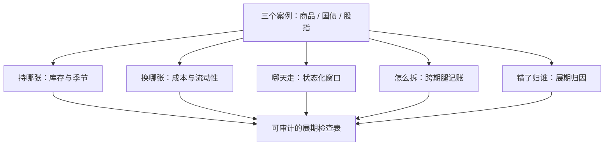
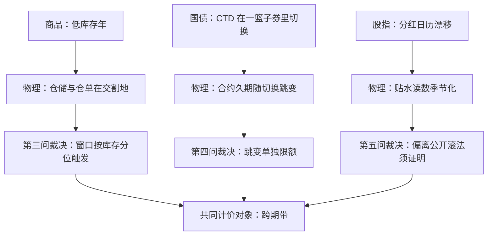

# 期货深化案例与收束

展期的账只有两种记法：一种把到期当作远处的麻烦，一种把每一次换月当作一次小额交易决策的复利；深化的全部内容，就是把前者改写成后者。

<footer>—— 据本课程各课的决策单与 Working, 1949；Cootner, 1960 整理</footer>

[上一课](/quant/ft-seasonal-patterns)把库存写回展期：日历、成本、执行三件工具状态化，$\partial y/\partial I\lt 0$ 让晚滚变成持有负向选择权。本课是[期货与展期深化](/quant/ft-roll-cost-modeling)课程的收束：用三个跨板块的案例把六课的决策单走一遍，再收拢成一张可审计的展期检查表。后课默认已经读完本课程。

## 问题

商品、国债、股指三个板块的展期各有其物理：商品的仓储与仓单在交割地，国债的 CTD 在一篮子券里切换，股指的分红剩余在日历上漂移。缺口的共性是：把「展期」当成日历上的一次性动作，而不是一张需要状态化、可审计、可归因的决策表。三个案例分别演示决策单在哪一步裁决了不同的错误。

## 方法

决策单固定为五问：**持哪张**（近月还是远月，库存与季节说话）；**换哪张**（目标合约由成本与流动性定，不由习惯定）；**哪天走**（窗口由宽度与风险预算定，状态化阈值触发）；**怎么拆**（单腿风险与跨期腿的记账口径）；**错了归谁**（展期损益单独归因，不混进 alpha）。三个案例都按这五问逐项过，先商品、再国债、后股指。

术语翻译：「错了归谁」就是展期归因——每过一次换月，把「按公开答案滚会是多少、实际滚成多少」的差额单独记一本账。混进 alpha 的展期成本是隐形回撤，事后没人说得清亏在哪一课。

Cootner 1960 把「展期收益」从幸存者的轶事变成可测量的理论对象；本课的检查表是同一件事的工程版。

## 机制

**案例一，商品**：低库存年被动滚多头的代价在 [展期与库存再探](/quant/ft-roll-inventory-revisit) 里已经算过——负向选择权。决策单的裁决在第三问：窗口不是日历日，而是库存分位触发，宽度过宽就持近月收条件收益，宁可多付一次移仓。**案例二，国债**：CTD 切换让「换哪张」的答案在行情里漂移，久期跳变必须按 [展期成本建模](/quant/ft-roll-cost-modeling) 的账单口径单独限额，不能混进利率观点。**案例三，股指**：分红日历漂移使贴水读数季节化，指数滚法是公开答案（[指数展期的策略执行](/quant/ft-index-roll-strategy)），偏离公开答案的每一分预期收益都要交出对应约束的证明。三案合看，[跨期套利深化](/quant/ft-calendar-arb-deep) 的「带」是共同的计价对象，[季节模式](/quant/ft-seasonal-patterns) 是共同的校准背景。

数字实例：国债 CTD 从久期约 4 年的券切到约 7 年的券，多头期货的利率敏感度一夜之间接近翻倍；若不把这次跳变单独记账限额，原有的对冲比例就全错了——这正是第四问要拦住的事。

## 边界

决策单覆盖的是「持仓的存续」；交割的物理流程、交割违约与仓单法律问题不在本课程，做实盘交割需要另读交易所交割规则。展期执行里的跨期腿在深度不足的市场会显著变宽，此时本单的第三问与第五问可能同时失效——那不是检查表的缺陷，是市场告诉你别滚。

常见误区：初学者把展期当成「到期前一天记得换个合约」的日历杂务。实际上展期是一串小交易决策的复利：滚早滚晚、目标合约选谁、怎么拆单，每一步都有成本、都能归因，攒起来能吃掉被动收益的一大块。

## 小结

- 五问决策单：持哪张、换哪张、哪天走、怎么拆、错了归谁；三板块各有其物理，检查表同一张。
- 商品看库存分位，国债看 CTD 漂移，股指看分红日历；共同计价对象是跨期「带」。
- 展期损益单独归因，混进 alpha 的展期成本是隐形回撤。
- 出处：Working, *AER*, 1949；Cootner, 1960；本课程各课的决策单。
