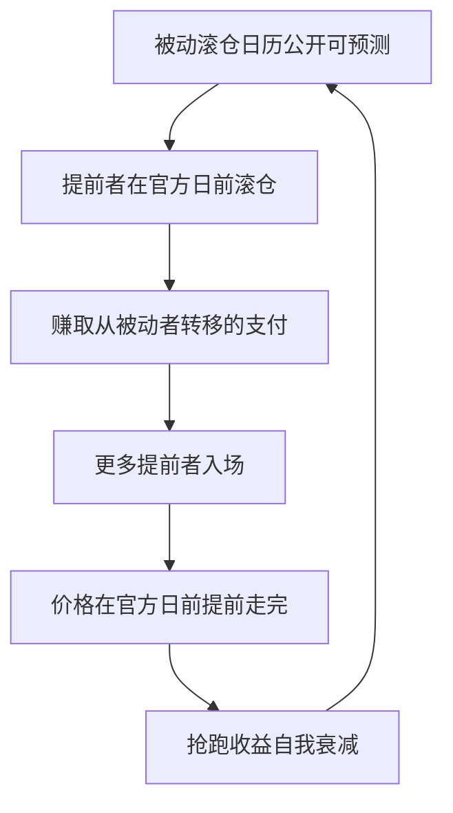

# 指数展期的策略执行

<div class="epigraph">
<p>指数的滚法是公开答案；围绕这条答案，每个账户在对齐与偏离之间定价自己的约束——聪明滚仓挣的不是新 alpha，是不做别人被迫做的那笔流量。</p>
<footer>—— Mou, 2011；Bessembinder, Carrion, Tuttle and Venkataraman, JFE, 2016；展期与商品指数收益的分解见 Erb and Harvey, FAJ, 2006</footer>
</div>

[上一课](/quant/ft-roll-inventory-revisit)把库存状态注进日历、成本与执行，机制单元收束。本课进入策略单元，第一站是指数展期：当持仓的目的不是交易斜率，而是复制或对冲一条指数时，展期从主动决策变成约束下的执行问题。主干已从收益端写过[商品展期 alpha](/quant/commodity-roll-alpha)——那是跨品种选择谁该持有；本课写同一品种内、围绕指数基准的滚仓策略，对象是复制盘、对冲盘与增强盘。

## 问题

三类账户的自由度不同。复制盘必须贴官方滚仓日历，否则跟踪误差先罚；可选项只剩执行细节——何时开始、分几日、用不用价差单。对冲盘没有官方日历，但有对冲成本账：展期直接进对冲成本，深贴水市场里机械滚近月要多付年化贴水加冲击，[股指期货与贴水](/quant/cn-stockindex-basis)给了比较口径。增强盘自由度最大，也最容易把「躲拥挤」做成「追逐流动性差的远月」。错在哪：复制盘为省冲击偏离官方日，跟踪误差罚金超过省下的成本；对冲盘照抄指数日历，白付拥挤费；增强盘用远月薄深度换一点斜率，样本外被滑点吃光。

<span class="marginnote">术语翻译：复制盘是拿着指数资金、必须贴官方滚仓日历走的账户；对冲盘是用期货顶替现货敞口的账户；增强盘是允许偏离基准、去赚执行与斜率钱的账户。自由度依次变宽，罚则也从「跟踪误差罚金」依次换成「对冲成本」和「滑点」。</span>

### 约束下的滚仓优化

把三类账户写进同一个框架：最小化预测展期成本，约束是各自的可选集。复制盘的可选集窄：合约固定为指数规定的那张，时间固定在官方窗，优化变量只剩参与率与摊薄日数。对冲盘可选月份与日期，约束是基差敞口上限与换月后对冲比率的重算。增强盘可选月份、日期与提前量，约束是最低深度与[展期成交量与持仓](/quant/roll-volume-oi)的窗口证据——避开被抢跑前移的拥挤段。三者都对照基准滚法度量：年化节省多少基点，承担了什么敞口。

<span class="marginnote">「聪明滚仓」的收益有一块是转移支付：Mou 记录过指数官方窗前的抢跑使部分展期从被动者流向提前者。这块收益的容量以被动名义为上限，抢跑者拥挤时它自己衰减——它不是仓储新溢价。</span>

## 方法

第一步，锁定基准滚法的定义：指数方法论文件的合约与日期，或对冲惯例的近月加固定提前天数——没有基准，「优化」无从对账。第二步，列可选集与约束；每项偏离写成对账表一行：偏离了什么、省了多少、多了什么敞口。第三步，用上一课状态化的成本表预测各方案成本，选预期成本最低且约束可行者。第四步，事后分解：实现的展期与基准滚法逐期对比，把节省归因到日期选择、月份选择与执行细节三栏——归因不清的「节省」会在下一次滚仓里还回去。

<span class="marginnote">数字实例：设某股指期货年化贴水 5%，对冲盘若机械照抄指数官方日，拥挤日每次换月多付 3 个基点冲击；改成错峰分五天滚、冲击降到 1 个基点，一年四次换月就省下约 8 个基点——这就是对账表「偏离了什么、省了多少」一栏要填的具体数。</span>

```mermaid
flowchart TD
  ROLE["账户类型：复制 / 对冲 / 增强"] --> SET["可选集与约束：合约、日期、提前量"]
  SET -> PRED["状态化成本表预测各方案"]
  PRED -> PICK["选预期成本最低且可行者"]
  PICK -> EXEC["执行（上一课的方案族）"]
  EXEC -> ATTR["对账：与基准滚法逐期分解"]
  ATTR -> PRED
```

## 机制

偏离有空间的机制是流量的可预测性：被动滚仓方向公开，流动性供给者愿意在非官方日提供更好的价格引你过来——Bessembinder 等人证明可预测流量周围供给会组织起来，市场质量取决于供给弹性。偏离有限度的机制是约束的真实成本：跟踪误差罚金、审计解释成本、基差限额都是定价过的；优化是在真约束下省真钱，不是绕过约束。抢跑衰减的机制是策略容量：提前滚的收益以「还有多少被动名义没滚」为上限；提前者多了，价格在官方日之前走到头，Mou 记录的前移正是证据。



<span class="marginnote">为什么重要：对冲盘换月后月份变了，DV01 或 beta 敞口随之变；不重算对冲比率，一期利率或市场的波动就能把全年省下的展期费吞回去——「节省」必须连同敞口一起入账。</span>

## 边界

指数方法论会修订：滚仓日、合约选择、纳入品种一改，历史「节省」的分布作废，优化要重估。对冲盘换月后的对冲比率必须重算——月份变了，DV01 或 beta 敞口随之变，省下的展期可能被对冲偏差吞掉。增强盘的容量按远月深度打折，不是按指数名义外推。别把本课与[商品展期 alpha](/quant/commodity-roll-alpha)混同：那里选品种承担曲线溢价，这里在给定的指数暴露下省执行成本，收益来源与风险都不相同。

## 小结

- 三类账户同一框架：最小化预测展期成本，约束是各自的可选集——复制窄、增强宽、对冲居中。
- 没有基准滚法就没有优化：官方日历或惯例滚法是对账的起点。
- 偏离的收益是流量转移（Mou 的抢跑证据），容量以被动名义为上限，拥挤后衰减。
- 每期对账：日期、月份、执行三栏归因；对冲盘换月后重算对冲比率。
- 出处：Mou, 2011；Bessembinder, Carrion, Tuttle and Venkataraman, *JFE*, 2016；Erb and Harvey, *FAJ*, 2006。
