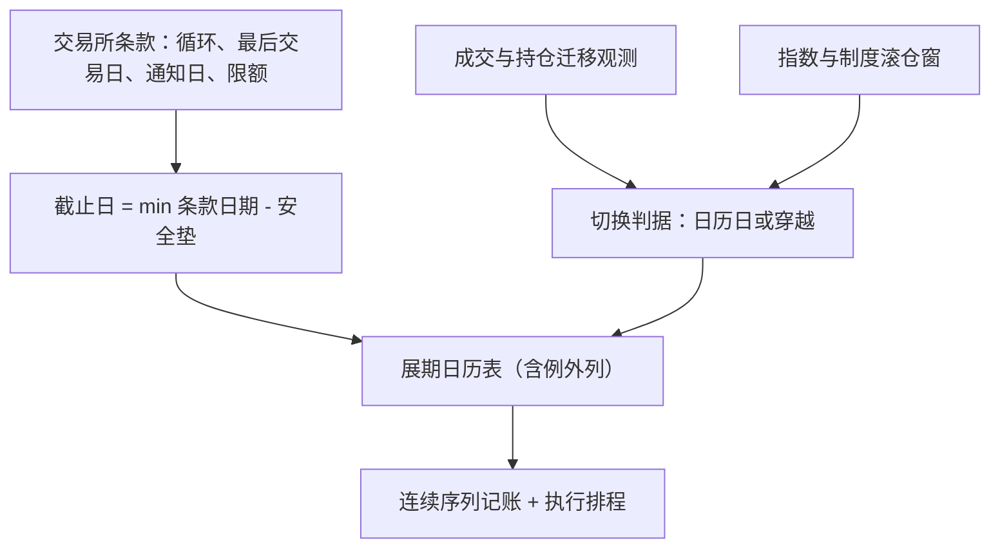

# 展期日历的深入

期货的到期是物理，持仓的存续是选择；展期日历就是把这张选择表写成可审计的规则——持哪张、换哪张、哪一天之前必须换完。

<footer>—— 据交易所合约规则与商品指数方法论整理；被动滚仓的需求冲击见 Mou, 2011 与 Bessembinder, Carrion, Tuttle and Venkataraman, JFE, 2016</footer>

[上一课](/quant/etf-case-map)把债券组合收成一张地图，工具空间里期货那一格写着标准化、CTD 刻度与逐日盯市；但那张地图默认持仓会自己跨过到期日。主干已把展期拆过几次：[展期收益](/quant/roll-yield)记收益账，[展期成交量与持仓](/quant/roll-volume-oi)记订单流账，[季节性展期](/quant/seasonal-roll)记库存季节账。本课程是「期货与展期深化」的第一课，对象换成持仓本身：逐日盯市的头寸如何在到期约束下连续存在。第一课钉日历。后课默认已经读完本课。

## 问题

「哪张是主力、哪天换月」没有唯一答案：日历由三层规则叠成。第一层是交易所条款：合约循环、最后交易日、交割通知日（first notice day）、限额分档收紧的日程。第二层是流动性迁移：成交与持仓从近月滑向次近月的日期，每年每品种都在漂。第三层是被动与制度日程：商品指数公开的滚仓窗（如第五至第九个工作日）、复制产品为压跟踪误差提前的日子。三层常互相矛盾：指数说这几天走，成交说上周就该走，条款说不能晚于通知日前五天。

错在哪：把到期日当滚仓日，你会撞进交割月——深度塌掉、限额生效、空头可能被指派交割；把官方指数日当唯一高峰，你会漏掉抢跑前移后的真实冲击，见[展期成交量与持仓](/quant/roll-volume-oi)；把主力判据从持仓穿越改成日期穿越，同一段历史会换出不同的连续价格，回测与实盘从此不是同一个策略。

### 截止日不是到期日

可执行日历为每品种每期合约记一个**截止日**：$\min(\text{最后交易日},\ \text{通知日},\ \text{限额收紧日})$ 再往前推安全垫。安全垫有据可依：交割月内深度按天衰减，保证金分档上调，接货后的清算以天计。被动多头持有的是负向选择权——过了通知日，接货义务在别人手里。

通知日只存在于实物交割市场且随品种各异：农产品常在交割月前最后一周，能源金属多在交割月初。指数化产品对此最敏感——章程禁止接货，截止日由通知日而非到期日决定。

## 方法

把日历写成表，不写成经验。每行一个品种：合约循环与活跃月集合、切换判据、截止日规则、窗口长度。切换判据显式二选一：日历日（每月第 $n$ 个工作日）或穿越（次近月持仓连续 $k$ 日超过近月）。判据定下不许中途改——连续序列的收益分布与展期损益都依赖它，改判据等于换数据。窗口长度单独一列，分几日摊完由成本与择时的权衡决定，下一课再谈。

表还要有例外列：停板、合约规则修改、到期循环对上长假。例外不进表，实盘就会现想，现想的决定不可复盘。

## 机制

截止日必须提前的机制是交割窗的流动性塌缩：临近条款日期，投机持仓被限额与保证金推离，剩下的是交割意向真实的产业户，市价单对面没有宽度。判据必须固定的机制是可复制性：日历是策略定义的一部分，同一套信号跑在不同日历上，展期腿记账不同——[展期收益](/quant/roll-yield)已警告被动滚法决定你分到哪块斜率。三层的张力因此可读：指数为可复制牺牲择时，穿越为效率牺牲规则性，截止日是在两者之间买保险。

## 边界

日历是约定，不是预测：它回答「什么时候必须走完」，不回答「走贵走便宜」。跨市场品种没有统一循环，每品种一行是底线。条款会改：指数方法论修订、限额与保证金调整都使历史日历失效，修改要进版本号。本课不谈走的成本与执行次序——那是接下来两课的分工；库存状态如何改日历，第四课再探。

## 小结

- 展期日历由三层规则合成：交易所条款、流动性迁移观测、被动指数日程，三层分开记。
- 可执行日历的核心是截止日：条款日期取最小再减安全垫，不由到期日定。
- 切换判据是策略定义的一部分，中途更换等于更换数据。
- 日历写成带例外列的表并可版本化，实盘不现想、复盘有据。
- 出处：据交易所合约规则与商品指数方法论文件整理；滚仓窗冲击见 Mou, 2011 与 Bessembinder, Carrion, Tuttle and Venkataraman, *JFE*, 2016。
